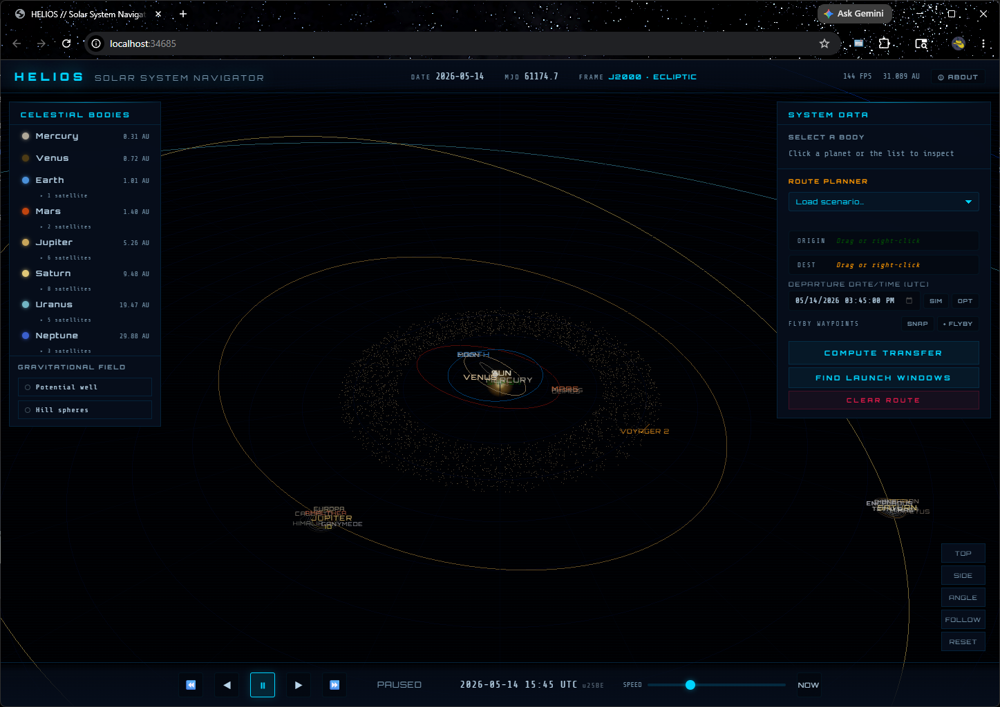
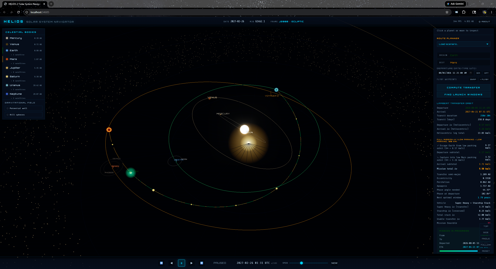

# HELIOS // Solar System Navigator

A real-time 3D solar system simulator with accurate orbital mechanics, real stellar data, and interplanetary mission planning — including gravity-assist trajectories and a porkchop-plot launch-window finder.

## Screenshots





## Features

### Scene
- **All 8 planets** — Keplerian orbital mechanics from J2000 mean elements
- **Planet surface textures** — equirectangular NASA-derived maps for each planet (served from jsDelivr), with axial rotation driven by real sidereal periods (Venus and Uranus rotate retrograde)
- **Earth clouds** — translucent cloud shell using the cloud map as its own alpha channel
- **Saturn's rings** — ring texture with UV remapped radially so banding reads correctly from inner to outer edge
- **~30 major moons** — Moon, Galilean moons, Titan, Enceladus, Triton, and more, with real orbital periods
- **119,000+ real stars** — HYG v4.2 catalogue with accurate positions, magnitude-scaled sizing, and B-V spectral colour
- **Animated Sun** — procedural canvas texture with granulation and sunspots; rotation + pulsing corona

### Real spacecraft
Five deep-space probes rendered as labelled tetrahedron markers with velocity-direction trails, anchored at J2000 state vectors and linearly propagated (validated against NASA tracking to within a few percent through 2026):
- Voyager 1 · Voyager 2 · Pioneer 10 · Pioneer 11 · New Horizons

### Mission planner
- **Robust Lambert solver** — bracketed bisection on the universal-variable equation. Convergence-safe across the full single-revolution regime; rejects degenerate 180° geometries and validates every solution by propagating back to the target (≤1000 km miss required).
- **Physics / visuals decoupling** — inclinations are visually exaggerated for dramatic 3D tilt, but all Δv and orbit-parameter computations use real inclinations, so displayed numbers are physically accurate.
- **Porkchop-plot launch-window finder** — sweep a grid of (departure date × transit duration) and heat-map the total Δv. Click a cell or use the auto-selected global minimum to drive the planner's dates in one click.
- **Gravity-assist / multi-leg routing** — add any number of flyby waypoints between origin and destination. Each leg is solved with its own Lambert; at each flyby the spacecraft's V∞ turning angle is checked against the maximum achievable at the planet's minimum-safe periapsis — infeasible swingbys are flagged **TOO SHARP** with the required vs. minimum periapsis shown.
- **Mission feasibility** against the configured vehicle stack (Starship + Super Heavy): all of Starship's propellant is reserved for final-mile ops; transfer Δv budget is Super Heavy only, lifting the fully-loaded Starship as payload.

### Simulation
- **Date picker** — jump to any instant with presets (Apollo 11, Voyager 1 launch, J2000, etc.)
- **Time controls** — pause / play / fast-forward / reverse from 1 day/s to 100 years/s
- **Ship flight simulation** — launch a computed transfer, watch the ship trace its trajectory, jump straight to the departure date, abort a mission mid-flight
- **Drag-and-drop or right-click route planning** — assign origin/destination from the sidebar

## Tech stack

- **Three.js r0.164** — 3D rendering with UnrealBloom post-processing
- **CSS2DRenderer** — planet/moon/spacecraft labels
- **Node.js** — static file server + Ollama chat proxy + agent C2 bus

## AI assistant (Ollama Cloud)

Floating-action-button chat and a CLI agent drive the planner. The API key never ships to the browser.

1. Copy `.env.example` → `.env` and set `OLLAMA_API_KEY` from [ollama.com/settings/keys](https://ollama.com/settings/keys).
2. Default model: **`gemma4:31b-cloud`** ([library](https://ollama.com/library/gemma4)).
3. Start the app: `npm start` → open `http://localhost:8080`.
4. Use the **AI** FAB (bottom-right) for in-app chat.

### Agentic CLI

```bash
npm run agent -- help
npm run agent -- status
npm run agent -- chat "Explain L1 vs L2-compare fidelity"
npm run agent -- agent "Set Earth to Mars and compute the route"
npm run agent -- cmd set_route --origin Earth --destination Mars
npm run agent -- cmd compute_route
npm run agent -- repl
```

Keep a browser tab on HELIOS so the **onboard agent** can execute C2 commands (`set_route`, `compute_route`, `set_vehicle`, …). The CLI queues work on `POST /api/agent/command`; the page polls and returns results.

`.env` is gitignored. Never commit API keys.

## Physics summary

| Component | Method |
|---|---|
| Planet positions | JPL "Approximate Positions of Major Planets" 1800–2050: linear element rates per Julian century + great-inequality corrections (b·T² + c·cos(f·T) + s·sin(f·T) added to mean longitude L for Jupiter–Neptune). Newton–Raphson solver for eccentric anomaly. **Default offline path for all trip planning.** |
| Optional Horizons compare | Stretch educational overlay (`js/physics/ephemeris-horizons.js`): on explicit UI opt-in only, fetch a public Horizons VECTOR table and report distance error vs the approximate model. **Not SPICE** (no `.bsp` kernels), **not flight ops**, **not required for planning**. CI uses mocked fetch only. |
| Transfer orbit | Lambert's problem via universal-variable formulation, bracketed-bisection solver |
| Trajectory propagation | Kepler in perifocal frame (p̂, q̂, ŵ) |
| Δv | Vector difference `|v_transfer − v_planet|` (both from physical-inclination state) |
| Gravity assist | Patched-conic: `e = 1 + r_p·V∞² / μ`, turning angle `δ = 2·asin(1/e)` |
| Launch windows | Lambert sweep over departure time × transit time, min Δv at each cell |

## Tests

Offline numeric validation (no browser required):

```bash
node tests/trip_planning_test.mjs     # Lambert / Hohmann / planet positions vs references
node tests/verify_fix.mjs             # Lambert solver convergence sweep
node tests/porkchop_sim.mjs           # porkchop minimum vs real Mars windows
node tests/gravity_assist_sim.mjs     # multi-leg VEEGA-style routes
node tests/spacecraft_check.mjs       # Voyager/Pioneer distances vs NASA tracking
node tests/visual_alignment.mjs       # trajectory-line-vs-marker accuracy
node tests/module_integration.mjs     # imports js/* modules: load, accuracy; perf is soft
node tests/perf_budgets.mjs           # soft/informational perf floors (always exit 0)
node tests/ephemeris_check.mjs        # JPL element-rate model: J2000 self-consistency, perihelion/aphelion, Mars opposition, drift vs frozen-J2000
node tests/horizons_mock.mjs          # optional Horizons adapter: parse sample VECTOR payload + mocked fetch (no live network)
```

## Performance baselines

Measured offline on a **local desktop (Windows)** development machine (Node.js, warm process). CI primary gate is **correctness** — throughput checks in `module_integration` and `perf_budgets` are **soft** (informational; they do not fail the suite on slow runners).

| Metric | Baseline | Notes |
|---|---|---|
| `assets/stars-mag75.json` cold size | **~1.03 MiB** (1,084,641 bytes) | Prebaked mag≤7.5 star field; largest static asset on critical path |
| Core app JS + catalog (no vendor Three.js) | **~150 KiB** raw | Plus CDN Three.js / fonts in the browser |
| Cold-load stars + core app assets | **~1.18 MiB** | Offline estimate of first-paint related local files |
| Lambert throughput (Earth→Mars, 10k solves) | **~1.1×10⁵ solves/s** | Soft budget ≥10k/s; GH runners often lower |
| Single-leg planning path (Earth→Mars, warm) | **~0.05 ms / solve** | `routing.solveMultiLegRoute` 2-waypoint |
| Multi-leg planning path (VEEGA-style, warm) | **~0.16 ms / solve** | Earth→Venus→Earth→Jupiter |
| Time-to-first-route (offline proxy) | **~30–40 ms** | Physics module import + first Earth→Mars solve (no browser, no GPU) |
| `getBodyPosition3D` | **≪ 5 μs / call** | Soft budget; animate loop calls this per body per frame |

Browser **time-to-first-route** (DOM ready → first successful **Calculate Route**) depends on network (CDN Three.js, textures) and GPU; use the offline proxy above for regression smoke, not absolute UX SLAs.

End-to-end UI test (requires Puppeteer):

```bash
npm install puppeteer
node tests/ui_smoke.mjs     # drives the app in headless Chromium, screenshots in tests/screenshots/
```

## Getting started

```bash
npm install   # optional — only needed for Playwright/Puppeteer UI tests
npm start
```

The local-dev server picks a free port automatically and prints the URL:

```
HELIOS server running at http://localhost:XXXXX
```

Open that URL in your browser. For production, prefer any static file host (GitHub Pages, etc.) — `server.js` is local-dev only (path-jailed).

### Scripts

| Command | Purpose |
|---|---|
| `npm start` | Local path-jailed static server (ESM) |
| `npm test` / `npm run test:physics` | Offline physics + catalog + share + multi-leg suite |
| `npm run test:server` | Path-jail HTTP tests |
| `npm run test:ui:ci` | Playwright UI smoke (starts its own server) |
| `npm run build:stars` | Rebuild `assets/stars-mag75.json` from `hyg_v42.csv` |
| `npm run build:ephemeris` | Rebuild `assets/ephemeris-samples-v1.json` (L2-plan samples) |

**CI:** GitHub Actions runs physics offline tests on every push/PR to `main`, plus a Playwright Chromium UI smoke job.

### Trip planner & cargo-aware measurements

- **Need / Capability / Margin** — Measurement Card on every computed route (concept-grade)
- **Vehicles** — Super Heavy + Starship (**legacy demo**, unrefueled LEO→TMI, N-tanker), **Falcon 9** (illustrative C₃–payload table), abstract Δv budgets (`fh-class` = heavy-lift chemical abstract — not Falcon Heavy)
- **Cargo mass (kg)** — first-class input for F9 and Starship architectures
- **Porkchop cargo** — selected-cell max cargo + optional **MAX CARGO** heatmap (F9 Earth C₃ table or SS unrefueled/tanker at cell Δv)
- **Ephemeris fidelity** — **L1** offline JPL Approximate Positions (default); **L2-compare** after optional Horizons Δr check (planning still L1); **L2-plan** optional offline sample-table endpoints (`assets/ephemeris-samples-v1.json`); L3 SPICE out of scope
- **Approx error bars** — Measurement Card shows JPL nominal λ/φ/ρ error class for origin/destination
- **Cost basis** — heliocentric leg vs full parking-orbit mission Δv (legacy/abstract; SS cargo modes use injection Need)
- **Display scale** — cinematic vs schematic
- **Catalog** — planets, moons, dwarfs, NEOs, EM-L1/L2 waypoints
- **Share / import** — URL hash + JSON v3 (recomputes geometry; never trusts stored Δv)
- **Classroom mode** — `?mode=classroom` → schematic + abstract budget + methodology banner
- **Debug** — `?debug=1` logs Need / Capability / Margin objects to the browser console after compute

> **Not flight design.** Vehicle numbers are educational illustrations — not SpaceX-certified performance.

## Data sources

- **Planetary orbits** — JPL "Approximate Positions of Major Planets" (1800–2050 valid range): J2000 elements + per-century rates + great-inequality corrections for Jupiter through Neptune (authoritative for HELIOS planning)
- **Optional educational Horizons fetch** — public [Horizons API](https://ssd.jpl.nasa.gov/horizons/) VECTOR tables only when the user clicks **Compare Horizons** in the About panel; never on the planning path. Not SPICE.
- **Star data** — [HYG Database v4.2](https://github.com/astronexus/HYG-Database) (~119,600 stars)
- **Moon data** — NASA/JPL planetary satellite ephemerides
- **Planet surface textures** — [threex.planets](https://github.com/jeromeetienne/threex.planets) (NASA public-domain maps)
- **Spacecraft state vectors** — JPL Horizons / NASA tracking pages (epoch J2000)

## Controls

| Action | Input |
|---|---|
| Orbit camera | Left-drag |
| Pan camera | Right-drag |
| Zoom | Scroll wheel |
| Select body | Click planet/moon |
| Centre on body | Double-click |
| Follow body | Select + press `F` |
| Set route origin/dest | Right-click planet or drag to route slot |
| Add gravity-assist flyby | **+ FLYBY** button in route panel |
| Find launch windows | **Find Launch Windows** button in route panel |
| Jump to date | Click the date in the bottom bar |
| Play/pause | Spacebar |
| Speed up/down | `+` / `-` |
| Deselect | Escape |

## Project structure

```
index.html                — HTML shell + base CSS + DOM
css/app.css               — progressive mobile layout + reduced-motion overrides
js/                       — application code, ES modules
  constants.js / state.js / display-scale.js
  data/                   — bodies, moons, dwarfs, neos, waypoints, catalog, scenarios
  physics/                — kepler, lambert, routing, porkchop-grid, vehicles, mission-budget, ephemeris-horizons (optional)
  scene/                  — Three.js construction (+ extra-bodies, prebaked stars, gravity FX)
  ui/                     — route planner, porkchop, share, scenarios, controls
  mission.js / animation.js / main.js
assets/stars-mag75.json   — prebaked mag≤7.5 star field (~1.03 MiB)
trajectory-calculator.js  — re-export shim → js/physics/vehicles.js
server.js                 — path-jailed local-dev static server (ESM)
hyg_v42.csv               — full HYG source (optional; not on critical path)
tests/                    — offline physics + soft perf_budgets + server + Playwright
LICENSE                   — MIT
docs/trip-planner-design.md — product redesign + PR plan
```
