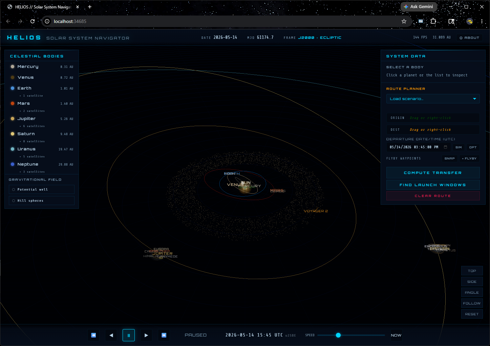
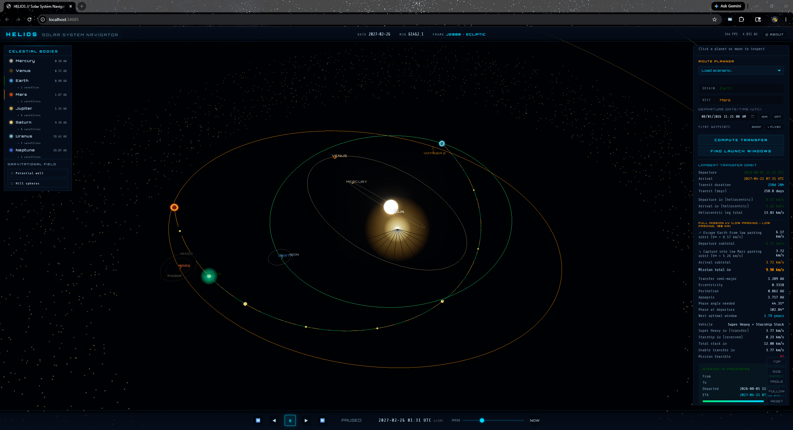

# HELIOS // Mission Design · Launch Planning

An **industrial-grade preliminary mission-design workstation** in the browser: real-time 3D solar system, Lambert trajectories, launch-window search, vehicle Need/Capability/Margin, GO/NO-GO Plan Dossier, DE440s-class offline ephemeris, and dense SPICE Float32 packs — for realistic interplanetary launch campaign analysis.

**Not flight-certified software. Not range safety. Not SpaceX performance warranty. Not a GMAT/STK/SPICE-OD replacement.**

**Primary production URL (App Hosting):** https://helios--k-solar-system-navigator.us-central1.hosted.app  
**Static fallback (classic Hosting):** https://k-solar-system-navigator.web.app

## Screenshots





## Features

### Scene
- **All 8 planets** — Keplerian orbital mechanics from J2000 mean elements
- **Planet surface textures** — equirectangular NASA-derived maps for each planet (served from jsDelivr), with axial rotation driven by real sidereal periods (Venus and Uranus rotate retrograde)
- **Earth clouds** — translucent cloud shell using the cloud map as its own alpha channel
- **Saturn's rings** — ring texture with UV remapped radially so banding reads correctly from inner to outer edge
- **~30 major moons** — Moon, Galilean moons, Titan, Enceladus, Triton, and more, with real orbital periods
- **119,000+ real stars** — HYG v4.2 catalogue with accurate positions, magnitude-scaled sizing, and B-V spectral colour
- **Animated Sun** — procedural canvas texture with granulation and sunspots; rotation + pulsing corona

### Real spacecraft
Five deep-space probes rendered as labelled tetrahedron markers with velocity-direction trails, anchored at J2000 state vectors and linearly propagated (validated against NASA tracking to within a few percent through 2026):
- Voyager 1 · Voyager 2 · Pioneer 10 · Pioneer 11 · New Horizons

### Mission design / launch planning
- **Robust Lambert solver** — bracketed bisection on the universal-variable equation. Convergence-safe across the full single-revolution regime; rejects degenerate 180° geometries and validates every solution by propagating back to the target (≤1000 km miss required).
- **Physics / visuals decoupling** — cinematic tilt is display-only; all Δv and orbit-parameter computations use real inclinations.
- **READY / NO-GO Mission Review Board** — every compute produces pass / warn / fail gates, analysis-completeness confidence (not OD covariance), and Fly study enablement only when `mission_ready` / `launch_enabled`. **Analysis readiness — not flight release.**
- **Need / Capability / Margin triad** — live planning vehicle models: Falcon 9 (C₃–payload table), Starship + Super Heavy (**product default: unrefueled Starship injection**; optional N-tanker). Mock abstract stacks hidden. **Not SpaceX-certified performance.**
- **Launch campaign workflow** — Plan rail steps: Route → Window → Vehicle → Compute → Review. **Mission package** export (JSON + path CSV + brief; OEM-like when OPS on).
- **Live ephemeris pipeline** — product default offline DE440s sample table (8 planets, **2015–2055 @ dense step**) → **L3-plan** when SPICE-baked. Dense SPK packs for moons. Opt-in **live Horizons VECTORS inject** into Need. **Browser loads JSON/Float32 only — not live `.bsp`. Not certified OD.**
- **Ops review mode** — top-bar **OPS**: light-time, analysis gates, OEM-like export. **NOT** mission assurance or certified flight software.
- **Theme** — industrial mission console by default; `?theme=classic` restores the neon navigator look.
- **Geographic sites** — optional origin/dest **lat / lon / altitude** (planetocentric east-lon; height above reference). Gas/ice giants use a **1-bar cloud-deck** sphere with high default parking; oblate bodies use local ellipsoid *R*(φ) and dual planetographic readout; body-fixed orientation uses IAU-class *W(t)* (+ leading Moon/Mercury libration) and ICRF pole α₀/δ₀ → ecliptic. Sites round-trip in share hash (`os`/`ds`) and mission JSON; multi-leg applies sites on **terminals only**.
- **Porkchop-plot launch-window finder** — sweep a grid of (departure date × transit duration) and heat-map Δv or SS injection-class cargo (workerized). Click a cell or use the auto-selected minimum to drive dates.
- **Gravity-assist / multi-leg routing** — patched-conic flybys; **SUGGEST GA** ranks direct vs assist seeds (Accept/Keep); manual **+ FLYBY** remains. Infeasible swingbys flagged **TOO SHARP**. Local seeds only — not a global tour optimizer.
- **Planet-relative routes** — same-SOI pairs (e.g. Europa→Io, Earth→Moon) use **parent-centered Lambert** (Jupiter/Earth μ), not a dishonest heliocentric half-orbit. Patched-conic preliminary; not CR3BP.

### Simulation & chrome
- **Date picker** — jump to any instant with presets (Apollo 11, Voyager 1 launch, J2000, etc.)
- **Time controls** — pause / play / fast-forward / reverse from 1 day/s to 100 years/s
- **Ship flight simulation** — launch a computed transfer, watch the ship trace its trajectory, jump straight to the departure date, abort a mission mid-flight
- **Body picker + dossier** — click Origin/Dest for a searchable catalog; click any body for a full info modal (registries, physical params)
- **Right rail tabs** — Inspect / Plan / Results; Advanced accordion for secondary knobs; map-first mobile chips
- **Drag-and-drop or right-click route planning** — assign origin/destination from the sidebar or scene

### Cloud (Firebase)
- **Google sign-in** — top-bar ☁ chip + account menu (disabled with `?firebase=0` for hermetic offline)
- **Firestore** — cloud plans (`users/{uid}/plans`, schema v2 + `plan_request`) and user prefs
- **RTDB** — last-route bookmark + window campaigns
- **Storage** — mission JSON blobs + public dense SPK packs
- **App Hosting (primary)** — Next.js SSR shell + dense-SPK API + health/build identity
- **Classic Hosting (fallback)** — static SPA mirror
- **Admin smoke (local only)** — `npm run firebase:smoke` with gitignored Admin SDK JSON

### Three.js visualization (display only — not a physics engine)
**Three.js does not make trajectories accurate.** Accuracy is `js/physics` (Lambert, Kepler, ephemeris). Three.js draws those results.

- **ACCURATE view** — schematic frames + physical path + dual overlay (honest scene)
- **1:R true-scale** — semi-true body radii (`R/AU × boost`; pure 1:1 is invisible)
- **MAP mode** — dual path for physical vs cinematic geometry review
- **Transfer ribbon** + **path bead** (scrub sim time on the arc) + **Δv arrows** at burns
- **Camera TOUR** along the transfer; **SOI** focus; ship trail + velocity arrow
- **Earth clouds + night lights** + atmosphere shells; **InstancedMesh** asteroid belt
- **Trajectory HUD** + Results trust strip; **Path CSV** export
- **Quality tier** — bloom off on mobile / reduced-motion

## Tech stack

- **Three.js r0.164** — 3D rendering with UnrealBloom post-processing, transfer ribbons, dual path overlays
- **CSS2DRenderer** — planet/moon/spacecraft labels + path tick labels
- **Node.js** — static file server + Ollama chat proxy + agent C2 bus
- **Firebase** (optional) — Auth + Firestore plans; modular SDK via import map (gstatic CDN)
- **Firebase App Hosting** — Next.js SSR shell (`web/`) wrapping the HELIOS client SPA + `/api/*` routes

### Firebase App Hosting (primary cloud deploy)

App Hosting requires the project **Blaze** plan and a framework backend (Next.js). HELIOS keeps its vanilla ESM + Three.js planner as a **client SPA**; the Next.js app provides an **SSR product shell**, metadata, and API routes.

```bash
# Local App Hosting-style server
npm run web:prepare   # copy js/css/assets into web/public
npm run web:dev       # http://localhost:3000

# Production build
npm run web:build

# Deploy App Hosting backend (backendId: helios)
npx -y firebase-tools@latest deploy --only apphosting --project k-solar-system-navigator
```

| Path | Role |
|------|------|
| `/` | SSR shell + client boot of HELIOS (`js/main.js`) |
| `/spa.html` | Static SPA fallback (classic single file) |
| `/api/health` | Health / product-class probe |
| `/api/planning/window-shortlist` | Server ranking of client window candidates |

Classic **Firebase Hosting** (`npm run deploy:hosting`) remains available for the pure static SPA at the project root.

Config: `web/apphosting.yaml`, `firebase.json` → `apphosting.backendId: helios`, `rootDir: web`.

## AI core (Ollama Cloud)

AI is a first-class co-pilot for mission design: **model selection**, streaming chat, optional tool-driven planner control, and CLI agent. Physics stays pure JS; the model never replaces Lambert/Need.

1. Copy `.env.example` → `.env` and set `OLLAMA_API_KEY` from [ollama.com/settings/keys](https://ollama.com/settings/keys).
2. Default model: **`gemma4:31b-cloud`** (override with `OLLAMA_MODEL`). Catalog from live **`GET /api/models`** → Ollama Cloud [`/api/tags`](https://docs.ollama.com/api/tags).
3. Start: `npm start` → **`http://127.0.0.1:8080`** (loopback only by default).
4. Open the **AI** FAB → pick a **cloud model** → chat (streams; usage metrics when available — [usage](https://docs.ollama.com/api/usage)). Enable **Tools** to set route / compute.

**Security:** Key stays in local `.env` / Node proxy — never in the browser bundle. Do not expose `npm start` beyond loopback without `HELIOS_API_TOKEN`.

API docs: [Ollama Cloud](https://docs.ollama.com/cloud) · [chat](https://docs.ollama.com/api/chat) · [tags](https://docs.ollama.com/api/tags).

### Agentic CLI

```bash
npm run agent -- help
npm run agent -- status
npm run agent -- chat "Explain L1 vs L2-compare fidelity"
npm run agent -- agent "Set Earth to Mars and compute the route"
npm run agent -- cmd set_route --origin Earth --destination Mars
npm run agent -- cmd compute_route
npm run agent -- repl
```

Keep a browser tab on HELIOS so the **onboard agent** can execute C2 commands (`set_route`, `compute_route`, `set_vehicle`, …). The CLI queues work on `POST /api/agent/command`; the page polls and returns results.

`.env` is gitignored. Never commit API keys.

## Physics summary

| Component | Method |
|---|---|
| Planet positions (animation / L1) | JPL "Approximate Positions of Major Planets" 1800–2050: linear element rates per Julian century + great-inequality corrections. Newton–Raphson for eccentric anomaly. Always used for scene animation. |
| Planning ephemeris (L2/L3) | Offline sample table (`assets/ephemeris-samples-v1.json`) with **Catmull–Rom cubic** interp + velocity from positions. Prefer bake from **NAIF de440s.bsp** via spiceypy. **Porkchop / nearest-feasible / multi-leg** all use the same planning backend as Need (product sample-de / L3-plan). |
| Path / residual | Shared `transfer-path.js` ship↔line identity; optional **Cowell n-body arrival miss** (analysis only — never feeds Need). Multi-rev Lambert when Advanced flag on (single + multi-leg). |
| Optional Horizons inject | Opt-in live VECTORS endpoints for Lambert Need (`js/physics/ephemeris-horizons-inject.js`). Network analysis only. **Not a closed-loop OD system.** CI uses mocked fetch. |
| Flight-ops mode | Analysis light-time, ops gates, OEM-like export (`js/physics/flight-ops.js`). **Not certified.** |
| Transfer orbit | Lambert's problem via universal-variable formulation, bracketed-bisection solver |
| Trajectory propagation | Kepler in perifocal frame (p̂, q̂, ŵ) |
| Δv | Vector difference `|v_transfer − v_point|` (body center or geographic site with spin) |
| Geographic sites | Planetocentric lat/lon + *h*; ellipsoid *R*(φ); IAU-class *W(t)* / ICRF pole (not full SPICE PCK) |
| Gravity assist | Patched-conic: `e = 1 + r_p·V∞² / μ`, turning angle `δ = 2·asin(1/e)` |
| Launch windows | Lambert sweep over departure time × transit time, min Δv at each cell (workers) |

## Tests

Primary gate (offline, no browser):

```bash
npm test   # physics suite + server path jail + agent API + snapshot/launch contracts
```

Useful individual suites:

```bash
node tests/trip_planning_test.mjs     # Lambert / Hohmann / planet positions vs references
node tests/plan_quality.mjs           # Plan Dossier gates
node tests/scenario_gate_audit.mjs    # Mode A abstract + Mode B product-default vehicles
node tests/surface_point.mjs          # geographic sites, oblate, W(t), multi-leg terminals
node tests/share_codec.mjs            # share hash including os/ds sites
node tests/agent_api.mjs              # chat proxy + C2 claim/lease + auth tiers
node tests/onboard_snapshot_contract.mjs
node tests/ephemeris_check.mjs
node tests/horizons_mock.mjs          # Horizons adapter (mocked fetch only)
```

Design docs (index): **`docs/README.md`** · deploy checklist: **`docs/DEPLOY.md`**.

## Performance baselines

Measured offline on a **local desktop (Windows)** development machine (Node.js, warm process). CI primary gate is **correctness** — throughput checks in `module_integration` and `perf_budgets` are **soft** (informational; they do not fail the suite on slow runners).

| Metric | Baseline | Notes |
|---|---|---|
| `assets/stars-mag75.json` cold size | **~1.03 MiB** (1,084,641 bytes) | Prebaked mag≤7.5 star field; largest static asset on critical path |
| Core app JS + catalog (no vendor Three.js) | **~150 KiB** raw | Plus CDN Three.js / fonts in the browser |
| Cold-load stars + core app assets | **~1.18 MiB** | Offline estimate of first-paint related local files |
| Lambert throughput (Earth→Mars, 10k solves) | **~1.1×10⁵ solves/s** | Soft budget ≥10k/s; GH runners often lower |
| Single-leg planning path (Earth→Mars, warm) | **~0.05 ms / solve** | `routing.solveMultiLegRoute` 2-waypoint |
| Multi-leg planning path (VEEGA-style, warm) | **~0.16 ms / solve** | Earth→Venus→Earth→Jupiter |
| Time-to-first-route (offline proxy) | **~30–40 ms** | Physics module import + first Earth→Mars solve (no browser, no GPU) |
| `getBodyPosition3D` | **≪ 5 μs / call** | Soft budget; animate loop calls this per body per frame |

Browser **time-to-first-route** (DOM ready → first successful **Calculate Route**) depends on network (CDN Three.js, textures) and GPU; use the offline proxy above for regression smoke, not absolute UX SLAs.

End-to-end UI test (requires Puppeteer):

```bash
npm install puppeteer
node tests/ui_smoke.mjs     # drives the app in headless Chromium, screenshots in tests/screenshots/
```

## Getting started

```bash
npm install   # optional — only needed for Playwright/Puppeteer UI tests
npm start
```

The local-dev server picks a free port automatically and prints the URL:

```
HELIOS server running at http://localhost:XXXXX
```

Open that URL in your browser. For production, prefer any static file host (GitHub Pages, etc.) — `server.js` is local-dev only (path-jailed).

### Scripts

| Command | Purpose |
|---|---|
| `npm start` | Local path-jailed static server (ESM) |
| `npm test` / `npm run test:physics` | Offline physics + catalog + share + multi-leg suite |
| `npm run test:server` | Path-jail HTTP tests |
| `npm run test:ui:ci` | Playwright UI smoke (starts its own server; boots with `?firebase=0`) |
| `npm run precommit` / `npm run ci` | **Full CI mirror** — `npm test` + `test:ui:ci` (run before every push) |
| `npm run release:check` | Release checklist (= precommit); add `--live` for production smoke |
| `npm run smoke:live` | HTTP smoke vs Hosting + App Hosting + Functions dense packs |
| `npm run build:stars` | Rebuild `assets/stars-mag75.json` from `hyg_v42.csv` |
| `npm run build:ephemeris` | Rebuild `assets/ephemeris-samples-v1.json` (L2-plan samples) |

**CI:** GitHub Actions runs physics offline tests on every push/PR to `main`, plus a Playwright Chromium UI smoke job. **`npm test` alone is not enough** — always run `npm run precommit` (or `release:check`) before pushing.

### Reference mission share links

Industrial work packages (recompute geometry on open — never trust stored Δv). Defined in `js/data/demo-links.js`. Prefer **App Hosting** primary URL.

| Mission | Link |
|---|---|
| Earth → Mars 2026 | [mars-2026](https://helios--k-solar-system-navigator.us-central1.hosted.app/#v=1&o=earth&d=mars&dep=2026-11-21&tof=258&veh=sh-starship&arch=unrefueled&basis=helio&view=cinematic&eph=sample) |
| Earth → Mars 2033 min-energy | [mars-2033](https://helios--k-solar-system-navigator.us-central1.hosted.app/#v=1&o=earth&d=mars&dep=2033-04-22&tof=259&veh=sh-starship&arch=unrefueled&basis=helio&view=cinematic&eph=sample) |
| F9 cargo Mars | [f9-mars](https://helios--k-solar-system-navigator.us-central1.hosted.app/#v=1&o=earth&d=mars&dep=2026-11-21&tof=258&veh=falcon9&f9v=expendable&cargo=1000&basis=helio&view=cinematic&eph=sample) |
| Venus direct | [venus](https://helios--k-solar-system-navigator.us-central1.hosted.app/#v=1&o=earth&d=venus&dep=2026-10-01&tof=146&veh=sh-starship&arch=unrefueled&basis=helio&view=cinematic&eph=sample) |
| Mars flyby → Jupiter | [GA](https://helios--k-solar-system-navigator.us-central1.hosted.app/#v=1&o=earth&d=jupiter&dep=2031-01-10&fb=mars@2031-10-01&veh=sh-starship&arch=unrefueled&basis=helio&view=cinematic&eph=sample) |
| OPS review Mars (`?ops=1`) | [ops](https://helios--k-solar-system-navigator.us-central1.hosted.app/?ops=1#v=1&o=earth&d=mars&dep=2026-11-21&tof=258&veh=sh-starship&arch=unrefueled&basis=helio&view=cinematic&eph=sample) |
| Physical path (schematic) | [physical](https://helios--k-solar-system-navigator.us-central1.hosted.app/#v=1&o=earth&d=mars&dep=2026-11-21&tof=258&veh=sh-starship&arch=unrefueled&basis=helio&view=schematic&eph=sample) |

### Trip planner & measurements

- **Need / Capability / Margin** — Measurement Card on every computed route (preliminary industrial analysis)
- **Vehicles** — Super Heavy + Starship (**legacy stack**, unrefueled LEO→TMI, N-tanker), **Falcon 9** (C₃–payload table), abstract Δv budgets (`fh-class` = heavy-lift chemical abstract — not Falcon Heavy)
- **Cargo mass (kg)** — first-class input for F9 and Starship architectures
- **Porkchop cargo** — selected-cell max cargo + optional **MAX CARGO** heatmap
- **Ephemeris fidelity** — product **L2-plan** offline sample table (promotes **L3-plan** when DE440s/SPICE-baked); optional Horizons **L2-compare** / inject; **dense SPK** packs; manual L1 approx available
- **Path honesty** — ship and dashed line share `transfer-path.js`; `pathGeometry=physical` keeps ship on the physical conic
- **Share / import** — URL hash + JSON v3 (recomputes geometry; never trusts stored Δv)
- **Hermetic offline** — `?firebase=0` disables cloud (CI / air-gapped); not a dumbed-down product mode
- **Debug** — `?debug=1` logs Need / Capability / Margin to the console after compute

> **Preliminary industrial analysis only.** Vehicle numbers are engineering models — not SpaceX-certified performance or flight design products.

## Data sources

- **Planetary orbits** — JPL "Approximate Positions of Major Planets" (1800–2050 valid range): J2000 elements + per-century rates + great-inequality corrections for Jupiter through Neptune (authoritative for HELIOS planning)
- **Optional Horizons fetch** — public [Horizons API](https://ssd.jpl.nasa.gov/horizons/) VECTOR tables when the user enables inject / Compare Horizons. Not SPICE OD.
- **Star data** — [HYG Database v4.2](https://github.com/astronexus/HYG-Database) (~119,600 stars)
- **Moon data** — NASA/JPL planetary satellite ephemerides
- **Planet surface textures** — [threex.planets](https://github.com/jeromeetienne/threex.planets) (NASA public-domain maps)
- **Spacecraft state vectors** — JPL Horizons / NASA tracking pages (epoch J2000)

## Controls

| Action | Input |
|---|---|
| Orbit camera | Left-drag |
| Pan camera | Right-drag |
| Zoom | Scroll wheel |
| Select body | Click planet/moon |
| Centre on body | Double-click |
| Follow body | Select + press `F` |
| Set route origin/dest | Right-click planet or drag to route slot |
| Add gravity-assist flyby | **+ FLYBY** button in route panel |
| Find launch windows | **Find Launch Windows** button in route panel |
| Jump to date | Click the date in the bottom bar |
| Play/pause | Spacebar |
| Speed up/down | `+` / `-` |
| Deselect | Escape |

## Project structure

```
index.html                — HTML shell + base CSS + DOM
css/app.css               — progressive mobile layout + reduced-motion overrides
js/                       — application code, ES modules
  constants.js / state.js / display-scale.js
  data/                   — bodies, moons, dwarfs, neos, waypoints, catalog, scenarios
  physics/                — kepler, lambert, routing, porkchop-grid, vehicles, mission-budget, ephemeris-horizons (optional)
  scene/                  — Three.js construction (+ extra-bodies, prebaked stars, gravity FX)
  ui/                     — route planner, porkchop, share, scenarios, controls
  mission.js / animation.js / main.js
assets/stars-mag75.json   — prebaked mag≤7.5 star field (~1.03 MiB)
trajectory-calculator.js  — re-export shim → js/physics/vehicles.js
server.js                 — path-jailed local-dev static server (ESM)
hyg_v42.csv               — full HYG source (optional; not on critical path)
tests/                    — offline physics + soft perf_budgets + server + Playwright
LICENSE                   — MIT
docs/README.md — design-doc index + as-built snapshot + honest backlog
docs/trip-planner-design.md — product redesign (as-built)
docs/geographic-site-coordinates-design.md — body-fixed geographic sites (full stack)
```
