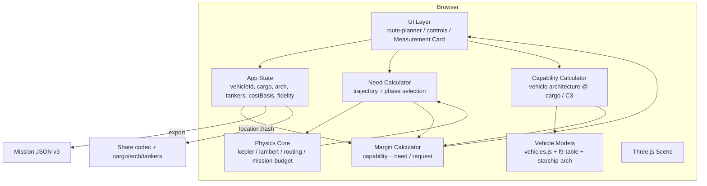
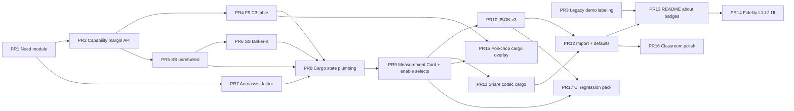

# HELIOS Cargo-Aware Vehicle Platform

| Field | Value |
|---|---|
| **Document title** | HELIOS Cargo-Aware Vehicle Platform |
| **Author** | HELIOS engineering (design owner TBD for product sign-off) |
| **Date** | 2026-07-16 |
| **Status** | Approved for implementation (rev 3 — design review consensus; K25 arch-default freeze) |
| **Repo** | `C:\Users\kevin\workspace\k-solar-system-navigator` |
| **Branch baseline** | `main` (tip includes trip planner, `vehicles.js` SH-only model, mission-budget, porkchop, share codec, catalog) |
| **Audience** | Senior engineers implementing evolutionary PRs |
| **Prior design** | `docs/trip-planner-design.md` (evolutionary trip planner — largely implemented) |
| **Supersedes (product framing)** | SH-only transfer feasibility as the **primary** product story; keeps it as an explicitly labeled **legacy demo** preset |

---

## Overview

HELIOS already delivers browser-first interplanetary trip planning: JPL Approximate Positions ephemeris (`js/physics/kepler.js`), dual-branch Lambert transfers (`js/physics/lambert.js` + `js/physics/routing.js`), multi-leg gravity assists, porkchop C3/V∞ grids (`js/physics/porkchop-grid.js`), patched-conic parking budgets (`js/physics/mission-budget.js`), shareable plan hashes (`js/ui/share-codec.js` v1), and JSON mission export (`js/ui/mission-export.js` schema v2). Feasibility today is a **single scalar comparison**: `getTransferBudget(vehicleId)` ≥ `requiredDeltaV(td)` under a cost basis (`helio` | `mission`). The only architecture-aware preset is Super Heavy with fully-loaded Starship as payload and **all Starship propellant reserved**, yielding a fixed ~3767 m/s transfer budget (`js/physics/vehicles.js`, golden in `tests/vehicles_presets.mjs`).

This design evolves HELIOS into the **go-to browser platform for solar-system trip planning measurements** by making **cargo mass a first-class input** and by restructuring results around three always-paired calculators — **Need**, **Capability**, and **Margin** — for the same mission phase. Sample vehicle architectures expand from SH-only theatrics to **Falcon 9** (payload-vs-C3 tables) and **Starship + Super Heavy** (unrefueled LEO→TMI injection, N-tanker refuel, optional aeroassist on capture Need), while remaining **educational / concept-grade**: no SpaceX warranty, no flight ops, no mandatory SPICE, no backend.

---

## Background & Motivation

### Current product (verified in code)

| Layer | Reality on `main` |
|---|---|
| **Vehicle model** | `js/physics/vehicles.js`: `VEHICLE_SPECS` for Super Heavy + Starship; `superHeavyDeltaV()` rocket equation with SS dry+prop as payload; `usableStarshipPropellant() === 0`; `getTransferBudget('sh-starship')` ≈ **3766.67 m/s**; abstract presets `chem-medium` 6000 / `fh-class` 9000 / `high-energy` 15000 / user `abstract` |
| **Feasibility UI** | `js/ui/route-display.js` `vehicleBlockHtml`: Required Δv vs Usable transfer Δv → YES/NO; SH lines show reserved Starship Δv; no cargo mass, no C3-linked capability |
| **Cost basis** | `js/ui/mission-budget-ui.js` `requiredDeltaV(td)`: multi-leg → helio multi total; single-leg `mission` → `computeMissionBudget(td).totalMission`; else helio Lambert/Hohmann |
| **Mission budget** | `js/physics/mission-budget.js`: 100 km parking escape/capture from V∞; moon-aware phases; **no cargo, no aeroassist factor**; `escapeFromLowOrbitDV` is **private** — callers use `computeMissionBudget(td).departure.total` / `.arrival.total` |
| **Trajectory need** | Lambert `dv1`/`dv2`, porkchop `c3` / arrival `vinf`; C3 **not** stored on `transferData` from `routing.js` (must recompute from \(v_{\infty,\mathrm{dep}}^2\)); export maneuvers may include `v_inf_m_s` / `c3_m2_s2` for single-leg |
| **Share / export** | Share codec **v1** (`veh`, `ab`, `basis`, `view`); JSON **schema_version: 2** with `feasibility.transfer_dv_budget_m_s` + boolean `feasible`; `buildPlanObject` is **private** in `mission-export.js` |
| **State** | `js/state.js`: `vehicleId`, `abstractBudget_m_s`, `costBasis` — **no** `cargoMass_kg`, architecture mode, tanker count, or fidelity level |
| **Controls** | `index.html` `#vehicle-select` options; abstract budget row; cost-basis select; wired in `js/ui/controls.js` |
| **Classroom** | **Already on main:** `?mode=classroom` in `js/main.js` sets schematic + `vehicleId: 'abstract'` + helio |
| **Ephemeris fidelity** | Default L1-class offline JPL approx; optional Horizons adapter exists (`js/physics/ephemeris-horizons.js`) but is not framed as a measurement badge on the results card |
| **UI label** | Default SH option text is still “Super Heavy + Starship” (not yet “legacy demo”) |

### Pain points this design addresses

| Pain | Evidence | Impact |
|---|---|---|
| SH-only cartoon as primary story | README still frames “Starship propellant reserved; transfer = Super Heavy only”; default `vehicleId: 'sh-starship'` | Users treat booster Δv as mission capability; cargo never appears |
| Feasibility is Δv-only | `budget >= requiredDv` in `vehicleBlockHtml` / export | Cannot answer “how much cargo can this window lift?” or “how many tankers?” |
| Capability ignores C3 | Fixed transfer budgets for all presets | Real launch vehicles are **payload at C3**, not constant Δv |
| Starship model never burns for transfer | `usableStarshipPropellant() → 0` | Unrefueled and tanker-refuel educational modes are impossible |
| Measurement not productized | Results panel is a flat list of Δv rows | Hard to compare Need vs Capability vs Margin, or share a “measurement card” |
| Trust ceiling opaque | Methodology in about modal / export, not per-result badge | Users cannot see L1 default vs optional Horizons compare vs out-of-scope SPICE |

### Strengths to preserve

1. Pure physics modules under `js/physics/*` (no DOM) with offline golden tests via `tests/run_physics.mjs`.
2. Cost-basis honesty (helio vs mission parking) already fixed relative to the prior trip-planner design (K6).
3. Share hash + JSON export/import recompute geometry and never trust stored Δv (`mission-import.js`).
4. Porkchop already emits **C3** and arrival **V∞** per cell — natural input to Falcon 9 tables and injection Need.
5. Classroom mode abstract default already implemented and tested.

---

## Goals & Non-Goals

### Goals

1. **Three calculators, always paired** — for any computed single-leg (and multi-leg where defined) result, report **Need**, **Capability**, and **Margin** for the **same mission phase**.
2. **Cargo-first input** — payload mass (kg) is first-class in `state`, UI, share codec, and JSON export.
3. **Sample architectures** — ship **Falcon 9** (expendable + ASDS derate) and **Starship + Super Heavy** (legacy-demo, unrefueled LEO→TMI **injection**, N-tanker) as educational models with sourced, labeled tables and disclaimers.
4. **Mission Measurement Card** — unified results surface + JSON **v3** + share extensions (`cargo`, `veh`, `tankers`, `arch`).
5. **Fidelity badges L1–L3** — L1 default (JPL approx); L2 optional Horizons compare; L3 SPICE out of default product scope.
6. **Deprecate SH-only primary** — keep current rocket-eq SH transfer budget as **`legacy-demo`** architecture with strong UI disclaimer; flip new-session default to cargo-aware `unrefueled` only when Measurement Card / evaluate* is live (**PR 9**, K23/K25).
7. **Evolutionary delivery** — 12–18 independently mergeable PRs with tests; browser-first; no mandatory backend.

### Non-Goals

| Non-goal | Rationale |
|---|---|
| **SpaceX / NASA flight performance certification** | Illustrative published-ish numbers only; every surface carries disclaimer |
| **Full stage-by-stage 6DOF / GNC / fairing dynamics** | Concept-grade mass ratios and tables |
| **Mandatory network / SPICE kernels (L3 default)** | Offline L1 remains the planning path; SPICE never required |
| **Real tanker rendezvous simulation** | N-tanker = discrete propellant increments, not docking geometry |
| **Propulsive landing Δv as ops product** | Optional aeroassist **factor** on capture Need only; not full EDL |
| **Replacing abstract class budgets entirely** | Keep `abstract` / `chem-medium` / etc. as Δv-only comparison tools |
| **Multi-leg full patched-conic parking budget** | Remains single-leg only (existing rule); multi-leg Need stays helio sum |
| **Backend pricing, accounts, or telemetry APIs** | Stateless browser + static hosting |
| **Claiming Falcon 9 / Starship performance guarantees** | Explicit educational labels; cite public illustrative sources in data tables |
| **Live / external vehicle performance APIs or scraped payload guides** | No runtime fetch of SpaceX/ULA catalogs; in-repo frozen educational tables only (reinforces Alt 4) |

### Success Metrics

| Metric | Baseline (today) | Target after platform |
|---|---|---|
| Cargo as plan input | Absent | Cargo kg in state, UI, share, JSON v3 for all cargo-aware vehicles |
| Feasibility framing | YES/NO on fixed transfer Δv | Need / Capability / Margin triad always visible on Measurement Card |
| Vehicle samples | SH-only rocket-eq + abstract Δv classes | + F9 expendable/ASDS tables; + SS/SH arch modes (legacy, unrefueled, N-tanker) |
| Primary SH-only story | Default preset, README hero claim | Renamed/labeled **legacy demo**; new sessions default arch **unrefueled** only after PR 9 Card |
| Export honesty | schema v2 feasibility boolean | schema v3 `measurement` + retained deprecated `feasibility` mirror |
| Share fidelity | codec v1 `veh`/`ab` | codec v1 + `cargo`/`tankers`/`arch`/`f9v` |
| Test coverage | `vehicles_presets.mjs` SH golden only | F9 interp, SS cargo rocket-eq, tanker N, triad kinds, share cargo+f9v |
| Trust labeling | About modal | Per-result L1/L2 badge; L3 “out of scope” copy only |

---

## Proposed Design

### Product architecture (target)



### Need / Capability / Margin control flow

```mermaid
sequenceDiagram
  participant User
  participant RP as route-planner.js
  participant RT as routing.js / lambert
  participant MB as mission-budget.js
  participant NEED as need.js
  participant CAP as vehicles / f9 / starship-arch
  participant MC as measurement-card UI

  User->>RP: Origin, dest, dates, cargo, vehicle, arch
  RP->>RT: solveTransferOrbit / multi-leg
  RT-->>NEED: Lambert vectors / helio Δv
  NEED->>NEED: C3 = |V∞_dep|² (recompute; not on transferData)
  NEED->>MB: computeMissionBudget for parking-derived phases
  NEED-->>MC: Need (phase-aligned need_dv, c3, v_inf; NO cargo)
  MC->>CAP: need + state cargo/arch/variant
  CAP-->>MC: Capability (max cargo or available Δv)
  MC->>MC: evaluateMargin(need, capability, {cargoMass_kg})
  MC-->>User: Measurement Card (L1 badge, disclaimers)
```

### Design pillar A — Three calculators

Always report the triad for the **same phase**. Phase is chosen by **architecture-aware auto rules** (K18), not by cost-basis alone for cargo-aware Starship modes.

| Phase id | What Need means | What Capability means | Primary margin |
|---|---|---|---|
| `helio_leg` | Sum of heliocentric Lambert (or multi-leg) Δv | Usable transfer Δv (legacy SH, abstract classes) | capability_dv − need_dv |
| `mission_parking` | `computeMissionBudget(td).totalMission` (single-leg only) | Usable propulsive Δv when user **explicitly** overrides phase (see below) | capability_dv − need_dv |
| `injection` | **Departure only:** `computeMissionBudget(td).departure.total` (parking escape / TMI injection Need) | F9: max payload at C3; SS unrefueled/tanker: rocket-eq Δv or max cargo / tankers at that Need | mass or Δv or tankers |

**Normative phase rules (frozen — K18):**

| Vehicle / arch | Multi-leg | Default phase | Notes |
|---|---|---|---|
| Any | yes | `helio_leg` always | Same as today’s mission-basis coerce; `multi_leg: true` on Need object; **never null** |
| `falcon9` | no | `injection` | Mass-at-C3 primary; Need still reports injection Δv for transparency |
| `sh-starship` + `legacy-demo` | no | costBasis → `helio_leg` or `mission_parking` | Matches today’s Δv YES/NO story |
| `sh-starship` + `unrefueled` | no | **`injection`** | LEO→TMI: SS burns vs **departure parking escape only** — not full mission, not full helio unless user overrides |
| `sh-starship` + `tanker-n` | no | **`injection`** | Tanker count solves against injection Need only by default |
| abstract / chem-* / fh-class / high-energy | no | costBasis → `helio_leg` or `mission_parking` | Δv-only presets |

**User override:** `state.measurementPhase` may force `helio_leg` | `mission_parking` | `injection` when not multi-leg. For unrefueled/tanker, override to `mission_parking` is allowed **only** with UI copy: “Models SS propulsive Δv vs full parking mission (dep+arr); capture is not aeroassist unless factor applied on Need.” Override to `helio_leg` is allowed with copy that this is **not** the LEO→TMI staging story.

**Other frozen rules:**

1. F9 primary metric is **mass margin at departure C3** (injection phase); show injection Δv Need as secondary only; **no** constant F9 Δv budget.
2. Abstract presets: Capability = fixed/user Δv; cargo input disabled (K16).
3. Margin units must match: never subtract kg from m/s. One **primary** margin on the card.
4. **Need never contains cargo.** Cargo is request state / capability input only (K19).
5. **Injection Need source:** when Lambert-ok, call `computeMissionBudget(td)` and set `need_dv_m_s = budget.departure.total`. Do **not** re-implement private `escapeFromLowOrbitDV`. When not Lambert-ok, injection Need is `null` and capability evaluation is skipped with UI “Need unavailable.”
6. **C3 source:** \(C_3 = |\mathbf{v}_{\infty,\mathrm{dep}}|^2\) in m²/s², using the **same parent-relative V∞ construction as** `computeMissionBudget` / porkchop `evaluateCell` (`v1_lambert − v_body` for planet origins). Convert to km²/s² only at F9 table boundary (`c3_m2_s2 / 1e6`). C3 is **recomputed in Need**; not read from `transferData` fields that do not exist today.

**New pure module:** `js/physics/need.js`

```js
/**
 * @typedef {'helio_leg'|'mission_parking'|'injection'} MissionPhase
 * @returns {{
 *   phase: MissionPhase,
 *   need_dv_m_s: number|null,
 *   c3_m2_s2: number|null,
 *   v_inf_dep_m_s: number|null,
 *   v_inf_arr_m_s: number|null,
 *   breakdown: Array<{label:string, dv_m_s:number}>,
 *   multi_leg: boolean,
 *   aeroassist_factor_applied: number,
 * }}
 * // NOTE: no cargoMass_kg — cargo is not a Need field
 */
export function computeNeed(td, { phase, aeroassistFactor = 0 }) { /* ... */ }
```

`requiredDeltaV(td)` becomes a thin wrapper that calls `computeNeed` for the **active auto/override phase** and returns `need_dv_m_s` (or Infinity if null) for any remaining legacy callers during migration.

**Migration freeze (K25):** Until PR 9 ships the Measurement Card, default `state.starshipArch` remains **`legacy-demo`** so `autoPhase` continues to follow costBasis (helio/mission) and YES/NO Required Δv is unchanged on main. Default **`unrefueled`** is flipped only in PR 9 (when evaluate* is the feasibility path), not in PR 8 state plumbing.

### Design pillar B — Falcon 9 sample

**Preset id:** `falcon9` (vehicle select option — **not selectable until Measurement Card path is live**; see PR 8 sequencing).

**Model:** piecewise **payload mass vs C3** table (illustrative). Not rocket-equation staging.

| Field | Spec |
|---|---|
| Variants | `expendable` (full table) and `asds` with **`F9_ASDS_DERATE = 0.65`** (frozen) |
| Applicability | **Earth-departure only:** origin is Earth **or** `originSOIParent` is Earth (e.g. Moon origin uses Earth-parent V∞/C3 for table — still labeled “Earth SOI departure sample”). Non-Earth planet origins, multi-leg, or waypoint-only sketches → `capability = null`, UI: “F9 sample is Earth-departure only.” |
| C3 domain for interplanetary | Use table knots with **`c3_km2_s2 ≥ 0` only** for transfers. Negative-C3 LEO-context knot(s) may exist in the array for classroom LEO demos but are **not** used when interpolating Mars/interplanetary windows (clamp/interp starts at C3=0). |
| Inputs | Departure C3 from Need (m²/s² → km²/s²); requested `cargoMass_kg` from **state** |
| Outputs | `max_cargo_kg` at C3 (piecewise linear); margin via `evaluateMargin`; `feasible = margin ≥ 0` |
| Labels | “Illustrative public-order payload-vs-C3 curve — **not** SpaceX performance guarantee; not GTO/GEO catalog substitution” |
| Sources | In-module comment + `sources` array; **no UG revision year in UI** (K20); no runtime performance fetch |

**Proposed data module:** `js/data/falcon9-c3-table.js` (or `js/physics/falcon9.js`)

```js
/** Frozen educational knots — golden-tested; do not “update to match” live SpaceX numbers. */
export const F9_C3_PAYLOAD_KG = [
  // c3_km2_s2: -2 is LEO-context only; interplanetary interpolation uses c3 >= 0
  { c3_km2_s2: -2, payload_kg: 22800, context: 'leo_only' },
  { c3_km2_s2: 0,  payload_kg: 16000 },
  { c3_km2_s2: 10, payload_kg: 8500 },
  { c3_km2_s2: 20, payload_kg: 4500 },
  { c3_km2_s2: 40, payload_kg: 2000 },
  { c3_km2_s2: 60, payload_kg: 900 },
  { c3_km2_s2: 80, payload_kg: 400 },
];
export const F9_ASDS_DERATE = 0.65;
export const F9_C3_INTERPLANETARY_MIN_KM2_S2 = 0;
export const F9_C3_MAX_KM2_S2 = 80;

export function maxPayloadAtC3(c3_m2_s2, variant = 'expendable') {
  // c3_km2 = c3_m2_s2 / 1e6
  // interplanetary: clamp/interp on knots with c3_km2_s2 >= 0
  // above F9_C3_MAX → out_of_range, max_cargo null
  // ASDS: expendable_payload * F9_ASDS_DERATE
}
```

### Design pillar C — Starship + Super Heavy sample

**Preset id:** keep `sh-starship`; architecture mode `state.starshipArch`.

| Mode id | Behavior | Default phase | Primary outputs |
|---|---|---|---|
| `legacy-demo` | Current SH rocket-eq; SS prop reserved; cargo **ignored**; amber disclaimer | costBasis helio/mission | Fixed Δv ≈ 3767 m/s |
| `unrefueled` | After SH places stack in LEO-class orbit, **Starship** burns for **injection** with rocket equation + cargo. **Full tanks at burn epoch** (see frozen constants). SH Δv not double-counted as interplanetary | **`injection`** | max cargo @ Need **or** Δv @ cargo |
| `tanker-n` | Start from full-tank baseline; each tanker adds fixed prop delivery until injection Need met or cap | **`injection`** | tankers_needed **or** max cargo @ N **or** infeasible |

#### Frozen propellant / tanker constants (K21)

| Constant | Value | Meaning |
|---|---|---|
| `SS_DRY_KG` | `VEHICLE_SPECS.starship.dryMass` = **120_000** | Dry mass |
| `SS_PROP_MAX_KG` | `VEHICLE_SPECS.starship.propellantMass` = **1_200_000** | Tank volume cap |
| `SS_PROP_LEO_KG` | **1_200_000** | Propellant at burn epoch for `unrefueled` and as baseline before tankers |
| `SS_ISP` | **350** | Matches existing `starship.isp` |
| `M_TANKER_DELIVER_KG` | **100_000** | Educational quanta per tanker flight |
| `MAX_TANKERS` | **20** | Hard cap |
| Prop after N tankers | `min(SS_PROP_MAX_KG, SS_PROP_LEO_KG + N * M_TANKER_DELIVER_KG)` | With full LEO baseline, N tankers only help if design later lowers LEO prop; **normative educational story:** `unrefueled` = full tanks without *extra* tanker flights; `tanker-n` allows solving as if starting from a **reduced** LEO residual when product needs headroom — **freeze for v1:** baseline prop = `SS_PROP_LEO_KG` full; tanker mode adds delivery **only up to cap**, so with full baseline tankers cannot increase prop further. |

**v1 tanker story (frozen clarification):** For educational tanker counting against high injection Need at large cargo, use:

- Effective prop for N tankers: `min(SS_PROP_MAX_KG, SS_PROP_BASE_KG + N * M_TANKER_DELIVER_KG)`
- **`SS_PROP_BASE_KG = 0` for `tanker-n` mode** (start empty-of-transfer-prop educational “tankers fill the ship in LEO”), while **`unrefueled` uses `SS_PROP_LEO_KG = SS_PROP_MAX_KG`** (full ship, zero extra tankers).

This matches PR 5 AC (zero-cargo Δv = `starshipDeltaV()` for unrefueled) and makes tanker-N meaningful (fill from empty educational baseline to full). Label UI: “Educational tanker fill model — not SpaceX ops sequencing.”

**“Unrefueled” naming (K21):** Means **no additional tanker flights** beyond the LEO full-tank assumption — **not** residual prop after Earth ascent with empty tanks.

#### Optional aeroassist (K11, frozen)

- `state.aeroassistFactor` clamped to **[0, 0.9]**, default **0**.
- **Single application site:** only inside `computeNeed`, scaling the **arrival capture contribution** (`budget.arrival.total * (1 - factor)`) when phase includes arrival (`mission_parking`) or when breakdown shows arrival. For phase `injection`, aeroassist is a **no-op** (injection is departure-only).
- **Capability APIs never accept `aeroassistFactor`.**

#### Core equation

\[
\Delta v = I_{sp}\, g_0\, \ln\frac{m_{\mathrm{dry}} + m_{\mathrm{prop}} + m_{\mathrm{cargo}}}{m_{\mathrm{dry}} + m_{\mathrm{cargo}}}
\]

**Proposed API:** `js/physics/starship-architecture.js` (or extensions on `vehicles.js`)

```js
/**
 * @param {{
 *   arch: 'legacy-demo'|'unrefueled'|'tanker-n',
 *   cargoMass_kg: number,
 *   tankers: number|null,   // fixed N, or null to solve min N (tanker-n)
 *   need_dv_m_s: number,    // MUST be phase-aligned (default injection)
 * }} opts
 * // NO aeroassistFactor here
 */
export function evaluateStarshipCapability(opts) { /* ... */ }
```

**Deprecation path:** share omit-`arch` → `legacy-demo` **forever** (K8). Session default stays **`legacy-demo` through PR 8**; flips to **`unrefueled` in PR 9** when Card + evaluate* replace YES/NO (K25). `legacy-demo` remains selectable.

### Design pillar D — Mission Measurement Card

**UI location:** `js/ui/measurement-card.js`; replaces `vehicleBlockHtml` feasibility block in `route-display.js`.

**Hard sequencing rule (K22):** F9 and non-legacy Starship arch **must not** be user-selectable on the old Δv YES/NO path. PR 8 either (a) lands state/plumbing only without new select options, or (b) is merged with PR 9 Measurement Card + capability wiring. Prefer **PR 8 = state + hidden plumbing; PR 8b/9 = expose selects + Card together**.

**Card sections:**

1. **Title** — “MISSION MEASUREMENT” + fidelity badge (L1 / L2)
2. **Trajectory Need** — phase, C3, V∞, need Δv breakdown
3. **Vehicle Capability** — arch, cargo requested, max cargo / Δv / tankers
4. **Margin** — primary metric; unit label mandatory
5. **Disclaimers** — always visible, compact

#### JSON export schema v3

- **`schema_version`: 3**
- **New** top-level `measurement` block (source of truth for triad)
- **Retain** v2-style `feasibility` block as a **deprecated mirror** of primary margin for back-compat (`vehicle_id`, `transfer_dv_budget_m_s` when metric is Δv else null, `required_dv_m_s`, `feasible`, `disclaimer`). Importers prefer `plan_request` / `measurement` for vehicle config; never trust stored Δv for geometry.
- Keep dual summary totals: `heliocentric_total_dv_m_s`, `mission_total_dv_m_s`, `cost_basis`
- **Export `buildPlanObject`** from `mission-export.js` for offline unit tests (PR 10)

```json
{
  "schema_version": 3,
  "measurement": {
    "fidelity": "L1",
    "phase": "injection",
    "need": {
      "dv_m_s": 0,
      "c3_m2_s2": 0,
      "v_inf_dep_m_s": 0,
      "v_inf_arr_m_s": 0,
      "breakdown": []
    },
    "capability": {
      "vehicle_id": "falcon9",
      "variant": "expendable",
      "arch": null,
      "primary_metric": "cargo",
      "max_cargo_kg": 0,
      "capability_dv_m_s": null,
      "tankers_used": null,
      "tankers_needed": null,
      "applicable": true
    },
    "margin": {
      "kind": "cargo_kg",
      "value": 0,
      "feasible": true
    },
    "cargo_requested_kg": 1000,
    "disclaimer": "…"
  },
  "feasibility": {
    "vehicle": "Falcon 9 (illustrative)",
    "vehicle_id": "falcon9",
    "transfer_dv_budget_m_s": null,
    "required_dv_m_s": 0,
    "cost_basis": "helio",
    "feasible": true,
    "deprecated": true,
    "disclaimer": "…"
  },
  "plan_request": {
    "v": 1,
    "o": "earth",
    "d": "mars",
    "dep": "2026-11-21",
    "tof": 258,
    "veh": "falcon9",
    "cargo": 1000,
    "arch": null,
    "tankers": null,
    "f9v": "exp",
    "basis": "helio",
    "view": "cinematic"
  }
}
```

#### Import mapping (`planJsonToRequest`) — explicit v3 fields

| Source | Maps to request field |
|---|---|
| `plan_request.cargo` or top-level cargo | `cargoMass_kg` (int, clamp 0–500000; default 0) |
| `plan_request.arch` | `starshipArch` (`legacy`→`legacy-demo`, `unrefuel`→`unrefueled`, `tanker`→`tanker-n`) |
| `plan_request.tankers` | `tankerCount` |
| `plan_request.f9v` | `falcon9Variant` (`exp`→`expendable`, `asds`→`asds`) |
| `plan_request.veh` / `feasibility.vehicle_id` | `vehicleId` (existing) |
| `measurement.*` | **Never** applied as live Need/Capability numbers |

#### Share codec extensions

| Param | Meaning | Notes |
|---|---|---|
| `cargo` | integer kg | omit if 0; clamp 0–500000 |
| `arch` | `legacy` \| `unrefuel` \| `tanker` | omit → see K8 |
| `tankers` | integer N | 0–20 |
| `veh` | existing + `falcon9` | |
| `f9v` | `exp` \| `asds` | default exp |

Keep `v=1` if total hash ≤ `MAX_LEN` (1500). Prefer short tokens (K7).

**K8 (frozen, permanent):** `veh=sh-starship` with **omitted** `arch` ⇒ **`legacy-demo`** forever (reproducible old links). Notify string stable: `SHARE USED LEGACY SH DEMO MODEL (NO ARCH PARAM)`. **New UI sessions** (no hash / no import) default `starshipArch = 'unrefueled'` **only after PR 9** (K25); before PR 9, session default is `legacy-demo`. No time-based migration.

### Design pillar E — Fidelity badges L1–L3

| Level | Meaning | Product behavior |
|---|---|---|
| **L1** | JPL Approximate Positions + Lambert + patched-conic sketches | **Default**; offline |
| **L2** | Optional Horizons VECTOR compare | Badge after opt-in compare; planning math remains L1 |
| **L3** | SPICE kernels | Out of scope — popover only |

### Design pillar F — Deprecate SH-only as primary feasibility

| Action | Detail |
|---|---|
| Rename UI label | “Super Heavy + Starship (legacy demo)” |
| New session default arch | `legacy-demo` until PR 9; **`unrefueled` from PR 9 onward** (K25) |
| Share omit arch | `legacy-demo` forever |
| README | Need/Capability/Margin + cargo samples |
| Classroom | **Keep** abstract + schematic (already on main); do not switch to F9 by default |
| Golden SH | Keep `superHeavyDeltaV()` ≈ 3766.67 for `legacy-demo` |

---

## API / Interface Changes

### State (`js/state.js`)

```js
// Additive fields
cargoMass_kg: 0,
// PR 8 initial default (behavior-preserving while YES/NO still live):
starshipArch: 'legacy-demo',
// PR 9+ product default (Card/evaluate* live) — flip in same PR as Card:
// starshipArch: 'unrefueled',
tankerCount: null,               // null = auto min-N when arch is tanker-n
falcon9Variant: 'expendable',
aeroassistFactor: 0,             // clamped [0, 0.9] in computeNeed only
measurementPhase: 'auto',        // 'auto' | 'helio_leg' | 'mission_parking' | 'injection'
fidelityLevel: 'L1',
```

### Unified capability / margin entry points

```js
// js/physics/vehicles.js (or capability.js)
export function evaluateCapability({
  vehicleId,
  abstractBudget_m_s,
  cargoMass_kg,
  starshipArch,      // REQUIRED for sh-starship — no silent legacy default inside hot path after PR 9
  tankerCount,
  falcon9Variant,
  need,              // from computeNeed (phase already aligned)
  originBody,        // for F9 Earth-only gate
  isMultiLeg,
}) {
  // returns capability + primary_metric + disclaimer + applicable:boolean
}

/**
 * Cargo comes from request/state, NEVER from need.
 * @param {object} need
 * @param {object} capability
 * @param {{ cargoMass_kg: number }} request
 */
export function evaluateMargin(need, capability, request) {
  // kind-enforced; mixed units → { kind:'error', feasible:false }
}
```

### UI controls

- Cargo, arch, F9 variant, aeroassist — shown only when vehicle/arch applicable.
- **Do not** add `falcon9` or non-legacy arch to `#vehicle-select` until Card uses evaluateCapability (K22).

### Backward-compatible wrappers (post–PR 9)

| Existing API | Behavior |
|---|---|
| `getTransferBudget(id, ab, opts?)` | Abstract/chem unchanged. For `sh-starship`, **must** receive `opts.arch`; if missing in tests, default `legacy-demo` for golden SH only. Production UI **must not** call this for feasibility after PR 9. |
| `transferBudgetNow()` | **Deprecated for feasibility** after PR 9. May remain as debug helper returning Δv-only capability when `primary_metric === 'dv'`, else `null` (never `Infinity`). |
| Feasibility UI / export | **Only** `evaluateCapability` + `evaluateMargin` |
| `requiredDeltaV(td)` | Delegates to `computeNeed` with autoPhase |

---

## Data Model Changes

### Share / plan_request examples

```
#v=1&o=earth&d=mars&dep=2026-11-21&tof=258&veh=falcon9&cargo=2000&f9v=exp&basis=helio&view=cinematic
#v=1&o=earth&d=mars&dep=2026-11-21&tof=258&veh=sh-starship&cargo=50000&arch=tanker&tankers=4&basis=helio
#v=1&o=earth&d=mars&dep=2026-11-21&tof=258&veh=sh-starship&basis=helio
  → arch omitted ⇒ legacy-demo + notify
```

### JSON schema

| Version | Support |
|---|---|
| v1 | Import recompute from names (existing) |
| v2 | Import `plan_request` + feasibility vehicle_id; no cargo |
| v3 | `measurement` + retained deprecated `feasibility` + `plan_request` cargo/arch/tankers/f9v |

### Migration strategy

1. No server DB.
2. Old share without `cargo` → `cargoMass_kg = 0`.
3. Omitted `arch` on sh-starship → **`legacy-demo` forever** (K8).
4. Export writes v3 after PR 10; multi-version import forever.

---

## Alternatives Considered

### Alt 1 — Keep fixed Δv budgets; cargo cosmetic only

**Rejected:** cargo must affect Capability math.

### Alt 2 — Full multi-stage trajectory optimization in-browser

**Rejected:** concept-grade tables + rocket equation; SPICE/L3 non-goal.

### Alt 3 — Single “mission score”

**Rejected:** hides unit mismatches; triad is the product.

### Alt 4 — Server-side / live vehicle performance APIs

**Rejected:** browser-first; legal/ToS; offline classroom; non-goal for live scrapes.

---

## Security & Privacy Considerations

| Topic | Approach |
|---|---|
| **Threat model** | Static educational site; no auth; plans in URL hash and local JSON |
| **Hash length** | `MAX_LEN` 1500 |
| **Input clamps** | Cargo 0–500000; tankers 0–20; aeroassist [0, 0.9]; abstract budget existing |
| **Horizons L2** | Opt-in network only |
| **Disclaimers** | Card + export + about |
| **No live performance feeds** | Frozen in-repo tables only |

**Risk (Medium):** Users screenshot feasible without disclaimer.  
**Mitigation:** Disclaimer adjacent to badge; export requires disclaimer field.

**Risk (High):** F9 selectable on old YES/NO path → always-feasible Infinity.  
**Mitigation:** K22 sequencing — no F9 select until Card path.

---

## Observability

| Signal | Mechanism |
|---|---|
| Offline tests | F9 interp, SS cargo, tanker N, triad kinds, share cargo+f9v+omit-arch |
| UI smoke | F9+cargo card; legacy banner; non-Earth F9 null capability |
| Logging | `?debug=1` need/capability/margin objects |
| CI | `npm test` / `tests/run_physics.mjs` |

---

## Rollout Plan

### Phases

1. **Foundation Integrity** — Need API, capability/margin types, legacy labeling  
2. **Vehicle Models** — F9 tables, SS architectures, aeroassist on Need  
3. **Cargo UX** — state plumbing first; Measurement Card + expose selects together  
4. **Measurement Platform** — JSON v3, share, import, README, session default arch  
5. **Stretch** — L2 badge, porkchop cargo, classroom polish (non-blocking for platform launch)

### Staged rollout

1. Pure modules + tests (no UI default change; PR 3 labeling only).  
2. State plumbing without new vehicle options; default arch still **legacy-demo** (PR 8).  
3. Measurement Card + evaluate* + enable F9/arch selects + **flip session default to unrefueled** (PR 9).  
4. Export/share/import (PR 10–12); PR 12 asserts post–PR 9 unrefueled default.  
5. README last among core (PR 13).

### Rollback

Each PR independently revertible; share without new params keeps working; F9 knots pinned by golden tests.

---

## Risks

| Risk | Severity | Mitigation |
|---|---|---|
| Users treat F9/SS as certified | **High** | Disclaimers; illustrative labels |
| Unit confusion kg vs m/s | **High** | `evaluateMargin` kind enforcement |
| F9 on old Δv YES/NO | **High** | K22: no select until Card |
| Split brain getTransferBudget vs Card | **High** | Post–PR 9 feasibility only via evaluate* |
| Wrong SS phase (full mission vs injection) | **High** | K18: unrefueled/tanker default injection |
| PR 8 unrefueled default flips Required Δv before Card | **High** | K25: PR 8 default legacy-demo; flip unrefueled only in PR 9 |
| Share omit-arch ambiguity | **Medium** | K8 permanent legacy-demo |
| Hash length overflow | **Medium** | Short tokens; MAX_LEN fixtures |
| Aeroassist double-apply | **Low** | Need-only; clamp [0, 0.9] |
| Multi-leg parking scope creep | **Medium** | Non-goal; phase force helio |

---

## Open Questions (non-blocking residual)

Resolved into Key Decisions where launch-blocking (see K18–K23). Product polish follow-ups (**done on main**):

1. **Porkchop cargo** — selected-cell readout + **MAX CARGO** heatmap metric (`js/physics/porkchop-cargo.js`, Color by control). Green = higher max cargo (F9 Earth C3 table or SS unrefueled/tanker @ cell Δv). Isoline contours still optional / not required.
2. **`fh-class` display** — UI + preset name is “Heavy-lift chemical (abstract)”; id stays `fh-class` for share back-compat; disclaimer excludes Falcon Heavy.
3. **`?debug=1`** — Measurement Card logs Need / Capability / Margin to the console.

---

## References

- Prior product design: `docs/trip-planner-design.md`  
- **Next fidelity execution plan:** `docs/ephemeris-fidelity-platform-design.md` (L1 / L2-compare / L2-plan; main-only delivery)  
- **Reliability / no silent failures:** `docs/trip-plan-reliability-completeness-design.md`  
- **Concept-grade boundary & extras:** `docs/concept-grade-and-extras-design.md`  
- Vehicle model: `js/physics/vehicles.js`  
- Mission parking budget: `js/physics/mission-budget.js`  
- Budget UI helpers: `js/ui/mission-budget-ui.js`  
- Results panel: `js/ui/route-display.js`  
- Export / import: `js/ui/mission-export.js`, `js/ui/mission-import.js`  
- Share codec: `js/ui/share-codec.js`, tests `tests/share_codec.mjs`  
- Porkchop C3: `js/physics/porkchop-grid.js` `evaluateCell`  
- Horizons adapter: `js/physics/ephemeris-horizons.js`  
- Vehicle golden tests: `tests/vehicles_presets.mjs`  
- Physics suite runner: `tests/run_physics.mjs`  
- App state: `js/state.js`  
- Classroom defaults: `js/main.js`  
- Controls wiring: `js/ui/controls.js`, `index.html` vehicle select  

---

## Key Decisions

1. **K1 — Need / Capability / Margin triad is mandatory on every computed route result.** Rationale: product differentiator; unit-honest margin.
2. **K2 — Cargo mass is first-class state (kg), default 0.** Rationale: enables F9 and SS cargo solves.
3. **K3 — Falcon 9 capability is payload-vs-C3 table interpolation, not rocket equation.** Rationale: educational C3 curves; C3 from Lambert/Need.
4. **K4 — F9 variants: expendable + ASDS with `F9_ASDS_DERATE = 0.65` frozen.** Rationale: two teaching cases; golden-locked.
5. **K5 — Starship family arch modes: `legacy-demo` | `unrefueled` | `tanker-n`.** Rationale: preserve demo + enable cargo/tankers.
6. **K6 — `legacy-demo` retained with strong disclaimer and SH golden test.** Rationale: no silent break of `vehicles_presets.mjs`.
7. **K7 — Share codec v1 additive params under MAX_LEN; v2 only if fixtures fail length.** Rationale: back-compat.
8. **K8 — Omitted `arch` on `veh=sh-starship` ⇒ `legacy-demo` forever + stable notify.** Rationale: reproducible old links without time-based migration. (Session default unrefueled is K23/K25, not share omit.)
9. **K9 — Primary margin: mass for F9; Δv for abstract/legacy; cargo or tankers or Δv for SS modes.** Rationale: `evaluateMargin` enforces kind.
10. **K10 — Multi-leg Need always `phase: 'helio_leg'` with `multi_leg: true` (never null).** Rationale: stable API; parking single-leg only.
11. **K11 — Aeroassist only in `computeNeed` on arrival capture; clamp [0, 0.9]; default 0; capability APIs never take it.** Rationale: single application site.
12. **K12 — Fidelity: L1 default, L2 opt-in Horizons context, L3 out of scope.** Rationale: trust without ops scope.
13. **K13 — JSON v3 adds `measurement`; retains deprecated `feasibility` mirror; never trust stored Δv for geometry; export `buildPlanObject`.** Rationale: import safety + testability.
14. **K14 — All sample vehicle numbers illustrative with required disclaimers.** Rationale: no SpaceX warranty.
15. **K15 — Evolutionary PRs; pure modules + tests before default UI flips.** Rationale: low-risk merge.
16. **K16 — Abstract presets Δv-only; cargo controls hidden.** Rationale: no fake cargo capability.
17. **K17 — Porkchop cargo contours Stretch; platform launch does not block on them.** Rationale: Card is core value.
18. **K18 — Phase auto: F9 → injection; unrefueled/tanker-n → injection (departure Need only); legacy/abstract → costBasis; multi-leg → helio_leg.** Rationale: LEO→TMI product story; avoid comparing SS Δv to full mission/helio by default.
19. **K19 — `evaluateMargin(need, capability, { cargoMass_kg })`; Need has no cargo field.** Rationale: trajectory vs request separation.
20. **K20 — F9 knots frozen in-repo with golden tests; UI says “illustrative” only (no UG revision year); interplanetary uses C3 ≥ 0; Earth-departure only.** Rationale: no proprietary scrape; prevent LEO/escape curve misuse.
21. **K21 — Propellant freeze: unrefueled full `SS_PROP_LEO_KG = 1_200_000`; tanker-n baseline prop `SS_PROP_BASE_KG = 0` + `M_TANKER_DELIVER_KG = 100_000` each, cap `SS_PROP_MAX_KG`, `MAX_TANKERS = 20`.** Rationale: implementable goldens; “unrefueled” = no extra tankers, full LEO tanks.
22. **K22 — Never expose F9 or non-legacy arch on old `transferBudgetNow` YES/NO UI; Measurement Card + evaluate* required first (PR 8 plumbing-only or merge with PR 9).** Rationale: prevent Infinity/null feasibility bugs.
23. **K23 — Default vehicle remains `sh-starship`; classroom remains abstract+schematic (existing main.js). Product end-state new-session arch is `unrefueled`, but only after Card is live (see K25).** Rationale: product continuity; stable classroom tests.
24. **K24 — After PR 9, feasibility UI and export use only evaluateCapability/evaluateMargin; getTransferBudget is test/abstract/legacy helper and must thread `arch` for sh-starship.** Rationale: no split-brain budgets.
25. **K25 — Intermediate merge freeze: PR 8 sets `state.starshipArch` default to `legacy-demo` (YES/NO + `requiredDeltaV`/`autoPhase` unchanged). PR 9 flips new-session default to `unrefueled` in the same change set as Measurement Card + evaluate* feasibility.** Rationale: after PR 1, `autoPhase(unrefueled)→injection` would silently change Required Δv and YES/NO for default SH before Card ships; K22 alone (hide F9 select) does not protect default SH.

---

## PR Plan

Phases: **Foundation Integrity** → **Vehicle Models** → **Cargo UX** → **Measurement Platform** → **Stretch**.



**Platform launch (blocking):** PR 1–13.  
**Stretch (non-blocking):** PR 14–16.  
**Optional buffer:** PR 17 under Measurement Platform.

### PR 1: Pure Need calculator module

- **Description:** Extract trajectory Need into `js/physics/need.js` with phases `helio_leg`, `mission_parking`, `injection`. Injection Need = `computeMissionBudget(td).departure.total` when Lambert-ok (no new private exports required). Recompute C3 as \(v_{\infty,\mathrm{dep}}^2\) in m²/s². Wire `requiredDeltaV` via `computeNeed` + `autoPhase` per K18. **With default arch still absent/legacy until PR 8–9**, default SH path must remain costBasis helio/mission (K25 assumes no unrefueled default yet).
- **Files/components affected:** `js/physics/need.js` (new), `js/ui/mission-budget-ui.js`, `tests/need_calculator.mjs` (new), `tests/run_physics.mjs`
- **Dependencies:** None
- **Acceptance criteria:**
  - Earth→Mars single-leg helio Need matches prior `requiredDeltaV` within 1e-6 relative for same fixture
  - When `starshipArch` is missing or `legacy-demo`, `requiredDeltaV` matches pre-PR costBasis behavior (no silent injection for default SH)
  - `mission_parking` Need equals `computeMissionBudget(td).totalMission` when Lambert-ok
  - `injection` Need equals `computeMissionBudget(td).departure.total` within 1e-6 when Lambert-ok; else null
  - C3 matches \( |\mathbf{v}_{\infty,\mathrm{dep}}|^2 \) from same vectors as mission-budget / porkchop (m²/s²)
  - Multi-leg always returns `phase: 'helio_leg'`, `multi_leg: true` (never null phase)
  - Need object has **no** cargo field
  - Offline test in physics suite green
- **Effort:** M
- **Phase:** Foundation Integrity

### PR 2: Capability / Margin evaluation API (abstract + legacy SH)

- **Description:** Add `evaluateCapability` / `evaluateMargin(need, capability, request)` for abstract presets and `sh-starship` **legacy-demo only**. Thread `starshipArch` parameter (default legacy-demo in this PR for back-compat tests). Cargo ignored for abstract/legacy. Unit-kind enforcement.
- **Files/components affected:** `js/physics/vehicles.js`, `tests/vehicles_presets.mjs` (extend), `tests/capability_margin.mjs` (new), `tests/run_physics.mjs`
- **Dependencies:** PR 1
- **Acceptance criteria:**
  - Abstract / chem-medium / fh-class / high-energy capability_dv matches `getTransferBudget`
  - Legacy SH capability_dv within ±1 m/s of 3766.67 when `arch: 'legacy-demo'`
  - `evaluateMargin` cargo path uses `request.cargoMass_kg`, not need
  - Mixed units → error kind / not feasible
  - Feasible iff capability_dv ≥ need_dv for Δv kind
  - Docs: this PR does **not** complete unrefueled capability (PR 5)
- **Effort:** M
- **Phase:** Foundation Integrity

### PR 3: Deprecate SH-only labeling (behavior-preserving)

- **Description:** Rename preset display to “Super Heavy + Starship (legacy demo)”; strengthen disclaimer. No capability math change. Independent of evaluateCapability completeness.
- **Files/components affected:** `js/physics/vehicles.js`, `index.html`, `js/ui/route-display.js` (disclaimer visibility), `tests/vehicles_presets.mjs`
- **Dependencies:** None
- **Acceptance criteria:**
  - UI label contains “legacy”
  - Disclaimer length > 40 chars and mentions not SpaceX guarantee
  - Golden SH Δv test still passes
  - No change to YES/NO for same routes under default state
- **Effort:** S
- **Phase:** Foundation Integrity

### PR 4: Falcon 9 payload-vs-C3 table model

- **Description:** Commit frozen illustrative F9 C3→payload knots; linear interpolation for C3≥0; ASDS derate 0.65; Earth-departure applicability gate; integrate into `evaluateCapability` for `falcon9`. **No UI select option yet.**
- **Files/components affected:** `js/data/falcon9-c3-table.js` or `js/physics/falcon9.js` (new), `js/physics/vehicles.js`, `tests/falcon9_c3.mjs` (new), `tests/run_physics.mjs`
- **Dependencies:** PR 2
- **Acceptance criteria:**
  - Golden interpolation at knots exact; midpoints linear within 1e-6 relative
  - ASDS max payload = expendable × 0.65
  - Interplanetary path ignores leo_only negative-C3 knots
  - Non-Earth origin / multi-leg → `applicable: false`, capability null
  - C3 unit conversion m²/s² → km²/s² documented and tested
  - Source/disclaimer strings present; primary_metric `cargo`
- **Effort:** M
- **Phase:** Vehicle Models

### PR 5: Starship unrefueled cargo rocket-equation mode

- **Description:** Implement `unrefueled` with frozen full-tank LEO prop (K21); capability vs **injection** Need by default; solve max cargo / Δv; SH staging boundary documented (no double-count).
- **Files/components affected:** `js/physics/starship-architecture.js` (new) and/or `js/physics/vehicles.js`, `tests/starship_arch.mjs` (new), `tests/run_physics.mjs`
- **Dependencies:** PR 2
- **Acceptance criteria:**
  - Zero cargo Δv matches `starshipDeltaV()` within 1 m/s (full prop)
  - Monotonicity: higher cargo ⇒ lower capability_dv
  - Inverse solve max_cargo(need) round-trips within tolerance
  - Default phase assumption in tests: injection Need, not mission_parking/helio
  - `legacy-demo` still ignores cargo
  - Constants match K21 table
- **Effort:** M
- **Phase:** Vehicle Models

### PR 6: Starship N-tanker refuel mode

- **Description:** Implement `tanker-n` with `SS_PROP_BASE_KG = 0`, `M_TANKER_DELIVER_KG = 100_000`, `MAX_TANKERS = 20`, cap at `SS_PROP_MAX_KG`. Solve min N for injection Need at cargo, or max cargo at fixed N.
- **Files/components affected:** `js/physics/starship-architecture.js`, `js/physics/vehicles.js`, `tests/starship_arch.mjs`
- **Dependencies:** PR 5
- **Acceptance criteria:**
  - Golden fixture: documented (cargo_kg, need_dv_m_s) → expected tankers_needed
  - N > 20 ⇒ feasible false
  - Fixed N returns max_cargo_kg
  - Prop never exceeds SS_PROP_MAX_KG
  - Educational disclaimer string present
- **Effort:** M
- **Phase:** Vehicle Models

### PR 7: Optional aeroassist factor on arrival capture Need

- **Description:** Apply aeroassist only in `computeNeed` to arrival capture contribution; clamp [0, 0.9]; default 0. No-op for injection-only phase and multi-leg. Capability APIs unchanged.
- **Files/components affected:** `js/physics/need.js`, `tests/need_calculator.mjs`
- **Dependencies:** PR 1
- **Acceptance criteria:**
  - factor 0 ⇒ identical to baseline Need
  - factor 0.9 on mission_parking reduces arrival contribution by 90%; departure unchanged
  - factor on injection phase is no-op
  - Values outside [0, 0.9] clamped
  - Multi-leg ignores aeroassist
- **Effort:** S
- **Phase:** Vehicle Models

### PR 8: Cargo mass state plumbing (no premature vehicle options)

- **Description:** Add `cargoMass_kg`, `starshipArch`, `tankerCount`, `falcon9Variant`, `aeroassistFactor`, `measurementPhase` to `state.js` and optional hidden/debug controls. **Do not** add `falcon9` to `#vehicle-select` or expose non-legacy arch in production UI yet (K22). **Default `starshipArch: 'legacy-demo'`** (K25) so PR 1 `requiredDeltaV`/`autoPhase` does not switch default SH to injection Need while YES/NO is still live. Wire state so PR 9 can enable selects and flip default.
- **Files/components affected:** `js/state.js`, `js/ui/controls.js` (plumbing only), `css/app.css` (minor if needed)
- **Dependencies:** PR 4, PR 5, PR 6, PR 7
- **Acceptance criteria:**
  - State fields exist; **`starshipArch` default is `'legacy-demo'`** (not unrefueled); cargo 0
  - Clamps enforced if any input is wired
  - `#vehicle-select` still has no falcon9 option
  - Existing YES/NO path behavior unchanged for default `sh-starship` (Required Δv still helio/mission costBasis; same feasible boolean as pre-PR for same routes)
  - No production path sets session default arch to unrefueled
- **Effort:** S
- **Phase:** Cargo UX

### PR 9: Mission Measurement Card UI + enable cargo-aware selects

- **Description:** Ship `measurement-card.js` triad UI; replace `vehicleBlockHtml` feasibility path with evaluateCapability/evaluateMargin; **then** enable F9 option + arch/cargo/variant controls. **Flip new-session `state.starshipArch` default from `legacy-demo` to `unrefueled`** in this same PR (K25). Deprecate transferBudgetNow for feasibility. Multi-leg helio phase.
- **Files/components affected:** `js/ui/measurement-card.js` (new), `js/ui/route-display.js`, `js/ui/mission-export.js` (interim triad fields if needed), `index.html`, `js/ui/controls.js`, `js/state.js` (default arch flip), `css/app.css`, tests
- **Dependencies:** PR 8
- **Acceptance criteria:**
  - Card shows Need, Capability, Margin sections
  - F9 Earth→Mars shows cargo margin kg primary
  - F9 non-Earth shows inapplicable message (not YES via Infinity)
  - Unrefueled uses injection Need (departure total), not full mission by default
  - Fresh load without hash: **`starshipArch === 'unrefueled'`** (default flip lives here, not PR 8)
  - Legacy-demo amber banner when arch is legacy-demo
  - No call path uses `Infinity` as transfer budget for feasibility
  - Abstract shows Δv margin
  - Feasibility UI does not use pre-Card YES/NO Δv-only path for SH
- **Effort:** L
- **Phase:** Cargo UX

### PR 10: Mission JSON export schema v3

- **Description:** Bump `schema_version` to 3; add `measurement`; retain deprecated `feasibility` mirror; extend `plan_request` with cargo/arch/tankers/f9v; export `buildPlanObject` for tests.
- **Files/components affected:** `js/ui/mission-export.js`, `tests/mission_import_check.mjs`, optional golden JSON fixture
- **Dependencies:** PR 9
- **Acceptance criteria:**
  - schema_version === 3
  - measurement.need/capability/margin present for single-leg Lambert-ok
  - feasibility.deprecated === true (or documented mirror fields present)
  - buildPlanObject is importable offline
  - Disclaimer non-empty; fidelity field present
- **Effort:** M
- **Phase:** Measurement Platform

### PR 11: Share codec cargo / arch / tankers extensions

- **Description:** Encode/parse `cargo`, `arch`, `tankers`, `f9v`; wire share.js / share-sync.js; omit-arch ⇒ legacy-demo on parse/apply (K8).
- **Files/components affected:** `js/ui/share-codec.js`, `js/ui/share.js`, `js/ui/share-sync.js`, `tests/share_codec.mjs`
- **Dependencies:** PR 9
- **Acceptance criteria:**
  - Golden round-trips: F9+cargo+f9v; SS tanker+N; SS unrefueled+cargo
  - Old hashes without cargo still parse (cargo 0)
  - Omitted arch + sh-starship → starshipArch legacy-demo
  - Encoded length ≤ MAX_LEN for fixtures
  - Unknown arch token safe fallback + notify
- **Effort:** M
- **Phase:** Measurement Platform

### PR 12: Import path + session defaults

- **Description:** Map v3 `plan_request` cargo/arch/tankers/f9v in `planJsonToRequest`; apply K8 notify on bare arch; **assert** new-session default remains unrefueled (flipped in PR 9; do not re-default to legacy-demo here); classroom remains abstract.
- **Files/components affected:** `js/ui/mission-import.js`, `js/ui/share.js`, `js/state.js`, `tests/mission_import_check.mjs`, `tests/share_codec.mjs`
- **Dependencies:** PR 10, PR 11
- **Acceptance criteria:**
  - v2 JSON still imports
  - v3 restores cargo/arch/tankers/f9v
  - Bare sh-starship share → legacy-demo + notify string exact match fixture
  - Fresh load without hash: starshipArch === 'unrefueled' (regression guard for PR 9 flip)
  - measurement block never applied as live Δv
- **Effort:** M
- **Phase:** Measurement Platform

### PR 13: README, about modal, and methodology copy

- **Description:** Rewrite SH-only marketing to triad + cargo samples; L1–L3 table; educational disclaimers; note classroom abstract already default.
- **Files/components affected:** `README.md`, `index.html` about modal, optional pointer in `docs/trip-planner-design.md`
- **Dependencies:** PR 3, PR 12
- **Acceptance criteria:**
  - README does not claim SH-only as primary capability model
  - About lists Need/Capability/Margin and sample vehicles
  - Explicit not SpaceX-certified / not flight ops sentence
- **Effort:** S
- **Phase:** Measurement Platform

### PR 14: Fidelity badge L1/L2 wiring

- **Description:** L1 default on Card; L2 after explicit Horizons compare; L3 popover only.
- **Files/components affected:** `js/ui/measurement-card.js`, `js/physics/ephemeris-horizons.js` (hooks), `js/state.js`, about modal
- **Dependencies:** PR 13
- **Acceptance criteria:**
  - Default badge L1 without network
  - L2 only after explicit compare
  - L3 never a planning mode
  - Export records fidelity
- **Effort:** M
- **Phase:** Stretch

### PR 15: Porkchop selected-cell cargo readout (Stretch)

- **Description:** When vehicle is F9 and Earth-origin, selected porkchop cell shows max cargo at cell C3. Contours optional later.
- **Files/components affected:** `js/ui/porkchop.js`, optionally `js/physics/porkchop-grid.js`, worker if needed
- **Dependencies:** PR 4, PR 9
- **Acceptance criteria:**
  - Selected cell displays maxCargo_kg for active F9 variant when applicable
  - Non-F9 / non-Earth unchanged
  - Soft perf budgets still informational-only
- **Effort:** L
- **Phase:** Stretch

### PR 16: Classroom mode polish (keep abstract default)

- **Description:** Ensure classroom mode remains schematic + abstract (existing); add methodology emphasis next to Measurement Card if missing. Optional `?veh=falcon9` is **not** classroom default.
- **Files/components affected:** `js/main.js`, `js/ui/controls.js`, `tests/trip_planning_app_mode.mjs`
- **Dependencies:** PR 12
- **Acceptance criteria:**
  - `?mode=classroom` → schematic + vehicleId abstract (existing tests still pass)
  - Methodology emphasis visible
  - No network required
- **Effort:** S
- **Phase:** Stretch

### PR 17: UI regression pack for vehicles (optional buffer)

- **Description:** Playwright coverage for vehicle switch, cargo edit, legacy banner, F9 non-Earth inapplicable, export schema_version 3 via exported `buildPlanObject` / `__HELIOS` hooks.
- **Files/components affected:** `tests/playwright_*.mjs` or `tests/ci_ui.mjs`, `js/main.js` test hooks
- **Dependencies:** PR 9, PR 10
- **Acceptance criteria:**
  - CI fails if Measurement Card root missing after Calculate Route
  - F9 + cargo path covered
  - Bare-arch share notify path covered if UI-accessible
- **Effort:** M
- **Phase:** Measurement Platform

---

### PR count and sequencing notes

- **Core launch path:** PR 1–13.  
- **Stretch:** PR 14–16 (non-blocking).  
- **Optional:** PR 17.  
- **Total:** 16–17 PRs (within 12–18).  
- Parallelism: PR 4 ∥ PR 5 after PR 2; PR 7 ∥ vehicle models after PR 1; PR 10 ∥ PR 11 after PR 9; PR 3 independent.  
- **Critical:** PR 8 must not expose F9/non-legacy selects and must keep default arch **legacy-demo**; PR 9 enables selects + Card + flips default to **unrefueled** (K25).

---

## Implementation sketch (critical interfaces)

### Margin evaluation (normative)

```js
export function evaluateMargin(need, capability, request = {}) {
  if (!capability || capability.applicable === false) {
    return { kind: 'none', value: null, feasible: false };
  }
  if (capability.primary_metric === 'cargo') {
    const cargo = Number(request.cargoMass_kg);
    if (!Number.isFinite(cargo)) {
      return { kind: 'error', value: null, feasible: false };
    }
    const value = capability.max_cargo_kg - cargo;
    return { kind: 'cargo_kg', value, feasible: value >= 0 };
  }
  if (capability.primary_metric === 'tankers') {
    return {
      kind: 'tankers',
      value: capability.tankers_needed,
      feasible: !!capability.feasible,
    };
  }
  if (capability.primary_metric === 'dv') {
    if (need.need_dv_m_s == null || capability.capability_dv_m_s == null) {
      return { kind: 'error', value: null, feasible: false };
    }
    const value = capability.capability_dv_m_s - need.need_dv_m_s;
    return { kind: 'dv_m_s', value, feasible: value >= 0 };
  }
  return { kind: 'error', value: null, feasible: false };
}
```

### Phase auto-selection (normative — K18)

```js
export function autoPhase({ vehicleId, starshipArch, costBasis, isMultiLeg, measurementPhase }) {
  if (measurementPhase && measurementPhase !== 'auto') {
    if (isMultiLeg) return 'helio_leg'; // force
    return measurementPhase;
  }
  if (isMultiLeg) return 'helio_leg';
  if (vehicleId === 'falcon9') return 'injection';
  if (vehicleId === 'sh-starship') {
    if (starshipArch === 'unrefueled' || starshipArch === 'tanker-n') return 'injection';
    // legacy-demo
    return costBasis === 'mission' ? 'mission_parking' : 'helio_leg';
  }
  // abstract / chem-* / etc.
  return costBasis === 'mission' ? 'mission_parking' : 'helio_leg';
}
```

### getTransferBudget arch threading (normative — K24)

```js
export function getTransferBudget(vehicleId, abstractBudget_m_s = 8000, opts = {}) {
  const p = getPreset(vehicleId);
  if (p.transferDv_m_s === 'rocket-eq') {
    const arch = opts.arch || 'legacy-demo'; // test-safe default only
    if (arch !== 'legacy-demo') {
      // Not a complete capability API — callers must use evaluateCapability
      return null;
    }
    return superHeavyDeltaV();
  }
  // ... abstract / fixed presets unchanged
}
```

---

## Acceptance criteria (program-level)

1. For any single-leg Lambert-ok route, Measurement Card shows Need, Capability, and Margin for the same phase.  
2. Falcon 9 reports max cargo vs requested at departure C3 with ASDS derate when Earth-origin; non-Earth → inapplicable (not false YES).  
3. Starship unrefueled and tanker-n default against **injection** Need; legacy-demo remains labeled.  
4. JSON v3 + share round-trip cargo/arch/tankers/**f9v**; omit-arch ⇒ legacy-demo; never trust stored Δv on import.  
5. Fidelity badge defaults to L1; L3 never a planning dependency.  
6. `npm test` includes need/capability/F9/SS tests and stays green.  
7. No UI/export string claims SpaceX warranty or flight certification (release checklist).  
8. `evaluateMargin` never reads cargo from Need; unit kind enforced.  
9. F9 never feasible via Infinity/null Δv budget path.  
10. Multi-leg Need always `helio_leg` + `multi_leg: true`.

---

## Document history

| Rev | Date | Notes |
|---|---|---|
| Draft 1 | 2026-07-16 | Initial cargo-aware vehicle platform design from `main` codebase survey |
| Draft 2 | 2026-07-16 | Design review: phase rules, prop constants, margin API, PR 8/9 sequencing, F9 Earth-only+C3, schema/import, getTransferBudget arch, K18–K24, closed OQs |
| Draft 3 | 2026-07-16 | K25: PR 8 default starshipArch=legacy-demo; flip unrefueled only in PR 9 with Card (fixes intermediate YES/NO Required Δv change) |
