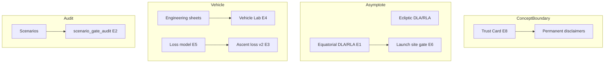
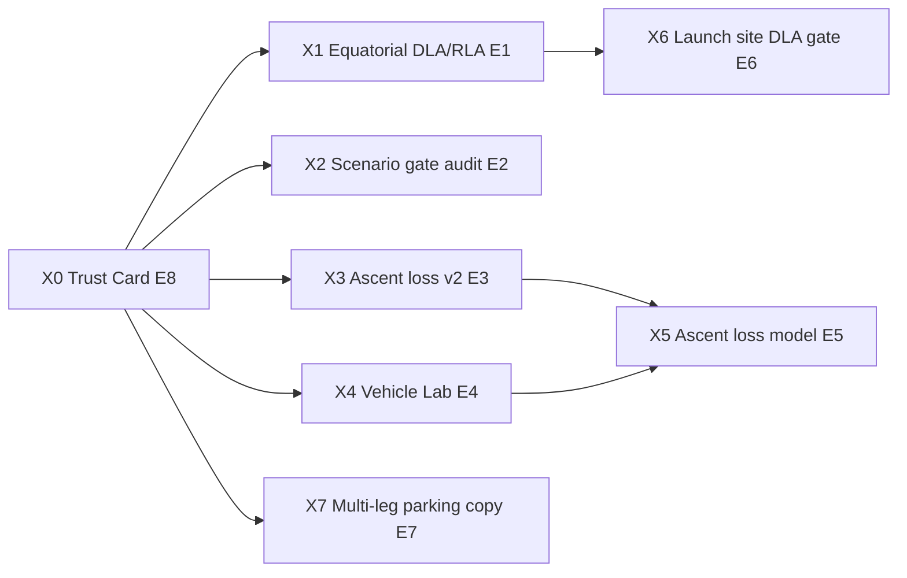

# HELIOS Concept-Grade Boundaries & Extras Roadmap

| Field | Value |
|---|---|
| **Document title** | Concept-Grade Boundaries & Extras Roadmap |
| **Author** | HELIOS engineering (design owner TBD for product sign-off) |
| **Date** | 2026-07-16 |
| **Status** | Approved for implementation (rev 1 — residual polish after reliability + fidelity) |
| **Repo** | `C:\Users\kevin\workspace\k-solar-system-navigator` |
| **Branch policy** | **`main` only** — sequential green commits |
| **Baseline** | `main` @ reliability dossier (`plan-quality`, `plan-dossier`), fidelity L1/L2-plan, vehicle engineering sheets, cargo triad |
| **Audience** | Engineers implementing remaining concept-grade honesty + completeness extras |
| **Prior designs** | `docs/trip-plan-reliability-completeness-design.md`, `docs/ephemeris-fidelity-platform-design.md`, `docs/cargo-vehicle-platform-design.md`, `docs/trip-planner-design.md` |

---

## Overview

HELIOS is an **educational / concept-grade** interplanetary trip planner: real Lambert geometry, honest Need/Capability/Margin, Plan Dossier quality gates, and sample vehicles (Super Heavy, Starship, Falcon 9). It is **not** flight operations software, **not** SPICE navigation, and **not** SpaceX-certified performance.

This design does two jobs:

1. **Freeze the concept-grade boundary** — what must stay labeled educational forever, and what may be upgraded without crossing into flight-ops claims.  
2. **Specify concrete extras** still open after reliability + fidelity landings, each with files, acceptance criteria, and a main-only PR plan:

| Extra | Why |
|---|---|
| **E1 — Earth-equatorial DLA / RLA** | Handbook-compatible launch asymptote language (today: ecliptic-class only) |
| **E2 — Scenario gate audit** | Reliability K12: every scenario pass or `demo_unsafe` |
| **E3 — Ascent loss budget v2** | Stronger UX + optional “required vs stack” framing (not silent mix into Lambert) |
| **E4 — Vehicle Lab panel** | Critical vehicle metrics without requiring a route first |
| **E5 — Educational gravity/drag loss model** | Order-of-magnitude ascent losses with explicit assumptions |
| **E6 — Launch-site latitude vs DLA gate** | Completeness: “can this DLA fly from Cape-class latitude?” |
| **E7 — Residual multi-leg parking note + optional stub** | Clarify non-goal; optional single-assist budget sketch |
| **E8 — Concept-grade Trust Card** | One UI surface listing what is / is not certified |

**Product vow (extends reliability design):** Users always know **how conceptual** a number is, and never confuse ecliptic asymptotes, ideal rocket-eq, or illustrative C₃ tables with flight design.

---

## Background & Motivation

### What is already “concept-grade but solid”

| Capability | Implementation | Concept-grade limit |
|---|---|---|
| Ephemeris L1 | JPL Approximate Positions | Arcsec / 10³–10⁶ km class errors (published) |
| L2-plan samples | Offline JSON + educational Mars bias | Not DE440; re-bake path exists |
| L2-compare | Horizons VECTOR opt-in | Does not change planning geometry |
| Lambert / porkchop | Dual-branch UV Lambert | 2-body Sun; no n-body midcourse |
| Mission parking | 100 km impulsive escape/capture | No finite burn, no launch site |
| Vehicles | Rocket-eq SH/SS; F9 C₃ table | Illustrative; not User’s Guide warranty |
| Reliability dossier | Gates + confidence | Completeness confidence ≠ OD covariance |
| Asymptotes | `departure-asymptote.js` | **Ecliptic-class DLA/RLA**, not Earth equatorial |
| Ascent loss | Select 0 / 1.5 / 2.0 km/s | Display-only; not physics-modeled |

### Pain points this design closes

| Pain | Evidence | Impact |
|---|---|---|
| Users read “DLA” as handbook DLA | Label says ecliptic-class; easy to miss | Wrong launch-site conclusions |
| Scenarios may not pass new gates | No `demo_unsafe` audit (K12 open) | “Broken demo” after reliability |
| Ascent loss easy to misread as Need | Separate line, but weak coupling UX | Over-trust of vehicle margin |
| Engineering sheet requires compute | Only on Measurement Card after route | Can’t browse SH/SS/F9 alone |
| No site-vs-DLA check | About stub only | Incomplete launch-plan story |
| Concept-grade scattered | Many disclaimers | Hard for classrooms to summarize |

---

## Goals & Non-Goals

### Goals

1. **Explicit concept-grade map** — permanent table of “educational forever” vs “upgradeable.”  
2. **Equatorial asymptote option** — Earth-equatorial DLA/RLA from V∞ with documented obliquity model.  
3. **Scenario audit CI** — offline test: each scenario either `mission_ready` after compute path or flagged `demo_unsafe`.  
4. **Ascent loss v2** — clearer framing; optional comparison line “ideal stack Δv − ascent budget.”  
5. **Vehicle Lab** — always-visible or modal sheet for SH / Starship / F9 without a route.  
6. **Educational loss model** — simple gravity + drag class estimate with knobs, not CFD.  
7. **Launch-site DLA gate** — warn/fail educational when |DLA| exceeds site latitude capability class.  
8. **Trust Card** — single completeness + concept-grade summary on results or About.  
9. **Main-only PR plan** with tests.

### Non-Goals

| Non-goal | Rationale |
|---|---|
| Claiming flight certification after extras | Labels stay educational |
| Full SPICE / n-body / OD (L3) | Separate fidelity design; optional later only |
| Real MERLIN/RAPT throttle profiles | OEM proprietary / non-goal |
| Full atmospheric entry / EDL | Aeroassist factor remains enough for v1 product |
| Global multi-leg optimal search | Local search remains; label honesty |
| Replacing Approximate Positions as default | L1 stays default cold path |

### Success metrics

| Metric | Baseline | Target |
|---|---|---|
| DLA frame ambiguity | Ecliptic only | Dual: ecliptic + equatorial when Earth-dep |
| Scenarios vs gates | Unknown | 100% audited: pass or `demo_unsafe` |
| Vehicle metrics without route | No | Vehicle Lab available |
| Ascent loss misread as Lambert | Possible | Explicit “not in Need” + optional stack compare |
| Trust Card | Fragmented | One surface |

---

## Part A — Concept-grade boundary (frozen)

### A1. Permanent concept-grade (must always disclaimer)

These may improve numerically but **must never** be marketed as flight-ops truth:

| Domain | Permanent label |
|---|---|
| Vehicle Δv / T/W / cargo tables | Illustrative / educational — not SpaceX-certified |
| F9 C₃ payload table | Illustrative knots — not User’s Guide performance |
| Confidence score | Plan-completeness educational — not navigation covariance |
| Sample-de ephemeris | Offline educational samples — not SPICE kernels |
| Ascent loss budget / educational loss model | Order-of-magnitude class — not integrated 6DOF ascent |
| Aeroassist factor | Scalar Need reduction — not entry guidance |
| Waypoints L1/L2 | Geometric sketches — not CR3BP |
| Porkchop / multi-leg search | Local / grid — not global certified optimum |

### A2. Upgradeable (still educational, higher fidelity)

| Domain | Upgrade path | Design doc |
|---|---|---|
| Planet states | DE samples / optional SPK | Ephemeris fidelity |
| Asymptote frame | Ecliptic → Earth equatorial | **This design E1** |
| Plan outcome honesty | Dossier gates | Reliability (done) |
| Launch site vs DLA | Educational gate | **This design E6** |
| Vehicle browsing | Vehicle Lab | **This design E4** |

### A3. Out of HELIOS product forever (default)

| Domain | Why |
|---|---|
| Flight rules / range safety | Ops |
| Covariance / Monte Carlo OD | L3 / navigation |
| Live vehicle telemetry APIs | Backend / legal |
| Classified propellant margins | N/A |

**K1 — Product framing never upgrades past “concept-grade educational” without an explicit product decision and new design.**

---

## Part B — Extra features (detailed)

### E1 — Earth-equatorial DLA / RLA

#### Problem

Handbook interplanetary design uses **declination of launch asymptote (DLA)** and **right ascension of launch asymptote (RLA)** in an **Earth-equatorial** frame. HELIOS currently reports **ecliptic-class** angles from physics-axis V∞ (`js/physics/departure-asymptote.js`), which is useful but not interchangeable with Cape Canaveral launch-site discussions.

#### Design

1. Keep ecliptic angles as `dla_ecliptic_deg` / `rla_ecliptic_deg`.  
2. Add transform for **Earth-origin only**:

```js
// departure-asymptote.js
export function eclipticVinfToEquatorialDlaRla(vInf_ecliptic, epoch) {
  // Rotate HELIOS physics V∞ by mean obliquity of ecliptic (J2000 ε ≈ 23.43928°)
  // Optional: simple mean equinox of date for epoch (not full IAU SOFA)
  // Return { dla_eq_deg, rla_eq_deg, frame: 'Earth mean equator / equinox (approx)' }
}
```

3. Dossier geometry:

```json
"asymptote": {
  "ecliptic": { "dla_deg": 0, "rla_deg": 0 },
  "equatorial_approx": { "dla_deg": 0, "rla_deg": 0, "obliquity_model": "J2000_mean" },
  "disclaimer": "Educational asymptote angles — not range safety products"
}
```

4. UI: show both rows when `body1` is Earth (or Earth SOI parent for moons later). Non-Earth origin: equatorial N/A.

5. Gate `G_ASYMPTOTE` (optional warn): if equatorial |DLA| > 28.5° educational “low-inclination launch” band → **warn** (not fail) with message to pick higher-inclination site class or different window.

**K2 — Equatorial DLA uses mean obliquity approximation; document not IAU 2006 full series.**  
**K3 — Never call equatorial angles “flight DLA” without disclaimer.**

#### Files

- `js/physics/departure-asymptote.js`  
- `js/ui/plan-dossier.js`  
- `tests/departure_asymptote.mjs`  

#### AC

- Earth→Mars Lambert-ok produces finite equatorial DLA/RLA.  
- Non-Earth origin omits equatorial or marks n/a.  
- Frame strings present in export.  
- Unit test: known V∞ vector → expected DLA within 0.1° of hand formula.

#### Effort

M  

---

### E2 — Scenario gate audit (Reliability PR10)

#### Problem

Reliability **K12**: scenarios may predate quality gates. Loading a scenario then Compute could yield FAIL and feel like a product regression.

#### Design

1. Extend scenario records:

```js
{
  id: 'mars-2026',
  // ...existing fields...
  plan_expect: 'mission_ready', // 'mission_ready' | 'demo_unsafe' | 'warn_ok'
  plan_notes: 'Passes gates under default unrefueled / abstract as configured by test',
}
```

2. Offline test `tests/scenario_gate_audit.mjs`:
   - For each scenario: set origin/dest/dep (and flybys), run `hohmannTransfer` + `solveTransferOrbit` + `buildPlanDossier` with a **documented vehicle default** (`abstract` 15 km/s **or** scenario-specified `vehicleId`).  
   - Assert:
     - `plan_expect === 'mission_ready'` ⇒ `dossier.mission_ready === true`  
     - `plan_expect === 'demo_unsafe'` ⇒ `dossier.mission_ready === false` (expected teaching case)  
     - `plan_expect === 'warn_ok'` ⇒ status is `pass` or `pass_with_warnings`

3. UI: scenario dropdown shows amber badge “demo may fail gates” when `demo_unsafe`.

4. Default vehicle for audit: **`high-energy` abstract** for outer-planet scenarios; **Earth–Mars** scenarios may use `chem-medium` or current product defaults — **freeze in test** to avoid product-default flakiness.

**K4 — Scenario audit freezes vehicle/costBasis in the test harness, not ambient app default.**  
**K5 — Jupiter-class scenarios may be `demo_unsafe` under SH legacy and still ship as educational.**

#### Files

- `js/data/scenarios.js`  
- `js/ui/scenarios.js` (badge)  
- `tests/scenario_gate_audit.mjs`  
- `tests/run_physics.mjs`  

#### AC

- CI fails if a `mission_ready` scenario fails gates.  
- At least one `demo_unsafe` scenario documented (e.g. high-Δv outer planet with weak vehicle if kept).  
- No live network.

#### Effort

M  

---

### E3 — Ascent loss budget v2

#### Current

- `state.ascentLossBudget_m_s` ∈ {0, 1500, 2000}  
- Displayed on Measurement Card only; **not** in Lambert Need  

#### Design v2

1. **Keep separation from Lambert Need** (K6).  
2. Add Card / Dossier lines when budget > 0:

| Line | Formula |
|---|---|
| Ideal stage / stack Δv (from vehicle engineering) | existing |
| Ascent loss budget | user |
| **Residual after ascent (edu)** | `idealStackDv − ascentLoss` (null if no stack Δv) |
| Compare to interplanetary Need | `residual − need_dv` as qualitative margin note |

3. Optional fourth preset: **custom** number input 0–5000 m/s (clamp).  
4. Export: `plan_request.ascent_loss_m_s` optional; dossier `ascent_loss` block.  
5. Gate: **never** fail plan solely on ascent residual (warn only if residual < need).

**K6 — Ascent loss never mutates Lambert or C₃.**  
**K7 — Residual-after-ascent is labeled educational stack framing.**

#### Files

- `js/ui/measurement-card.js`, `plan-dossier.js`, `controls.js`, `index.html`  
- `js/ui/mission-export.js`, share codec optional  
- `tests` static + unit for residual math  

#### AC

- Budget 0: no residual lines.  
- Budget 2000 + SH stack: residual = SH ideal − 2000 (or documented stack sum).  
- Lambert Need unchanged when toggling budget.

#### Effort

S–M  

---

### E4 — Vehicle Lab panel

#### Problem

Critical vehicle data (escape velocity context, T/W, stage Δv) appears only after route compute on the Measurement Card.

#### Design

1. UI: button **VEHICLE LAB** in route panel or top bar → collapsible panel / modal.  
2. Content: always call `buildVehicleEngineeringReport` for:

   - Super Heavy (with SS as payload, cargo slider)  
   - Starship (arch + tankers + cargo)  
   - Falcon 9 (variant + payload)  
   - Earth environment sheet (escape, LEO, atmosphere notes)

3. Independent of `transferData`.  
4. Reuse `vehicleEngineeringHtml` / split pure report HTML factory.  
5. Disclaimer banner permanent at top of lab.

**K8 — Vehicle Lab does not claim feasibility for a mission without a computed plan.**

#### Files

- `js/ui/vehicle-lab.js`  
- `index.html` shell  
- `js/ui/controls.js` or `main.js` wire  
- `css` / inline styles  

#### AC

- Open lab without origin/dest.  
- Changing cargo updates T/W and Δv.  
- Offline smoke: module builds HTML string with “Surface escape”.

#### Effort

M  

---

### E5 — Educational gravity + drag loss model

#### Problem

Ascent loss is a fixed knob; users want a **derived** estimate from vehicle T/W and a simple atmosphere class.

#### Design (intentionally simple)

```text
Δv_gravity_class ≈ g0 · t_burn · k_g     (k_g ~ 0.3–0.5 educational)
Δv_drag_class    ≈ c_d · (m/A) proxy     or fixed table by vehicle class
Δv_ascent_est    = gravity + drag + steering_class (optional 100–300 m/s)
```

Frozen educational constants per vehicle class in `js/physics/ascent-loss-model.js`:

| Class | t_burn_s | Δv_grav | Δv_drag | Δv_steer | Total class |
|---|---|---|---|---|---|
| F9-like | 160 | 1200 | 400 | 200 | ~1800 |
| SH+SS-like | 180 | 1400 | 500 | 250 | ~2150 |
| Abstract | — | user | 0 | 0 | user |

Wire: button **Estimate from vehicle** sets `ascentLossBudget_m_s` to rounded class total (clamped).  
Never presented as trajectory integration.

**K9 — Loss model is a lookup + simple formula, not numerical integration of ρ(h).**

#### Files

- `js/physics/ascent-loss-model.js`  
- controls / vehicle lab button  
- `tests/ascent_loss_model.mjs`  

#### AC

- F9 estimate finite in 1500–2500 m/s band.  
- Explicit disclaimer string length > 40.  
- Does not change Lambert when applied (only state budget).

#### Effort

S–M  

---

### E6 — Launch-site latitude vs DLA (educational gate)

#### Problem

Completeness for “concrete travel plan” includes whether asymptote DLA is compatible with a launch site latitude band.

#### Design

1. Data: small table `js/data/launch-sites-edu.js`:

```js
export const LAUNCH_SITES_EDU = [
  { id: 'cape', name: 'Cape-class (≈28.5°N)', lat_deg: 28.5, dla_max_deg: 28.5 },
  { id: 'vandenberg', name: 'Vandenberg-class (≈34.7°N)', lat_deg: 34.7, dla_max_deg: 34.7 },
  { id: 'kourou', name: 'Kourou-class (≈5.2°N)', lat_deg: 5.2, dla_max_deg: 5.2 },
  { id: 'any', name: 'No site constraint', lat_deg: null, dla_max_deg: 90 },
];
```

2. State: `launchSiteId: 'cape' | ...` default `'any'` for no surprise fails.  
3. Gate `G_SITE_DLA`: if equatorial |DLA| > site.dla_max_deg + 0.5° → **warn** (default) or **fail** if `state.planStrictSite === true` (default false).  
4. UI: select under vehicle / planning; dossier records site + pass/fail.  
5. Depends on E1 for meaningful equatorial DLA; if only ecliptic available, gate uses ecliptic DLA with louder disclaimer.

**K10 — Default site = `any` so existing scenarios stay green.**  
**K11 — Strict site mode opt-in.**

#### Files

- `js/data/launch-sites-edu.js`  
- `plan-quality.js`, state, controls, plan-dossier  
- tests  

#### AC

- With site `kourou` and |DLA_eq| = 20° → warn/fail per mode.  
- Site `any` never adds fail.  
- Export includes `launch_site_id`.

#### Effort

M  

---

### E7 — Multi-leg parking residual

#### Problem

Mission parking budget is single-leg only; multi-leg users may think totals include escape/capture.

#### Design

1. **No full multi-leg parking in this phase** (confirm non-goal).  
2. Dossier completeness item: `mission_parking: 'n/a multi-leg'`.  
3. Stronger multi-leg banner note (already partial).  
4. Optional stretch later: first-leg escape + last-leg capture only (stub PR if scheduled).

**K12 — Multi-leg full SOI chain remains non-goal; UI must say so.**

#### Effort

S (copy + completeness)  

---

### E8 — Concept-grade Trust Card

#### Design

Single collapsible block on results (or About + results):

```
TRUST & CONCEPT-GRADE SUMMARY
• Ephemeris: L1 / L2-plan / L2-compare — what it means
• Dynamics: 2-body Lambert — not n-body
• Vehicle: illustrative — not SpaceX certified
• Confidence: educational completeness score XX
• Mission ready: YES/NO (gates)
• Open upgrades: link to this design extras
```

Data-driven from dossier + fidelity state.

#### Files

- `js/ui/trust-card.js`  
- `route-display.js` / measurement-card  

#### AC

- Always visible after compute.  
- Mentions “not flight ops” and “not SPICE”.  
- Offline test: HTML contains “concept-grade” or “educational”.

#### Effort

S  

---

## Architecture (extras)



---

## Alternatives Considered

### Alt 1 — Only improve About prose  
**Rejected:** users need structured equatorial DLA + scenario CI.

### Alt 2 — Full SOFA / IAU Earth orientation  
**Rejected for v1 extras:** mean obliquity is enough for educational DLA; document upgrade path.

### Alt 3 — Make ascent losses part of Need by default  
**Rejected:** corrupts pure trajectory Need; keep optional and labeled (K6).

### Alt 4 — Drop scenario demos that fail SH  
**Rejected:** teachability; use `demo_unsafe` instead (K5).

---

## Security & Privacy

No new network. Launch-site table is static educational data.

---

## Observability

- `?debug=1` logs equatorial asymptote + site gate  
- Scenario audit in `npm run test:physics`  

---

## Risks

| Risk | Severity | Mitigation |
|---|---|---|
| Equatorial DLA still misread as flight | High | Dual labels + Trust Card |
| Scenario audit flaky with product defaults | Medium | Freeze vehicle in test (K4) |
| Vehicle Lab implies mission OK | Medium | K8 disclaimer |
| Loss model over-trusted | High | Band ranges + “not integrated ascent” |
| Site gate breaks classroom | Low | Default site `any` (K10) |

---

## Open Questions (defaults)

| # | Question | Default |
|---|---|---|
| Q1 | Strict site mode default? | **false** (`any` site) |
| Q2 | Scenario audit vehicle for Mars? | **chem-medium** or abstract 8000 frozen in test |
| Q3 | Share encode launch site? | **Yes** optional `site=` |
| Q4 | Vehicle Lab modal vs side panel? | **Collapsible section in right panel** |

---

## Key Decisions

1. **K1 — Product stays concept-grade educational unless new design elevates claims.**  
2. **K2 — Equatorial DLA uses mean obliquity approx.**  
3. **K3 — No “flight DLA” wording.**  
4. **K4 — Scenario audit freezes vehicle/basis.**  
5. **K5 — demo_unsafe scenarios allowed and labeled.**  
6. **K6 — Ascent loss never mutates Lambert Need.**  
7. **K7 — Residual-after-ascent is educational framing.**  
8. **K8 — Vehicle Lab ≠ mission feasibility.**  
9. **K9 — Loss model is lookup/simple formula.**  
10. **K10 — Default launch site = any.**  
11. **K11 — Strict site opt-in.**  
12. **K12 — Multi-leg full parking remains non-goal.**  
13. **K13 — Main-only delivery.**  
14. **K14 — Trust Card mandatory when E8 lands.**  

---

## PR Plan (main-only)



| PR | Title | Effort | Phase |
|---|---|---|---|
| **X0** | Trust Card (concept-grade summary on results) | S | Foundation |
| **X1** | Earth-equatorial DLA/RLA + tests | M | Completeness |
| **X2** | Scenario `plan_expect` + `scenario_gate_audit.mjs` | M | Reliability residual |
| **X3** | Ascent loss v2 residual framing + export | S | Completeness |
| **X4** | Vehicle Lab panel (SH / SS / F9) | M | Vehicle UX |
| **X5** | Educational ascent loss model + Estimate button | S | Vehicle UX |
| **X6** | Launch-site table + G_SITE_DLA gate | M | Completeness |
| **X7** | Multi-leg parking n/a completeness + copy | S | Honesty |

**Recommended first wave:** X0 → X2 → X1 → X4 (trust, audit, asymptote, vehicle lab).  
**Second wave:** X3 → X5 → X6 → X7.

---

## Implementation checklist (per commit)

1. Implement on `main`  
2. `npm run test:physics` green  
3. Commit + `git push origin main`  
4. No long-lived side branches  

---

## Appendix A — Concept-grade copy bank (UI)

Use consistently:

- “Educational / concept-grade — not flight operations.”  
- “Illustrative vehicle model — not SpaceX-certified performance.”  
- “Ecliptic-class asymptote (not range-safety DLA).”  
- “Earth-equatorial DLA (mean obliquity approx) — not IAU full EOP.”  
- “Ascent loss class estimate — not integrated 6DOF ascent.”  
- “Plan confidence is completeness scoring — not navigation covariance.”  

---

## Appendix B — Suggested commit messages

```
feat(trust): concept-grade Trust Card on plan results
feat(plan): Earth-equatorial DLA/RLA from V∞
test(plan): scenario gate audit with plan_expect
feat(plan): ascent loss residual framing v2
feat(vehicles): Vehicle Lab panel without route
feat(vehicles): educational ascent loss model
feat(plan): launch-site vs DLA educational gate
docs(ui): multi-leg parking n/a completeness
```

---

## Appendix C — Cross-links

| Document | Relationship |
|---|---|
| `trip-plan-reliability-completeness-design.md` | Outcome honesty (done); residual E2/E7 |
| `ephemeris-fidelity-platform-design.md` | State fidelity L1/L2 |
| `cargo-vehicle-platform-design.md` | Need/Capability/Margin |
| **This document** | Concept-grade boundary + extras E1–E8 |

---

## References

- HELIOS: `js/physics/departure-asymptote.js`, `plan-quality.js`, `vehicle-performance.js`, `js/data/scenarios.js`  
- JPL Approximate Positions accuracy table  
- Interplanetary design handbook language: C₃, DLA, RLA, porkchop families (public NASA/JPL literature)  
- SpaceX Falcon User’s Guide (public performance is limited; do not scrape as live API)  
