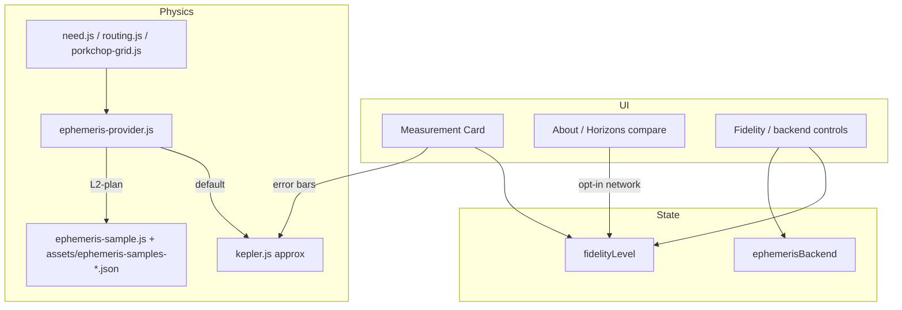
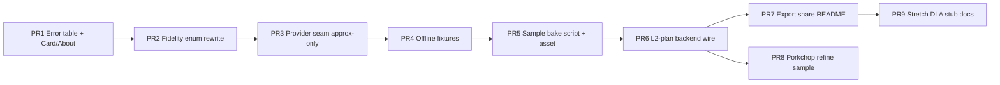

# HELIOS Ephemeris Fidelity & Measurement Trust Platform

| Field | Value |
|---|---|
| **Document title** | HELIOS Ephemeris Fidelity & Measurement Trust Platform |
| **Author** | HELIOS engineering (design owner TBD for product sign-off) |
| **Date** | 2026-07-16 |
| **Status** | In implementation on `main` (rev 1 design; PRs 1–7 landing as sequential commits) |
| **Repo** | `C:\Users\kevin\workspace\k-solar-system-navigator` |
| **Branch policy** | **`main` only** — sequential commits on `main`; no feature-branch / Graphite stack required |
| **Branch baseline** | `main` (cargo platform, Measurement Card, L1/L2 badge, Horizons compare, porkchop cargo heatmap) |
| **Audience** | Engineers implementing evolutionary commits on `main` |
| **Prior designs** | `docs/trip-planner-design.md`, `docs/cargo-vehicle-platform-design.md` |
| **Related research** | DE440/DE441, NAIF SPK, JPL Approximate Positions accuracy table, Horizons VECTOR API |

---

## Overview

HELIOS plans interplanetary routes with **JPL Approximate Positions** (`js/physics/kepler.js` → `getBodyPosition3D` / `getBodyVelocity3D`), dual-branch Lambert (`js/physics/lambert.js`, `routing.js`), and a cargo-aware **Need / Capability / Margin** Measurement Card. Fidelity UX today is thin: `state.fidelityLevel` is `L1` by default and flips to `L2` after an optional **Horizons educational compare** that **does not** change planning geometry (`js/ui/controls.js`, `js/physics/ephemeris-horizons.js`).

This design upgrades **trust and optional geometric fidelity** without becoming flight ops software. It introduces:

1. **Error transparency** for Approximate Positions (JPL-published nominal errors on the Card and About).
2. **Offline golden fixtures** (CI, no live network) comparing approx positions to frozen DE/Horizons-class snapshots.
3. A clean **ephemeris provider API** so planning can optionally evaluate Lambert endpoints with a higher-fidelity sample table (**L2-plan**), default remains offline Approximate Positions (**L1**).
4. Rewritten **fidelity badge semantics** (L1 / L2-compare / L2-plan / L3 out-of-scope) recorded in export JSON and share hash.
5. An evolutionary **PR plan** executed as **sequential commits on `main`**.

**Hard product rule:** default cold load stays offline and small. No mandatory multi-megabyte kernel download. Classroom mode (`?mode=classroom`) remains offline L1.

---

## Background & Motivation

### Current product (verified in code)

| Layer | Reality on `main` |
|---|---|
| **Planet states** | Kepler rates + great-inequality terms in `kepler.js` from JPL Approximate Positions (1800–2050) |
| **Physics callers** | `routing.js`, `porkchop-grid.js`, `mission-budget.js`, `need.js` all call `getBodyPosition3D` / `getBodyVelocity3D` with `exaggerate=false` for physics |
| **Animation** | Every frame uses approx Kepler for scene (acceptable; visual path may stay L1 forever) |
| **Horizons** | Opt-in About-panel compare only; sets `fidelityLevel='L2'` but planning still approx |
| **Export** | `methodology.ephemeris` hard-coded Approximate Positions string; `measurement.fidelity` is L1/L2 badge only |
| **Share** | No ephemeris backend token |
| **Assets** | `assets/stars-mag75.json` (~1 MiB); no DE/SPK |

### Pain points

| Pain | Evidence | Impact |
|---|---|---|
| Users cannot see ephemeris error scale | About mentions validation; Card does not show JPL λ/ρ error bars | Over-trust of km-class Δv |
| L2 badge overclaims | Horizons compare → L2 while Need still from approx | Badge lies about planning fidelity |
| No offline truth fixtures | Live Horizons only | CI cannot guard ephemeris drift |
| No path to better endpoints | All physics hard-wired to Kepler | Cannot A/B DE-class states without rewrite |
| OEM vehicle data confusion | Separate problem; out of scope here | Keep educational vehicle tables |

### Strengths to preserve

1. Pure physics modules under `js/physics/*` with offline golden tests (`tests/run_physics.mjs`).
2. Zero network on default planning path.
3. Measurement Card + JSON v3 + classroom offline defaults.
4. Existing Horizons mock suite (`tests/horizons_mock.mjs`).

---

## Goals & Non-Goals

### Goals

1. **Honest fidelity labels** — badge and export always match the ephemeris used for Need geometry.
2. **Error bars on Card** — publish Approximate Positions nominal error (from JPL SSD table) for origin/destination class.
3. **Provider seam** — `getPlanningState(body, t)` abstraction; default backend = approx Kepler.
4. **Optional L2-plan** — compact offline sample tables for major planets (position + velocity) over a limited epoch window; used for **Lambert endpoints** (and optional porkchop refine), not every animation frame.
5. **Offline fixtures + CI** — frozen vectors; no live network required in `npm test`.
6. **Classroom safety** — `?mode=classroom` forces L1 planning backend.
7. **Main-branch delivery** — sequential, independently reviewable commits; each leaves tests green.

### Non-Goals

| Non-goal | Rationale |
|---|---|
| **Flight ops / SPICE navigation** | L3 remains documentation-only |
| **Mandatory `de440.bsp` download** | Cold-load budget; optional advanced later |
| **Full n-body differential corrector** | Stretch only; not blocking |
| **Certified F9/Starship performance** | Cargo design already educational |
| **CR3BP / true Lagrange** | Waypoints stay geometric sketches |
| **Covariance / Monte Carlo OD** | Out of product scope |
| **Server-side mission design backend** | Browser-first |
| **Multi-branch PR stacks** | Work and push on `main` only |

### Success metrics

| Metric | Baseline | Target |
|---|---|---|
| Badge honesty | L2 after compare only | Distinct L1 / L2-compare / L2-plan |
| Error transparency | About prose only | Card + About + export field |
| Offline golden ephemeris | None | ≥8 bodies × ≥3 epochs fixtures |
| Planning backend selectable | Hard-coded Kepler | Provider API + L1 default |
| Cold load size | ~1 MiB stars | L2-plan sample asset ≤ **2.5 MiB** soft budget |
| Network for default plan | Zero | Still zero |

---

## Proposed Design

### Fidelity model (product language)

| Token | Meaning | Planning geometry | Network |
|---|---|---|---|
| **L1** | JPL Approximate Positions (offline default) | Approx Kepler r,v | Never |
| **L2-compare** | User ran Horizons educational Δr compare | Still **L1** geometry | Opt-in only |
| **L2-plan** | Optional compact sample-table backend for **endpoints** | Sample-table r,v at dep/arr (and optional refine) | Never (offline asset) |
| **L3** | SPICE / full DE kernel / n-body OD | **Not a HELIOS planning mode** | N/A |

**K1 — Split today’s overloaded `L2`.**  
`state.fidelityLevel` becomes a string enum: `'L1' | 'L2-compare' | 'L2-plan'`. Export may also set `methodology.ephemeris_backend: 'approx' | 'sample-de'`. Horizons compare alone never sets `L2-plan`.

**K2 — Animation stays L1 forever in v1.**  
Scene motion continues to use Approximate Positions. Only **planning** (Need / Lambert / optional porkchop refine) may use L2-plan. Prevents multi-MB evaluation per frame.

**K3 — Classroom locks L1.**  
If `state.classroomMode`, ignore sample backend and force `approx`.

### Architecture



### Ephemeris provider API

New module `js/physics/ephemeris-provider.js` (pure, no DOM):

```js
/**
 * @typedef {'approx' | 'sample-de'} EphemerisBackend
 * @typedef {{ x:number, y:number, z:number }} Vec3AU  // scene/helio coords per existing convention
 */

export function getPlanningPosition3D(body, timeSec, opts = {}) {
  // opts.backend defaults from state-aware wrapper in UI layer, or 'approx'
}

export function getPlanningVelocity3D(body, timeSec, opts = {}) {
  // finite-diff or analytic from sample tables
}

export function resolveBackend(requested, { classroomMode }) {
  if (classroomMode) return 'approx';
  if (requested === 'sample-de' && sampleAvailable(body, timeSec)) return 'sample-de';
  return 'approx';
}

export function approxErrorBars(bodyId) {
  // static table from JPL Approximate Positions accuracy page (1800–2050)
}
```

**Migration rule (K4):**  
Physics modules used for **planning** gradually import the provider instead of calling `kepler.getBodyPosition3D` directly. Visual path keeps direct Kepler calls.

| Caller | v1 action |
|---|---|
| `routing.js` Lambert endpoints | → provider |
| `porkchop-grid.js` `evaluateCell` | stay approx for full grid (perf); optional refine min uses provider |
| `need.js` / `mission-budget.js` velocity | → provider when backend sample |
| `animation.js` / scene | stay Kepler |

### L2-plan sample data format

**K5 — Prefer pre-baked JSON samples over shipping `.bsp` in v1.**

- Generator script (dev-only): `scripts/build-ephemeris-samples.mjs`
- Output: `assets/ephemeris-samples-v1.json` (git-tracked) **or** generated artifact with committed golden subset
- Coverage target: major planets Mercury–Neptune, **2020-01-01 → 2040-01-01**, sample step **1 day** for positions; velocities via central difference or stored if compact
- Coordinate frame: match HELIOS physics (**heliocentric ecliptic J2000**, same axis convention as `getBodyPosition3D(..., false)`)
- Interpolation: cubic or linear between knots; document max interp error vs source
- Source for bake: public Horizons VECTOR tables **or** DE440 via a documented offline tool; bake commits include **source citation + generation date + tool version**

Soft budget: **≤ 2.5 MiB** uncompressed JSON (gzip/static hosting may shrink). If over budget, reduce to 2-day step or 2024–2036 window and document.

**Fallback:** if body/time outside table → silent `approx` + Card note “sample table out of range; L1 geometry”.

### Error bars (Approximate Positions)

Static table in `js/data/approx-ephemeris-errors.js` transcribed from JPL SSD [Approximate Positions of the Planets](https://ssd.jpl.nasa.gov/planets/approx_pos.html) for **1800–2050**:

| Body class | λ (arcsec) | φ (arcsec) | ρ (1000 km) |
|---|---|---|---|
| Mercury | 15 | 1 | 1 |
| Venus | 20 | 1 | 4 |
| EM Bary / Earth | 20 | 8 | 6 |
| Mars | 40 | 2 | 25 |
| Jupiter | 400 | 10 | 600 |
| … | … | … | … |

Card shows: “Nominal JPL approx. error class (not 1σ formal): …” when backend is `approx`. For L2-plan, show “Sample-table endpoint ephemeris (educational) — not SPICE navigation.”

### Horizons compare (existing) vs L2-plan

| Feature | Horizons compare | L2-plan samples |
|---|---|---|
| Network | Yes, opt-in | No |
| Changes Need | No | Yes (endpoints) |
| Badge | `L2-compare` | `L2-plan` |
| Classroom | Allowed (educational) | Disabled (force L1) |

### Export / share

**JSON v3 extensions** (additive; keep schema_version 3 or bump to **3.1** only if needed):

```json
"methodology": {
  "ephemeris": "JPL Approximate Positions…",
  "ephemeris_backend": "approx",
  "fidelity": "L1",
  "approx_error_note": "Nominal JPL table 1800–2050; not formal covariance"
}
```

Share codec (optional token): `eph=approx|sample` (omit = approx). Classroom hashes ignore `sample`.

### UI

1. Measurement Card: fidelity badge text uses new enum; error bar row; backend label.
2. About: L1 / L2-compare / L2-plan / L3 table rewrite (replace overloaded L2).
3. Controls: optional select **Planning ephemeris: Approximate (default) | Sample DE-class (offline)** — hidden or disabled until sample asset present (PR sequencing).
4. `?debug=1` already logs triad; extend to log `backend` + whether sample hit.

### Tests

| Suite | Asserts |
|---|---|
| `tests/approx_error_table.mjs` | Table complete for major planets; Earth ρ > 0 |
| `tests/ephemeris_fixtures.mjs` | Approx vs golden vectors within documented tolerances |
| `tests/ephemeris_provider.mjs` | resolveBackend classroom lock; sample OOR → approx |
| `tests/ephemeris_sample_interp.mjs` | Interpolator monotonic; endpoint match knots |
| Update `horizons_mock.mjs` | Badge path sets `L2-compare` not `L2-plan` |
| Update `vehicle_ui_regression.mjs` / `mission_import_check` | Export fields if added |

---

## API / Interface Changes

### Before

```js
import { getBodyPosition3D, getBodyVelocity3D } from './kepler.js';
// all planning uses this
```

### After (planning path)

```js
import { getPlanningPosition3D, getPlanningVelocity3D } from './ephemeris-provider.js';
// defaults backend 'approx' → same numbers as today
```

### State

```js
// state.js
fidelityLevel: 'L1', // 'L1' | 'L2-compare' | 'L2-plan'
ephemerisBackend: 'approx', // 'approx' | 'sample-de'
```

`applyProductVehicleDefaults` / classroom block must also force `ephemerisBackend = 'approx'`.

---

## Data Model Changes

| Artifact | Change |
|---|---|
| `js/data/approx-ephemeris-errors.js` | New static error table |
| `assets/ephemeris-samples-v1.json` | New optional planning samples (after bake PR) |
| `scripts/build-ephemeris-samples.mjs` | Dev generator + README section |
| `tests/fixtures/ephemeris/*.json` | Small golden vectors (always offline) |
| Export `methodology` | `ephemeris_backend`, clarified `fidelity` |
| Share codec | optional `eph` |

No DB migrations (stateless app).

---

## Alternatives Considered

### Alt 1 — Ship full `de440s.bsp` + WASM SPICE reader

**Pros:** Authoritative DE.  
**Cons:** ~31 MB+, complex WASM, cold-load / mobile pain, classroom offline story harder.  
**Rejected for v1** (may revisit as optional advanced download, never default).

### Alt 2 — Live Horizons for every Lambert endpoint

**Pros:** Always “current” JPL.  
**Cons:** Network required, rate limits, non-deterministic CI, violates offline classroom.  
**Rejected** as planning path; keep educational compare only.

### Alt 3 — Only improve disclaimers / error bars (no provider)

**Pros:** Tiny.  
**Cons:** No path to better geometry.  
**Rejected as sole outcome**; still ship error bars as PR1 foundation.

### Alt 4 — Pre-baked JSON samples (chosen)

**Pros:** Offline, size-bounded, testable, main-friendly.  
**Cons:** Epoch window limited; bake pipeline maintenance.  
**Accepted for L2-plan v1.**

---

## Security & Privacy

| Topic | Approach |
|---|---|
| Network | Default still zero; Horizons remains explicit opt-in |
| Asset integrity | Committed samples + checksum in fixture tests |
| No PII | Unchanged |
| Path jail | New assets under `assets/` served by existing `server.js` jail |

---

## Observability

- `?debug=1`: log `{ fidelityLevel, ephemerisBackend, sampleHit, approxError }`
- Soft perf: first L2-plan route solve ≤ 50 ms over L1 on desktop (informational in `perf_budgets.mjs`)
- Asset size check in soft suite (like stars budget)

---

## Rollout Plan (main-only)

1. Land **trust UX** (error bars + badge rename) without behavior change to Δv.  
2. Land **provider seam** with backend fixed to approx (golden tests: bit-identical Need for fixed cases).  
3. Land **fixtures**.  
4. Land **sample asset + L2-plan**.  
5. Wire export/share/README.  
6. Stretch: porkchop refine-on-sample; DLA stub docs only.

**Rollback:** each commit reverts independently; feature flag = simply leave backend default `approx` and omit sample asset.

**Branch policy (product):** implement and `git push origin main` per completed PR slice. Do **not** open parallel long-lived branches unless explicitly requested.

---

## Risks

| Risk | Severity | Mitigation |
|---|---|---|
| Users think L2-plan is SPICE | High | Badge + About + export disclaimer |
| Sample bake wrong frame/axes | High | Golden compare vs known approx at J2000; fixture from Horizons ecliptic |
| Porkchop full-grid on sample too slow | Medium | Grid stays approx; refine only (K6) |
| Badge migration breaks UI tests | Low | Update ci_ui / regression strings |
| Asset exceeds budget | Medium | Coarser step / shorter window |
| Silent fallback hides OOR | Medium | Card amber note when fallback |

**K6 — Porkchop coarse grid remains Approximate Positions.**  
L2-plan applies to: single-leg compute, multi-leg legs, and **optional** refine around selected porkchop cell. Full 65×52 sample evaluation is non-goal for v1.

---

## Open Questions (non-blocking defaults)

| # | Question | Default if unanswered |
|---|---|---|
| Q1 | Sample window 2020–2040 vs 2024–2036? | **2020–2040**, 1-day step if ≤2.5 MiB else 2-day |
| Q2 | Share token `eph=` in v1? | **Yes**, optional omit=approx |
| Q3 | schema_version 3 vs 3.1? | Stay **3**, additive fields only |
| Q4 | Bake source Horizons vs DE440 local? | **Horizons VECTOR offline snapshots** for generator input first (documented); DE optional later |

---

## Key Decisions

1. **K1 — Fidelity enum: `L1` \| `L2-compare` \| `L2-plan`; L3 never a mode.**  
2. **K2 — Animation always approx; planning may use sample.**  
3. **K3 — Classroom forces approx + L1.**  
4. **K4 — Provider API; planning callers migrate; visual callers stay.**  
5. **K5 — L2-plan = pre-baked JSON samples, not mandatory BSP.**  
6. **K6 — Porkchop full grid stays approx; refine may use sample.**  
7. **K7 — Horizons compare never switches planning backend.**  
8. **K8 — Error bars always shown for approx backend (JPL nominal table).**  
9. **K9 — Delivery on `main` only; sequential green commits.**  
10. **K10 — Soft asset budget 2.5 MiB for sample JSON; stars budget unchanged.**  
11. **K11 — Export records `ephemeris_backend` + clarified fidelity.**  
12. **K12 — Bit-identical Need when backend=approx after provider migration (golden).**

---

## PR Plan

Execute as **ordered commits on `main`** (or short-lived PR → merge → delete branch if GitHub PR workflow is used; prefer direct main when local-only). Each PR slice leaves `npm run test:physics` green.



### PR 1: Approximate Positions error table + UX

- **Description:** Add `js/data/approx-ephemeris-errors.js`; show nominal error on Measurement Card and About; link JPL SSD source.
- **Files:** `js/data/approx-ephemeris-errors.js`, `js/ui/measurement-card.js`, `index.html` (About), `tests/approx_error_table.mjs`, `tests/run_physics.mjs`
- **Deps:** none
- **AC:**
  - Table covers Mercury–Neptune (+ Earth/EM)
  - Card shows error row when backend approx / L1
  - Offline test asserts Mars ρ class = 25 (×1000 km units as published)
- **Effort:** S  
- **Phase:** Foundation

### PR 2: Fidelity enum rewrite (L2-compare vs L2-plan)

- **Description:** Replace overloaded `L2` with `L2-compare` / `L2-plan`. Horizons success → `L2-compare` only. Update Card badge labels, About table, regression tests.
- **Files:** `js/state.js`, `js/ui/controls.js`, `js/ui/measurement-card.js`, `js/ui/mission-export.js`, `index.html`, `tests/vehicle_ui_regression.mjs`, `tests/ci_ui.mjs` (if string asserts)
- **Deps:** PR1 (can land without, but order preferred)
- **AC:**
  - Default `fidelityLevel === 'L1'`
  - Horizons path never sets `L2-plan`
  - Export fidelity string matches enum
  - Classroom still L1
- **Effort:** S  
- **Phase:** Trust UX

### PR 3: Ephemeris provider seam (approx-only)

- **Description:** Add `ephemeris-provider.js`; route `routing.js` (and need/mission-budget as needed) through provider with `backend:'approx'`. Golden: Earth→Mars fixed epoch Need/Δv matches pre-change within 1e-6 relative.
- **Files:** `js/physics/ephemeris-provider.js`, `js/physics/routing.js`, optionally `need.js` / `mission-budget.js`, `tests/ephemeris_provider.mjs`
- **Deps:** PR2
- **AC:**
  - Provider default ≈ Kepler bit-identical for tested cases
  - No sample asset required
  - Physics suite green
- **Effort:** M  
- **Phase:** Foundation

### PR 4: Offline ephemeris fixtures

- **Description:** Commit small golden position/velocity vectors (Horizons or DE-sourced, documented) for 8 planets × 3 epochs. Test approx error vs golden; tolerances = documented (not tighter than JPL approx table).
- **Files:** `tests/fixtures/ephemeris/*.json`, `tests/ephemeris_fixtures.mjs`, `tests/run_physics.mjs`
- **Deps:** PR3
- **AC:**
  - No network in CI
  - Fail if Earth J2000-class residual exceeds documented bound vs golden
  - README notes how fixtures were produced
- **Effort:** M  
- **Phase:** Foundation

### PR 5: Sample bake script + asset v1

- **Description:** `scripts/build-ephemeris-samples.mjs` + `assets/ephemeris-samples-v1.json` (or generated with committed checksum). Document source, frame, step, size.
- **Files:** `scripts/build-ephemeris-samples.mjs`, `assets/ephemeris-samples-v1.json`, `package.json` script `build:ephemeris`, soft size check in `perf_budgets.mjs`
- **Deps:** PR4
- **AC:**
  - Asset ≤ 2.5 MiB soft budget (or document reduced window)
  - Interp at knot recovers stored vector
  - Generator is Windows-friendly Node ESM
- **Effort:** L  
- **Phase:** L2-plan

### PR 6: Wire L2-plan backend

- **Description:** Implement `sample-de` in provider; UI select; state `ephemerisBackend`; set `fidelityLevel='L2-plan'` when active and samples hit; OOR fallback + Card note; classroom force approx.
- **Files:** `js/physics/ephemeris-sample.js`, provider, `js/state.js`, `js/ui/controls.js`, `js/ui/measurement-card.js`, `js/main.js`, tests
- **Deps:** PR5
- **AC:**
  - L2-plan changes Need/Δv vs L1 for at least one golden window (assert delta finite, not necessarily “better”)
  - Classroom cannot enable sample
  - Default new session remains approx
- **Effort:** M  
- **Phase:** L2-plan

### PR 7: Export, share, README, About final copy

- **Description:** Export `ephemeris_backend`; optional share `eph=`; README fidelity section; About L1/L2-compare/L2-plan/L3 table final.
- **Files:** `js/ui/mission-export.js`, `js/ui/share-codec.js`, `js/ui/share-sync.js`, `js/ui/share.js`, `README.md`, `index.html`, `tests/share_codec.mjs`, `tests/mission_import_check.mjs`
- **Deps:** PR6
- **AC:**
  - Round-trip share with `eph=sample` when present
  - Omit `eph` → approx
  - README states not SPICE / not flight ops
- **Effort:** M  
- **Phase:** Trust UX

### PR 8: Porkchop selected-cell refine on sample (Stretch)

- **Description:** When backend is sample-de, refine neighborhood around selection using provider; coarse sweep stays approx (K6).
- **Files:** `js/ui/porkchop.js`, possibly `porkchop-grid.js`, tests soft
- **Deps:** PR6
- **AC:**
  - Coarse grid still works offline approx
  - Refine uses sample when enabled
  - Soft perf only
- **Effort:** M  
- **Phase:** Stretch

### PR 9: Launch-geometry / DLA educational stub (Stretch)

- **Description:** Document-only or UI placeholder for departure asymptote declination vs site latitude — **no** full launch vehicle integration. Points forward; does not change Need math unless explicitly implemented later.
- **Files:** `docs/` note or About section; optional disabled control
- **Deps:** PR7
- **AC:**
  - No regression in Need
  - Clear “future / educational” label
- **Effort:** S  
- **Phase:** Stretch

---

### Sequencing notes

| Wave | PRs | Merge bar |
|---|---|---|
| **Trust foundation** | 1–4 | Badge honesty + provider + fixtures |
| **L2-plan product** | 5–7 | Optional sample planning |
| **Stretch** | 8–9 | Non-blocking |

**Platform launch for this design:** PR 1–7.  
**Stretch:** PR 8–9.

---

## Implementation checklist (per commit on main)

1. Implement slice.  
2. `npm run test:physics` green.  
3. Commit on `main` with conventional message (`feat(fidelity): …` / `docs: …`).  
4. `git push origin main`.  
5. Do **not** open parallel long-lived branches for this plan.

---

## References

- JPL SSD — [Approximate Positions of the Planets](https://ssd.jpl.nasa.gov/planets/approx_pos.html) (accuracy table)  
- JPL — [DE440 and DE441](https://ssd.jpl.nasa.gov/doc/de440_de441.html)  
- NAIF — [SPK planetary kernels](https://naif.jpl.nasa.gov/pub/naif/generic_kernels/spk/planets/) (`de440s.bsp`, etc.)  
- JPL Horizons — [API / VECTOR](https://ssd.jpl.nasa.gov/horizons/)  
- Prior HELIOS designs — `docs/trip-planner-design.md`, `docs/cargo-vehicle-platform-design.md`  
- Code — `js/physics/kepler.js`, `ephemeris-horizons.js`, `routing.js`, `porkchop-grid.js`, `js/ui/measurement-card.js`, `js/state.js`

---

## Appendix A: Fidelity badge copy (target)

| Badge | Card subtitle |
|---|---|
| L1 | Offline JPL Approximate Positions (default planning) |
| L2-compare | Horizons educational Δr check ran — **planning still L1** |
| L2-plan | Offline sample-table endpoints (educational DE-class) — not SPICE |
| L3 | Out of product scope (full SPICE / navigation) |

---

## Appendix B: Suggested commit messages

```
feat(fidelity): approx ephemeris error table on Measurement Card
feat(fidelity): split L2 into L2-compare and L2-plan
refactor(physics): ephemeris provider seam (approx backend)
test(fidelity): offline ephemeris golden fixtures
feat(fidelity): bake ephemeris sample asset v1
feat(fidelity): L2-plan sample-de planning backend
feat(fidelity): export/share ephemeris backend + README
feat(fidelity): porkchop refine uses sample when L2-plan
docs(fidelity): DLA/launch-geometry educational stub
```
