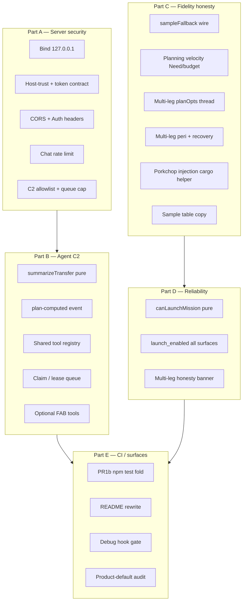
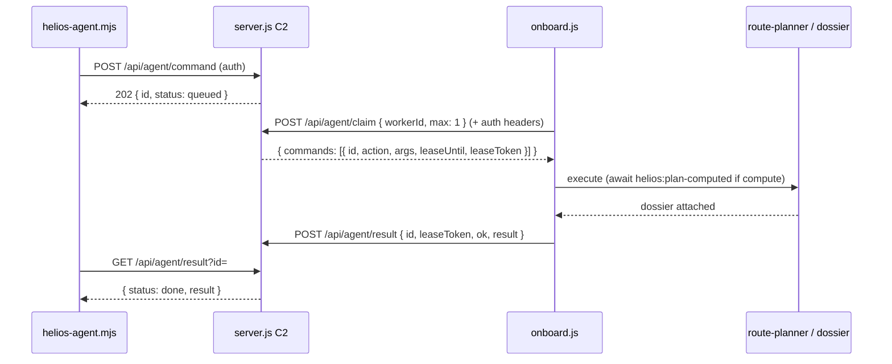
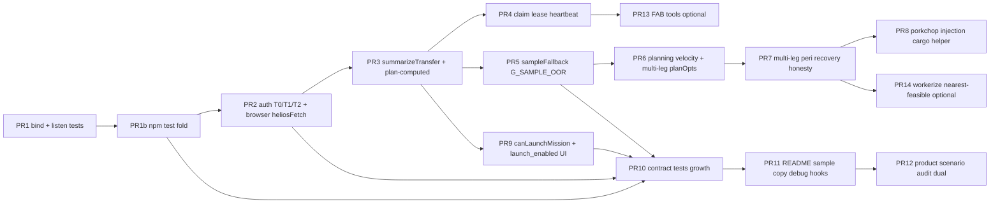

# HELIOS Post-Landing Hardening Platform

| Field | Value |
|---|---|
| **Document title** | Post-Landing Hardening Platform |
| **Author** | HELIOS engineering (design owner TBD for product sign-off) |
| **Date** | 2026-07-17 |
| **Status** | **Draft / Ready for implementation** (rev 2 — review issues addressed) |
| **Repo** | `C:\Users\kevin\workspace\k-solar-system-navigator` |
| **Branch policy** | **`main` only** — sequential green commits; no side-branch stacks |
| **Baseline** | `main` @ `de00413` (Ollama FAB + agent CLI + C2) after reliability dossier, fidelity L1/L2-plan, cargo triad, concept-grade extras |
| **Audience** | Engineers implementing security, agent C2, plan honesty, fidelity consistency, reliability gates, tests/CI, product surfaces |
| **Prior designs** | `docs/trip-planner-design.md`, `docs/cargo-vehicle-platform-design.md`, `docs/ephemeris-fidelity-platform-design.md`, `docs/trip-plan-reliability-completeness-design.md`, `docs/concept-grade-and-extras-design.md` |
| **Product vow** | **Loopback-safe tools; agent honesty; fidelity-consistent Need; Launch never bypasses dossier; CI covers the whole product surface** |
| **Revision** | rev 2 — closed review Issues 1–18 (browser token contract, multi-leg L2-plan, pure test seams, early CI fold, C4 interfaces) |

---

## Overview

HELIOS has landed a concept-grade educational trip planner: Lambert + multi-leg routing, Need/Capability/Margin, Plan Dossier quality gates, L1/L2-plan ephemeris, vehicle engineering sheets, and (as of `de00413`) a local Node server with Ollama chat proxy plus an agent C2 bus (CLI ↔ browser onboard executor).

A full codebase scan after that landing found **residual hardening debt** across five surfaces:

| Part | Theme | Severity class |
|---|---|---|
| **A** | Local server & agent security (bind, auth, CORS, rate limits) | **P0** |
| **B** | Agent C2 reliability & FAB agentic parity | **P0–P1** |
| **C** | Plan honesty / fidelity consistency (Need, sample-de, multi-leg, porkchop) | **P1** |
| **D** | Reliability gate hardening (`launchMission`, `mission_ready`, workerize later) | **P1** |
| **E** | Tests, CI, product surfaces (README, debug hooks, scenario audit realism) | **P1–P2** |

This design **formalizes verified findings with file paths**, specifies interfaces and acceptance criteria, and delivers an ordered **main-only PR plan**. It does **not** implement code. It must not contradict prior designs; it extends them where residual gaps remain after the reliability / fidelity / cargo / concept-grade landings.

**Success sentence:** A developer runs `npm start` on loopback with browser FAB + onboard C2 working under recommended defaults (no token required on loopback Host); agents report true `td.dossier` state and await plan completion; single-leg **and** multi-leg planning share the ephemeris provider under L2-plan; Need/C3/mission-budget use planning velocity; Launch is hard-blocked by `launch_enabled ?? mission_ready`; `npm test` covers physics + server + agent from the first security landings onward; README and dual scenario audits match product-default vehicles and concept-grade language.

---

## Background & Motivation

### Why this change is needed

Prior designs closed the big product vows (“no silent oops”, Need triad, L2-plan samples, concept-grade Trust Card). Post-landing code still has:

1. **Security debt** from a convenience local server that now proxies cloud chat and drives the planner.
2. **Agent field bugs** that make CLI/FAB automation report wrong mission readiness (`planDossier` miss → `null`).
3. **Fidelity seams** where single-leg Lambert uses the ephemeris provider but Need/C3/mission-budget still use Kepler velocity, and **multi-leg solves never receive backend opts** (always approx).
4. **UI-only Launch safety** — dossier disables the button, but `launchMission()` does not re-check.
5. **CI / docs lag** — server/agent tests exist but are not in `npm test`; README still leads with legacy SH budget language; scenarios audit with abstract 50 km/s vehicles.

### Verified pain points (code-backed)

| # | Pain | Evidence (path / behavior) | Severity |
|---|---|---|---|
| 1 | Server binds all interfaces | `server.js` `server.listen(PORT)` — no host; Node default is `::` / `0.0.0.0` | **Critical** |
| 2 | No API auth on chat / agent | `handleApi` serves `/api/chat`, `/api/agent/*` with no token check | **Critical** |
| 3 | CORS `*` | `cors(res)` sets `Access-Control-Allow-Origin: *` | High |
| 4 | No chat rate limit; open C2 queue | `pendingCommands.push` unbounded; chat unlimited | High |
| 5 | Onboard snapshot wrong dossier field | `js/agent/onboard.js` reads `td.planDossier`; builder sets `td.dossier` → **`missionReady` is `null`** when dossier present (not boolean false). Also `quality: td.planDossier?.overall` but dossier field is **`status`** | **Critical** (agent) |
| 6 | `compute_route` fixed 50 ms after sync compute | `computeRoute()` is **fully synchronous today** (incl. ~1400-cell nearest-feasible); dossier attaches in `finalizePlan` before return. 50 ms is a **latent/worker-prep** smell, not a present race — still replace for PR14 | Medium (latent) |
| 7 | FAB chat explain-only | `js/ui/agent-chat.js` POST `/api/chat` without `tools`; CLI has `AGENT_TOOL_DEFS` | Medium |
| 8 | Multi-tab C2 drain race | `GET /api/agent/commands` `splice(0, 32)` — first poller wins; no claim/lease | High |
| 9 | Spoofable results | `POST /api/agent/result` accepts any `id` without lease proof | Medium |
| 10 | No leadership / heartbeat TTL for “onboard” | `browserState.onboard = true` never ages out as offline | Medium |
| 11 | `G_SAMPLE_OOR` never wired | Gate exists in `plan-quality.js`; `route-planner.js` never sets `sampleFallback` | High |
| 12 | Need/C3/mission-budget use Kepler vel; **multi-leg ignores sample-de** | `need.js` / `mission-budget.js` import `getBodyVelocity3D`; single-leg Lambert uses `getPlanningVelocity3D`. `solveMultiLegRoute` uses `planOpts(waypoints[0])` but waypoints are `{body, simTime}` **without** `ephemerisBackend` — multi-leg always approx | High |
| 13 | Multi-leg Need = helio sum only; parking n/a always ok | `need.js` multi → `helio_leg`; `G_MISSION_PARKING` always `ok` for multi | Medium (by design, needs banner honesty) |
| 14 | No multi-leg perihelion gate | `plan-quality.js` peri only in single-leg branch; legs have `orbitPhysical` unused for gate | High |
| 15 | Porkchop SS cargo uses helio Δv | `porkchop-cargo.js` SS path: `dv_m_s` from grid (helio); Measurement Card SS unrefueled uses **injection** Need | High |
| 16 | User language “sample-de” / DE-class | UI select + Card short-name; want “offline sample table (not DE/SPICE)” | Medium |
| 17 | `launchMission()` ignores dossier | `js/mission.js` checks multi `allLegsOk` only; no `mission_ready` | **Critical** |
| 18 | `mission_ready` true on warnings | `mission_ready = status !== 'fail'` — `pass_with_warnings` still Launch-enabled | Medium (product choice) |
| 19 | Main-thread ~1400 Lamberts | `findNearestFeasibleTransfer` **N_DEP=40 × N_TOF=35** (~1400). File comment still says “30×30” — **stale; do not “fix” constants to match comment** | Medium (perf) |
| 20 | Multi-leg “optimum” language | Toast “local optimum” on some paths; success “MULTI-LEG ROUTE COMPUTED” lacks coarse-seed banner | Medium |
| 21 | `npm test` = physics only | `package.json` `"test": "npm run test:physics"`; `test:server` / `test:agent` separate | Medium |
| 22 | Scenario audit freezes abstract vehicle | `scenario_gate_audit.mjs` default `auditVehicleId \|\| 'abstract'` @ 50 km/s. Product cold-start already calls `applyProductVehicleDefaults()` → `unrefueled` in `main.js` when not classroom | Medium |
| 23 | `__HELIOS` always exposed | `main.js` always sets `window.__HELIOS`; `__HELIOS_ONBOARD.execute` always | Medium |
| 24 | README SH blurb stale | Features still describe legacy “all Starship propellant reserved / SH only budget” as primary story | Medium |

### Strengths to preserve

- Path jail on static files (`resolveSafePath`)
- API key server-side only (Ollama proxy)
- Plan Dossier + gates + UI Launch disable when `!mission_ready`
- Classroom offline force-approx
- Pure physics tests offline; Playwright optional
- Concept-grade Trust Card and disclaimers from prior designs
- Product default arch already `unrefueled` via `applyProductVehicleDefaults()` on main load (non-classroom)

---

## Product vows (this workstream)

1. **Loopback default** — chat and agent APIs never intentionally listen on the LAN without an explicit env opt-in and a loud console warning.
2. **Server-side secrets** — `OLLAMA_API_KEY` never ships to the browser bundle. Browser may hold an **operator-pasted** `HELIOS_API_TOKEN` in `sessionStorage`/`localStorage` only when the operator opts in (shared-lab mode); see §A2 — document XSS risk.
3. **Agent truth** — onboard snapshot and CLI results use the same field names and dossier object as the UI (`td.dossier`); pure mapper `summarizeTransfer(td)`.
4. **Completion over sleep** — agent `compute_route` returns after `finalizePlan` / `helios:plan-computed` (sync today; event required before workerization). No fixed 50 ms as the completion mechanism.
5. **One planning path under L2-plan** — single-leg **and** multi-leg Lambert endpoints, plus any V∞ / C3 / Need / mission-budget planet velocity, use the ephemeris provider when sample-de is selected (and samples hit).
6. **Launch is hard** — pure `canLaunchMission(td)` + `launchMission()` refuse when not launch-enabled.
7. **Honest labels** — sample table ≠ DE/SPICE; multi-leg ≠ global optimum; SS porkchop cargo phase aligned or labeled.
8. **CI is the product** — physics + server + agent under `npm test` from **PR1b** (immediately after bind), growing suites as security features land — not deferred to end of workstream.
9. **Main only** — sequential green commits; no long-lived side branches.
10. **Browser works on recommended defaults** — loopback + no token ⇒ FAB chat + onboard C2 fully functional without extra setup.

---

## Goals & Non-Goals

### Goals

1. **Part A** — Bind `127.0.0.1` by default; complete browser+CLI auth contract (§A2); restrict CORS (+ Authorization headers); rate-limit chat; allowlist C2 actions; max queue size; document never-expose.
2. **Part B** — Pure `summarizeTransfer`; completion event; shared tool registry (+ aliases); claim/lease C2 with onboard-first migration; heartbeat TTL; optional FAB tools.
3. **Part C** — Wire `sampleFallback` / `G_SAMPLE_OOR`; unify planning velocity; **thread multi-leg planOpts**; multi-leg peri gates + recovery; porkchop injection cargo with exported helper + numeric AC; sample-table copy.
4. **Part D** — Pure `canLaunchMission`; enforce in `launchMission`; `launch_enabled` on all UI surfaces; multi-leg honesty banner; defer workerize with comment hygiene.
5. **Part E** — Early `npm test` fold (PR1b); contract tests via pure seams; README rewrite; gate debug hooks; product-default scenario audit dual mode.

### Non-Goals

| Non-goal | Rationale |
|---|---|
| Production multi-tenant SaaS auth (OAuth, sessions) | Local classroom / solo dev scope |
| Full mTLS or reverse-proxy termination design | Out of product scope |
| HttpOnly cookie session bootstrap | Out of v1; power-user storage + Host trust instead |
| Making FAB tools equal to a mission control system | Educational agent only |
| SPICE / DE440 kernels / flight ops | Permanent concept-grade boundary |
| Guaranteed global multi-leg optimum | Coarse seed + local search remains |
| Immediate workerization of full porkchop | Later PR; design only reserves API |
| Importing `mission.js` / `onboard.js` whole into Node physics suite | Use pure extracted helpers |
| Replacing Ollama with another LLM provider | Orthogonal |
| Changing default ephemeris away from L1 approx | Fidelity design K3 |

### Success metrics

| Metric | Baseline (post-`de00413`) | Target |
|---|---|---|
| Default listen address | all interfaces | **`127.0.0.1` only** |
| Browser FAB + C2 on recommended defaults | Works (open APIs) | **Still works** on loopback without token (Host-trust) |
| Token + off-loopback | N/A | Token **required**; browser needs stored token to call APIs |
| Token + loopback (optional shared lab) | N/A | Token enforced; browser sends Bearer from storage set via FAB settings paste UI |
| Onboard `missionReady` when dossier present | **`null`** (wrong field) | Equals `td.dossier.mission_ready` |
| Onboard quality/status field | wrong (`overall`) | `td.dossier.status` |
| Multi-leg under sample-de (in-range) | Always approx endpoints | Provider endpoints; Δv can differ vs approx |
| `G_SAMPLE_OOR` when sample OOR | Never fires | Fires + banner when requested sample falls back |
| Need C3 under L2-plan vs Lambert V∞ consistency | May diverge (Kepler vel) | Planning-velocity consistent |
| SS porkchop cargo vs Card (Earth, unrefueled) | Helio vs injection mismatch | `maxCargo` within **1 kg or 0.1%** at same C3 |
| `launchMission` / `canLaunchMission` when not ready | Possible via console | **Blocked** |
| `npm test` includes server + agent | No | **Yes from PR1b** |
| Scenario audit under product default vehicle | Abstract 50 km/s only | Dual mode A (abstract geometry) + B (product default) |

---

## Proposed Design



---

## Part A — Local server & agent security (P0)

### A1. Bind address

**Today:** `server.listen(PORT)` (`server.js` ~516).

**Design:**

| Env | Default | Behavior |
|---|---|---|
| `HELIOS_BIND` | `127.0.0.1` | Listen host |
| `PORT` | `8080` | Unchanged |
| `HELIOS_BIND=0.0.0.0` or `::` | explicit non-loopback | **Require** `HELIOS_API_TOKEN`; print **loud** warning; exit if missing |

```js
// Conceptual
const BIND = process.env.HELIOS_BIND || '127.0.0.1';
const isLoopback = BIND === '127.0.0.1' || BIND === '::1' || BIND === 'localhost';
if (!isLoopback && !process.env.HELIOS_API_TOKEN) {
  console.error('FATAL: non-loopback bind requires HELIOS_API_TOKEN');
  process.exit(1);
}
server.listen(PORT, BIND, () => { /* log bind + security posture */ });
```

**Acceptance:** Fresh `npm start` shows `http://127.0.0.1:PORT`; port not reachable from LAN without explicit env. Tests use `listen(0, '127.0.0.1')`.

### A2. Auth contract (v1-complete — browser + CLI)

This section is the **authoritative** browser/CLI behavior. Do not land token enforcement without implementing the browser half of this contract.

#### A2.1 Decision (K2 / K2b)

**Three-tier model:**

| Tier | When | `/api/chat` + `/api/agent/*` auth |
|---|---|---|
| **T0 Recommended default** | Bind loopback **and** request `Host` is loopback (`127.0.0.1`, `localhost`, `[::1]`) **and** `HELIOS_API_TOKEN` **unset** | **Open** (no Bearer). FAB + onboard work with zero setup. |
| **T1 Shared lab (optional)** | Bind loopback **and** `HELIOS_API_TOKEN` **set** | **Token required** for all chat/agent routes (including heartbeat, claim, result). Browser must send Bearer. |
| **T2 Exposed bind** | Bind non-loopback | Token **mandatory** at process start; same as T1 for every request. |

**Host-trust note:** Auth exemption for “no token configured” only applies when **both** server bind and request Host are loopback. If token is set, **no Host exemption** — every client including same-origin browser must present the token.

#### A2.2 Browser token delivery (T1/T2)

1. **Never** put the token in the URL, share hash, or committed static assets.
2. FAB **Settings / API token** (small disclosure UI, default collapsed):
   - Operator pastes token once → store in `sessionStorage` key `HELIOS_API_TOKEN` (prefer session; optional “remember this browser” → `localStorage`).
   - Checkbox: “Clear on tab close” (sessionStorage only) vs “Persist on this machine” (localStorage).
   - Copy: **“Anyone who can run JS on this origin (XSS) can read this token. Prefer unset token on solo loopback.”**
3. Shared helper used by FAB chat, onboard poll/claim/result/heartbeat:

```js
// js/agent/api-auth.js (conceptual)
export function heliosAuthHeaders() {
  const t =
    (typeof sessionStorage !== 'undefined' && sessionStorage.getItem('HELIOS_API_TOKEN')) ||
    (typeof localStorage !== 'undefined' && localStorage.getItem('HELIOS_API_TOKEN')) ||
    '';
  return t ? { Authorization: `Bearer ${t}` } : {};
}

export async function heliosFetch(path, opts = {}) {
  const headers = {
    ...(opts.headers || {}),
    ...heliosAuthHeaders(),
  };
  const res = await fetch(path, { ...opts, headers });
  if (res.status === 401) {
    // surface FAB banner: "API token required — open AI settings and paste HELIOS_API_TOKEN"
    throw Object.assign(new Error('unauthorized'), { code: 'HELIOS_AUTH', status: 401 });
  }
  return res;
}
```

4. On **401**, FAB shows non-blocking banner + opens settings; onboard pauses noisy retries (backoff) and sets `window.__HELIOS_ONBOARD.authRequired = true` when exposed.
5. CLI (`scripts/helios-agent.mjs`) reads `HELIOS_API_TOKEN` from env / `.env` and always sends Bearer when set.

#### A2.3 Coordinated cut (PR2)

When PR2 enables token checks:

| Client | Change in same PR or hard dependency |
|---|---|
| `js/ui/agent-chat.js` | `heliosFetch` + settings paste UI |
| `js/agent/onboard.js` | all `getJson`/`postJson` use `heliosAuthHeaders` |
| `scripts/helios-agent.mjs` | Bearer from env |
| Server | `assertAuth` per A2.1 |
| Tests | cases for T0 open, T1 401 without header, T1 200 with header |

**Acceptance (unambiguous):**

- [ ] T0: `HELIOS_API_TOKEN` unset, loopback → FAB chat + onboard heartbeat + claim/result succeed without headers.
- [ ] T1: token set, loopback, browser **without** stored token → 401 on chat/agent; UI copy explains paste settings.
- [ ] T1: token set, browser **with** sessionStorage token → chat + full C2 path succeed.
- [ ] T2: non-loopback without env token → process exit; with token, same as T1.
- [ ] CLI with env token works in T1/T2.

### A3. CORS

**Today:** `Access-Control-Allow-Origin: *`; `Allow-Headers: Content-Type` only.

**Design:**

- Default: **omit CORS** for same-origin (or echo only `http://127.0.0.1:PORT` / `http://localhost:PORT`).
- Env `HELIOS_CORS_ORIGIN` = single origin allowlist for rare cross-port static hosting.
- Never `*` when token is configured.
- **When CORS echo/allowlist is enabled**, set:

```
Access-Control-Allow-Headers: Content-Type, Authorization, X-HELIOS-Token
Access-Control-Allow-Methods: GET, POST, OPTIONS
```

Without `Authorization` in Allow-Headers, preflight fails for tokenized cross-port clients.

### A4. Rate limit, allowlist, queue cap

| Control | Spec |
|---|---|
| Chat rate limit | Sliding window: **30 req / 60 s / IP** (loopback → single bucket). 429 + `Retry-After`. Disable or raise under `NODE_ENV=test`. |
| Max body | Keep `MAX_BODY` 2 MiB; cap `messages` count (e.g. 40) and total content chars (e.g. 200k) |
| C2 action allowlist | Executor names + aliases: `get_mission_state`, **`get_state`** (alias), `list_bodies`, `set_route`, `compute_route`, `clear_route`, `set_vehicle`, `set_departure`, `notify` |
| Tool schema | Canonical names only (no aliases in Ollama `AGENT_TOOL_DEFS`) — rule is **schema ⊆ executor ⊆ allowlist** where aliases are **allowlist+executor only** |
| Unknown action | `400` at enqueue time |
| Max queue | `HELIOS_C2_MAX_QUEUE` default **64**; reject with `503` when full |
| Max drain/claim batch | ≤ 32 |

### A5. Documentation

- README + `.env.example`: never expose beyond loopback; T0/T1/T2 table; FAB token paste for shared lab; classroom static hosting without Node is fine (no chat/C2).
- Startup banner lists: bind, token on/off, ollama key on/off, CORS mode, auth tier.

### Part A interfaces

```js
// server.js (exports for tests)
export function isLoopbackBind(host) { /* ... */ }
export function isLoopbackHostHeader(hostHeader) { /* ... */ }
export function assertAuth(req, res) {
  /* T0 open; T1/T2 require Bearer or X-HELIOS-Token; timingSafeEqual */
}
export function rateLimitChat(req) { /* { ok, retryAfterMs } */ }
export const C2_ACTIONS = new Set([/* canonical + aliases */]);
export const C2_ALIASES = { get_state: 'get_mission_state' };
```

### Part A acceptance criteria

- [ ] Default bind `127.0.0.1`
- [ ] Non-loopback without token exits non-zero
- [ ] T0/T1/T2 matrix tests green
- [ ] CORS not `*`; Allow-Headers includes Authorization when CORS enabled
- [ ] Chat 429 under flood in unit test
- [ ] Unknown C2 action rejected at POST
- [ ] Queue overflow → 503
- [ ] `.env.example` documents `HELIOS_BIND`, `HELIOS_API_TOKEN`, `HELIOS_CORS_ORIGIN`, `HELIOS_C2_MAX_QUEUE`

---

## Part B — Agent C2 reliability & FAB agentic parity

### Architecture (target)



### B1. Snapshot field contract + pure mapper

**Bug:** `snapshotState()` uses `td.planDossier?.mission_ready` → **`null`** when only `td.dossier` exists; `quality: ...overall` wrong (dossier has `status`).

**Extract pure mapper (Node-testable without DOM/Three):**

```js
// js/agent/transfer-summary.js (new, pure, no DOM)
/**
 * @param {object|null} td state.transferData
 * @returns {object|null} OnboardTransferSummary
 */
export function summarizeTransfer(td) {
  if (!td) return null;
  const dossier = td.dossier || null;
  return {
    isMultiLeg: !!td.isMultiLeg,
    tofDays: td.tofDays ?? td.tof_days ??
      (td.transferTime != null ? td.transferTime / 86400 : null),
    deltaV_m_s: td.dvTotal_lambert ?? td.dvTotal ?? td.dvTotalMultiLeg ??
      td.deltaV ?? td.totalDeltaV ?? null,
    vInfDep_m_s: td.vInfDep ?? td.v_inf_dep ??
      dossier?.geometry?.vinf_dep_m_s ?? null,
    missionReady: dossier?.mission_ready ?? null,
    launchEnabled: dossier?.launch_enabled ?? dossier?.mission_ready ?? null,
    status: dossier?.status ?? null,
    confidence_0_100: dossier?.confidence_0_100 ?? null,
    dossier_version: dossier?.dossier_version ?? null,
  };
}
```

`snapshotState()` in onboard imports `summarizeTransfer` and attaches route/vehicle fields (DOM-adjacent stays in onboard).

**Test:** `tests/onboard_snapshot_contract.mjs` imports **only** `transfer-summary.js` with fixture `td.dossier` — **does not** import `onboard.js`.

### B2. Completion-aware `compute_route`

**Today:** `computeRoute()` is **fully synchronous**; `finalizePlan` attaches dossier before return. The 50 ms sleep is **not** a current race; severity is **latent** (workerization PR14 will make fire-and-forget wrong).

**Design:**

1. Emit `helios:plan-computed` at end of `finalizePlan` with `{ dossier, transferData }`.
2. Onboard:

```js
case 'compute_route': {
  const done = waitForPlanComputed({ timeoutMs: 120_000 });
  computeRoute(); // sync today — event fires before wait resolves if same turn; use queueMicrotask-safe waiter
  await done;
  return snapshotState();
}
```

3. Waiter must handle **already-fired / sync** completion (e.g. subscribe before call, or resolve if `state.transferData?.dossier` stamped after call without requiring a future event only).
4. **Do not** use `setTimeout(50)` as the completion mechanism.

### B3. Shared tool registry

| Location | Role |
|---|---|
| `js/agent/tools.js` (new) or server export | Ollama tools JSON schema — **canonical names only** |
| `js/agent/onboard.js` | Executor: canonical + aliases (`get_state` → `get_mission_state`) |
| Server allowlist | Canonical + aliases |
| CLI | Loads schema from `GET /api/agent/tools` |

**Alias rule:** schema may be a **strict subset** of executor/allowlist; aliases are allowlist-only and never advertised to the model as separate tools.

### B4. FAB agentic parity (optional mode)

| Phase | Behavior |
|---|---|
| B4a (with B1) | Snapshot truthful via `summarizeTransfer`; explain-only |
| B4b (optional PR) | FAB may send tools + in-process `executeCommand` loop (max 6 rounds); toggle default **off** |
| B4c | In-process preferred over re-queue C2 |

All FAB fetches use `heliosFetch` (A2).

### B5. Multi-tab drain → claim/lease

**Today:** `GET /api/agent/commands` splices queue.

**Design:**

```
POST /api/agent/claim
body: { workerId: string, max?: number }
→ { commands: [{ id, action, args, leaseToken, leaseUntil }] }

POST /api/agent/result
body: { id, leaseToken, ok, result?, error? }
→ 200 if lease matches; else 409

GET /api/agent/commands
→ default **410 Gone** (or disabled). Optional `HELIOS_C2_LEGACY_DRAIN=1`: if enabled, legacy GET must **issue the same lease tokens** as claim (not raw splice without lease) so spoof protection holds.
```

**PR4 migration AC (hard):**

- [ ] Onboard **only** uses claim (never legacy splice drain).
- [ ] Same PR ships server claim + onboard claim together — no release where server removes drain before onboard updates.
- [ ] README: “After server upgrade, hard-refresh HELIOS tab so onboard uses claim.”
- [ ] If legacy GET remains behind flag, it returns leased commands (not unprotected splice).
- [ ] CLI unchanged (queue + poll results only) — no drain client in CLI today.

Lease TTL default **30 s**; optional renew endpoint.

### B6. Heartbeat TTL

- Heartbeat every ~4 s; grace **15 s**.
- `onboard: ageMs < TTL` on health/state.
- Heartbeat POST uses auth headers when T1/T2.

### B7. Spoofable results

`leaseToken` required on result; reject mismatch.

### Part B acceptance criteria

- [ ] `summarizeTransfer` unit test: fixture with only `td.dossier` → correct `missionReady` + `status`
- [ ] `compute_route` does not use fixed 50 ms as sole wait
- [ ] Two claimers cannot receive same command id
- [ ] Result without leaseToken → 409
- [ ] Stale heartbeat → onboard false
- [ ] Tool schema canonical; aliases allowlist-only
- [ ] Onboard+server claim ship same PR

---

## Part C — Plan honesty / fidelity consistency

### C1. Wire `sampleFallback` / `G_SAMPLE_OOR`

**Today:** gate supports `opts.sampleFallback`; planner never sets it. Provider silently falls back in `effectiveBackend`.

**Endpoint pairs (must match solve path):**

| Mode | Pairs to check for sample hit |
|---|---|
| Single-leg | `(body1, departureSimTime)`, `(body2, arrivalSimTime)` — same bodies/times as `solveTransferOrbit` planning positions. If Need/C3 later uses **SOI parent** velocity, also check parent at those times when parent ≠ body (moons). |
| Multi-leg | For each leg `i`: `(waypoints[i].body, depart)`, `(waypoints[i+1].body, arrive)` — every endpoint `getPlanningPosition3D` / velocity uses in `solveMultiLegRoute`. |
| Classroom / backend≠sample-de | Never set `sampleFallback` (classroom force-approx is separate; optional `G_FIDELITY_CLASSROOM` from reliability design). |

```js
// js/physics/ephemeris-provider.js (export)
export function planningSampleFallback(endpoints, requested, classroomMode) {
  // endpoints: Array<{ body, timeSec }>
  if (classroomMode || requested !== 'sample-de') return false;
  for (const { body, timeSec } of endpoints) {
    const { sampleHit, backend } = effectiveBackend(body, timeSec, requested, { classroomMode });
    if (!sampleHit || backend !== 'sample-de') return true;
  }
  return false;
}
```

Wire from `computeRoute` / multi-leg finalize / share recompute; pass `sampleFallback` into `buildPlanDossier`; stamp `td.sampleFallback`.

### C2. Planning velocity for Need / C3 / mission-budget

Replace `getBodyVelocity3D` with `getPlanningVelocity3D` using `planOptsFromTd(td)` in:

- `need.js` `computeDepartureC3`
- `mission-budget.js` V∞ parent velocities
- `mission-export.js` export state vectors

`plan-dossier.js` asymptote already uses planning velocity — keep.

### C2b. Multi-leg L2-plan backend threading (**in scope — not deferred**)

**Verified gap:** `solveMultiLegRoute` / flyby velocity use `planOpts(waypoints[0])`, but waypoints are `{ body, simTime }` only — **no** `ephemerisBackend`. `stampPlanningEphemeris(td)` runs **after** solve, so multi-leg Lambert **always** uses approx even when UI selects sample-de.

**Design:**

```js
// routing.js
export function solveMultiLegRoute(waypoints, opts = {}) {
  const pOpts = {
    backend: opts.backend || opts.ephemerisBackend || 'approx',
    classroomMode: !!opts.classroomMode,
  };
  // use pOpts for every getPlanningPosition3D / getPlanningVelocity3D
  // ...
  const td = { /* existing fields */, ephemerisBackend: pOpts.backend, classroomMode: pOpts.classroomMode };
  return td;
}

export function findMultiLegWindow(origin, dest, flybys, depHint, opts = {}) {
  // thread same opts into every internal solveMultiLegRoute call
}
```

**Callers** (`route-planner.js`, share, scenario audit):

```js
const planEph = {
  backend: state.classroomMode ? 'approx'
    : (state.ephemerisBackend === 'sample-de' ? 'sample-de' : 'approx'),
  classroomMode: !!state.classroomMode,
};
td = tagMultiLegBodies(solveMultiLegRoute(waypoints, planEph));
```

**Acceptance:** Earth→Venus→Mars (or any multi-leg with in-range samples) under sample-de: at least one of `dvTotalMultiLeg` or per-leg geometry differs from approx when sample table differs; classroom forces approx. Trust Card / fidelity row shows multi-leg backend honestly (not “L2-plan” if solve was approx).

**Not acceptable:** leaving multi-leg always-approx implicit without banner. Threading is the chosen path (not out-of-scope).

### C3. Multi-leg honesty (Need, parking, perihelion, recovery)

| Topic | Today | Target |
|---|---|---|
| Need phase | Always `helio_leg` sum | Keep; completeness/Trust: “heliocentric maneuver sum — not parking/injection” |
| `G_MISSION_PARKING` | level `ok` always | **ok + n/a** completeness; **warn** only if `costBasis === 'mission'` on multi-leg |
| Perihelion | Single-leg only | **`G_PERIHELION_LEGS` fail** if any leg `orbitPhysical` peri &lt; `MIN_PERIHELION_AU` |
| Recovery | `recoveryFromGates` triggers find-window on `G_PERIHELION` only | Include **`G_PERIHELION_LEGS`** in the same failCodes set as `G_PERIHELION` for `find_nearest_window` / porkchop; **also** push multi-leg-appropriate actions: `snap_flybys` (primary when flybys present), note that single-leg `findNearestFeasibleTransfer` alone may not fix multi-leg sun-graze |

```js
// recoveryFromGates (conceptual delta)
if (failCodes.has('G_PATHOLOGICAL') || failCodes.has('G_PERIHELION')
    || failCodes.has('G_PERIHELION_LEGS') || failCodes.has('G_DV_SANE')
    || failCodes.has('G_LAMBERT_OK')) {
  actions.push({ id: 'find_nearest_window', label: 'Find nearest feasible window', primary: !td?.isMultiLeg });
  actions.push({ id: 'open_porkchop', label: 'Open launch windows (porkchop)' });
}
if (failCodes.has('G_PERIHELION_LEGS') && td?.isMultiLeg) {
  actions.push({ id: 'snap_flybys', label: 'Snap flyby dates', primary: true });
}
```

### C4. Porkchop Starship cargo phase

**Today:** SS cargo uses helio cell Δv; Card unrefueled/tanker-n uses injection Need. `escapeFromLowOrbitDV` is **private** in `mission-budget.js`.

**Chosen path: C4-A for Earth origin** + loud label / n/a for non-Earth.

#### C4 interfaces (required export surface)

```js
// js/physics/mission-budget.js — export existing private helper or thin wrappers
/** Parking-orbit escape Δv to achieve given V∞ (m/s). Matches computeMissionBudget parking alt (100 km). */
export function injectionDepartureDvFromVinf(originBody, vInf_m_s) {
  // same μ, radius, parking altitude as escapeFromLowOrbitDV / computeMissionBudget
}

export function injectionDepartureDvFromC3(originBody, c3_m2_s2) {
  if (!isFinite(c3_m2_s2) || c3_m2_s2 < 0) return null;
  return injectionDepartureDvFromVinf(originBody, Math.sqrt(c3_m2_s2));
}
```

```js
// js/physics/porkchop-cargo.js
export function cellMaxCargoKg(opts = {}) {
  // mode === 'ss' && earthOrigin:
  //   inj = injectionDepartureDvFromC3(originBody, opts.c3_m2_s2)
  //   return maxCargoForNeed(inj, arch, tankerCount)
  // mode === 'ss' && !earthOrigin:
  //   either null (n/a) or helio path with opts.forceHelioLabel
}
```

**Parking assumptions:** identical to `computeMissionBudget` — low parking **100 km** above body radius, impulsive, same μ (`G_CONST * origin.mass`). Earth-only for SS injection heatmap alignment with F9-class C3 story; non-Earth SS → heatmap **n/a** or helio with UI title “heliocentric leg Δv (not injection Need)”.

**Tanker-n / cargo mass:** heatmap is **max cargo vs architecture** at cell Need (`maxCargoForNeed(inj, arch, tankerCount)`), same as Card’s capability max-cargo framing — **not** margin at `state.cargoMass_kg`. Document: changing cargo mass on UI does not recolor SS max-cargo heatmap (capability envelope), only margin readout elsewhere. `tankerCount` **does** affect heatmap key (invalidate cache on tanker change — already partially true via `helios:vehicle-changed`).

**Numeric AC:**

- Fixture: Earth origin, `sh-starship`, `unrefueled`, finite porkchop cell with C3 = C.
- `kgHeat = cellMaxCargoKg({ mode:'ss', c3_m2_s2: C, starshipArch:'unrefueled', tankerCount:0, originBody: Earth })`
- `kgCard = maxCargoForNeed(injectionDepartureDvFromC3(Earth, C), 'unrefueled', 0)`
- Assert: `kgHeat` and `kgCard` both finite and  
  **`abs(kgHeat - kgCard) ≤ max(1 kg, 0.001 * max(kgCard, 1))`**  
  (within **1 kg or 0.1%**, whichever is larger).

### C5. User-facing sample language

Keep internal id `sample-de` (share/export). Rename presentation strings only — never “Sample DE” without not-SPICE disclaimer.

### Part C acceptance criteria

- [ ] sample OOR → `G_SAMPLE_OOR` with endpoint pairs as defined
- [ ] Need C3 + mission-budget use planning velocity
- [ ] Multi-leg sample-de threaded; Δv can differ vs approx when samples hit
- [ ] Multi-leg sun-graze → `G_PERIHELION_LEGS` fail + recovery actions include snap/porkchop
- [ ] Porkchop SS Earth cargo within 1 kg / 0.1% of Card formula
- [ ] Exported `injectionDepartureDvFromC3` used by both paths

---

## Part D — Reliability gate hardening

### D1. Pure `canLaunchMission` + hard enforce

**Do not** Node-import full `mission.js` (pulls scene/Three/DOM).

```js
// js/mission-gates.js (new, pure) OR export from plan-quality.js
export function canLaunchMission(td) {
  if (!td) return { ok: false, reason: 'no transferData' };
  const dossier = td.dossier;
  if (!dossier) return { ok: false, reason: 'no dossier' };
  const launchOk = dossier.launch_enabled ?? dossier.mission_ready;
  if (!launchOk) return { ok: false, reason: 'not launch_enabled' };
  if (td.isMultiLeg && !td.allLegsOk) return { ok: false, reason: 'legs failed' };
  return { ok: true, reason: null };
}
```

```js
// mission.js launchMission()
const gate = canLaunchMission(td);
if (!gate.ok) {
  notify(`CANNOT LAUNCH: ${gate.reason} (see Plan Status)`);
  return;
}
```

If dossier missing after user compute, call `buildPlanDossier` once then re-check (UI path). Pure tests use fixture dossiers only.

**Full `launchMission` body** remains Playwright/ci_ui coverage, not physics suite.

### D2. `mission_ready` vs `launch_enabled` + UI coupling

| Field | Meaning |
|---|---|
| `status` | `pass` \| `pass_with_warnings` \| `fail` |
| `mission_ready` | **Unchanged:** `status !== 'fail'` |
| `launch_enabled` | Equals `mission_ready` unless `state.planStrictWarnings` → then only `status === 'pass'` |

**All Launch enablement surfaces must use `launch_enabled ?? mission_ready`:**

| Surface | File |
|---|---|
| Launch button disabled attr | `route-display.js` |
| Plan dossier banner “Launch enabled / blocked” | `plan-dossier.js` (~338–339 today hardcodes `mission_ready`) |
| Trust Card ready line | `trust-card.js` |
| Export `feasible` / `mission_ready` | keep export `mission_ready` as gate mission_ready; may add `launch_enabled` additive |
| Agent snapshot | `summarizeTransfer` → `launchEnabled` |

**v1 default:** `launch_enabled === mission_ready`.  
**AC:** With `planStrictWarnings` true and status `pass_with_warnings`, banner says Launch blocked and button disabled even though `mission_ready` might still be true (if we keep mission_ready as non-fail) — actually under strict warnings `launch_enabled` false while `mission_ready` still true by K14. Banner must not say “YES — Launch enabled” in that case.

### D3. Workerize `findNearestFeasibleTransfer` (later)

Hooks only. Grid is **40×35 (~1400)** — implementers must **not** change N_DEP/N_TOF to match the stale “30×30” comment; optional PR14/hygiene: fix comment to `40×35`.

### D4. Multi-leg honesty banner

Always show on multi-leg results:

> **Multi-leg plan uses coarse seed + local search — not a global optimum.** Gravity-assist Δv is patched-conic educational.

Gate `G_MULTI_LEG_SEARCH` level `ok` (informative); `G_DATE_ADJUSTED` remains warn when search moved dates.

### Part D acceptance criteria

- [ ] `tests/launch_mission_gate.mjs` imports **only** pure `canLaunchMission` (not full mission.js scene graph)
- [ ] `canLaunchMission` false when dossier not ready
- [ ] Banner + button + Trust Card all honor `launch_enabled ?? mission_ready`
- [ ] Multi-leg non-global-optimum language on panel

---

## Part E — Tests, CI, product surfaces

### E1. Fold tests into `npm test` **early (PR1b)**

Do **not** wait until end of workstream.

**PR1b** (immediately after PR1 bind, or same day follow-up commit):

```json
"test": "npm run test:physics && npm run test:server && npm run test:agent",
"test:physics": "node tests/run_physics.mjs",
"test:server": "node tests/server_path_jail.mjs",
"test:agent": "node tests/agent_api.mjs"
```

Also fix existing suites to `server.listen(0, '127.0.0.1')` in PR1/PR1b.

Later PRs **grow** `test:server` / `test:agent` / new pure modules; folding the npm script is not gated on those tests existing.

Optional later: `"test:server": "node tests/server_path_jail.mjs && node tests/server_security.mjs"` after PR2.

### E2. New / extended tests (pure seams)

| Test | Imports | Asserts |
|---|---|---|
| `tests/onboard_snapshot_contract.mjs` | `js/agent/transfer-summary.js` only | dossier field mapping |
| `tests/launch_mission_gate.mjs` | `canLaunchMission` pure module only | refuse when not ready |
| `tests/sample_fallback_gate.mjs` | provider + plan-quality | OOR → `G_SAMPLE_OOR` |
| `tests/multileg_peri_gate.mjs` | plan-quality + fixtures | sun-graze leg fails; recovery includes `G_PERIHELION_LEGS` |
| `tests/multileg_sample_backend.mjs` | routing + samples | multi-leg opts threaded |
| `tests/porkchop_cargo.mjs` (extend) | porkchop-cargo + exported injection helper | 1 kg / 0.1% AC |
| `tests/planning_velocity_need.mjs` | need + provider | C3 sample-de ≠ approx when samples differ |
| `tests/agent_api.mjs` (extend) | server | T0/T1 auth, allowlist, lease, queue |
| `tests/scenario_gate_audit.mjs` | dual mode | product-default expects |

Playwright remains for full `launchMission` / DOM.

### E3. README rewrite

1. Concept-grade — not flight ops / SPICE / SpaceX-certified  
2. Plan Dossier + launch gate  
3. Product default: **unrefueled** (already on main load) + cargo-aware — not legacy SH-only primary  
4. Fidelity L1 default; sample table L2-plan (single + multi)  
5. Local server: loopback, T0/T1/T2 auth, never expose  
6. Agent CLI + FAB; token paste for shared lab  
7. `npm test` = physics + server + agent  

### E4. Gate `__HELIOS` / `__HELIOS_ONBOARD.execute`

Expose when hostname loopback **or** `?debug=1`. Playwright on localhost OK.

### E5. Scenario audit dual mode

**Q5 closed:** `applyProductVehicleDefaults()` already runs on main load (`main.js` non-classroom → `unrefueled`). PR12 is **not** about wiring product defaults into the app; it is about **audit mode B** exercising product-default vehicles instead of only abstract 50 km/s.

| Mode | Vehicle | Purpose |
|---|---|---|
| **A (existing)** | `auditVehicleId` / abstract | Geometry / flyby gates |
| **B (new)** | Product default `sh-starship` + `unrefueled` (or per-scenario override) | Product honesty |

Scenarios failing B set `plan_expect: 'fail'` / `demo_unsafe` with notes.

### Part E acceptance criteria

- [ ] After PR1b, `npm test` fails if agent or server tests fail  
- [ ] Snapshot/launch tests use pure seams only  
- [ ] README primary vehicle story is unrefueled/cargo  
- [ ] Public hostname does not expose `execute`  
- [ ] Dual audit loop present  

---

## API / Interface Changes

### Server env (`.env.example`)

```bash
OLLAMA_API_KEY=
OLLAMA_MODEL=gemma4:31b-cloud
PORT=8080
HELIOS_BASE_URL=http://127.0.0.1:8080
HELIOS_BIND=127.0.0.1
HELIOS_API_TOKEN=
HELIOS_CORS_ORIGIN=
HELIOS_C2_MAX_QUEUE=64
HELIOS_CHAT_RATE_LIMIT=30
HELIOS_C2_LEGACY_DRAIN=
```

### Auth header

```
Authorization: Bearer <HELIOS_API_TOKEN>
# or
X-HELIOS-Token: <HELIOS_API_TOKEN>
```

### Agent claim (new)

```http
POST /api/agent/claim
Content-Type: application/json
Authorization: Bearer <token>   # when T1/T2

{"workerId":"tab-uuid","max":1}
```

### Pure helpers (new modules)

```js
// js/agent/transfer-summary.js
export function summarizeTransfer(td) { /* ... */ }

// js/mission-gates.js
export function canLaunchMission(td) { /* ... */ }

// js/physics/mission-budget.js
export function injectionDepartureDvFromVinf(originBody, vInf_m_s) { /* ... */ }
export function injectionDepartureDvFromC3(originBody, c3_m2_s2) { /* ... */ }

// js/physics/routing.js
export function solveMultiLegRoute(waypoints, opts = {}) { /* opts.backend, opts.classroomMode */ }
```

### Dossier additive fields

```json
{
  "launch_enabled": true,
  "geometry": { "sample_fallback": false },
  "gates": [
    { "code": "G_SAMPLE_OOR", "level": "warn" },
    { "code": "G_PERIHELION_LEGS", "level": "fail" },
    { "code": "G_MULTI_LEG_SEARCH", "level": "ok" }
  ]
}
```

### Events

```js
window.addEventListener('helios:plan-computed', (e) => {
  // e.detail = { dossier, transferData }
});
```

---

## Data Model Changes

| Object | Change | Migration |
|---|---|---|
| `td.dossier` | Additive `launch_enabled`, geometry.sample_fallback | Additive |
| `td.sampleFallback` | Boolean stamp | Optional |
| `sessionStorage.HELIOS_API_TOKEN` | Operator paste | User-local |
| C2 leases | In-memory | — |
| Scenarios | Optional product audit expects | Additive |

---

## Alternatives Considered

### Alt 1 — Remove Node agent / static only

Rejected for full removal; static offline classroom remains valid without Node.

### Alt 2 — Full session auth (cookies, OAuth)

Rejected for v1; Host-trust + optional bearer is enough.

### Alt 3 — Token required always, CLI-only when set (old Q1 default)

**Rejected as the only path.** Broke recommended-default FAB/C2. Replaced by **T0 Host-trust when token unset** + **T1 paste UI when token set** (Issue 1).

### Alt 4 — Multi-leg always approx with banner only

Rejected as sole fix for L2-plan honesty; **threading planOpts is in scope (C2b)**. Banner-only would violate vow 5.

### Alt 5 — Keep Kepler velocity for Need; document only

Rejected; documentation alone fails fidelity vow.

### Alt 6 — `mission_ready` false on any warning

Rejected as default; optional `planStrictWarnings` + `launch_enabled`.

### Alt 7 — Node-import full mission.js / onboard.js for unit tests

Rejected; extract pure seams (Issue 3).

### Alt 8 — Defer `npm test` fold to PR10

Rejected; **PR1b early fold** (Issue 4).

---

## Security & Privacy Considerations

### Threat model (local educational server)

| Threat | Impact | Mitigation |
|---|---|---|
| LAN attacker burns Ollama quota | $$$ / key abuse | Default loopback; token required non-loopback |
| LAN attacker queues C2 | Hijack open browser session | Token off-loopback; allowlist; claim/lease |
| Cross-origin webpage calls API | CSRF-like abuse | No CORS `*`; Authorization in Allow-Headers when CORS on |
| Malicious tab spoofs C2 results | False mission_ready to CLI | leaseToken |
| Multi-tab command theft | Lost/duplicate actions | claim/lease |
| XSS reads pasted token | Token theft | Document; prefer T0 solo; sessionStorage default |
| **Local malware / other user on same host** | Burn `OLLAMA_API_KEY` via open loopback APIs when token unset | **Loopback ≠ authenticated.** Shared lab machines should set `HELIOS_API_TOKEN` (T1) even on 127.0.0.1 |
| Path traversal static | File read | `resolveSafePath` |
| Client ships Ollama key | Key theft | Never; proxy only |

### AuthN/Z summary

- No user accounts. Shared secret = lab operator secret.
- T0 trusts loopback Host only when token unset.

### Data handling

- Chat → Ollama Cloud when key present — document privacy.
- C2 in-memory only.
- Do not log Authorization headers.

---

## Observability

| Signal | Where |
|---|---|
| Startup security posture | Console: bind, token tier, cors, ollama |
| Auth 401 counts | Optional health counters |
| Chat 429 | health / logs |
| C2 queue depth, claim conflicts | `/api/health` agent section |
| Onboard ageMs | health + state GET |
| Plan gates | dossier |

---

## Rollout Plan

1. **PR1 bind** → **PR1b fold `npm test`** (immediate).  
2. **PR2 auth contract** — server + browser `heliosFetch` + FAB paste UI + CLI **same cut**.  
3. **Agent truth** (summarizeTransfer, plan-computed).  
4. **Claim/lease** onboard+server same PR.  
5. **Fidelity** sample OOR, planning velocity, **multi-leg backend**, peri, porkchop cargo.  
6. **Launch pure gate** + UI `launch_enabled` surfaces.  
7. **README / debug / dual audit**.  
8. Optional FAB tools; workerize later.

**Rollback:** each PR independently revertable. Flags: empty token (T0), `HELIOS_C2_LEGACY_DRAIN`, `planStrictWarnings`, FAB agentic off.

---

## Key Decisions

1. **K1 — Default bind `127.0.0.1`.** Non-loopback requires token.

2. **K2 — Three-tier auth (T0/T1/T2).** Token unset + loopback Host → browser APIs open (recommended default). Token set → required for all clients including browser. Non-loopback → token mandatory at start.

3. **K2b — Browser token via operator paste to sessionStorage/localStorage + `heliosFetch`.** Never URL or committed assets. XSS documented. FAB settings UI required in PR2.

4. **K3 — CORS never `*` when token set; Allow-Headers includes Authorization when CORS enabled.**

5. **K4 — C2 allowlist at enqueue; aliases allowlist-only (`get_state`).** Schema canonical subset.

6. **K5 — Canonical dossier field `td.dossier` only.** Snapshot via pure `summarizeTransfer`; `status` not `overall`.

7. **K6 — Plan completion event / await; no fixed 50 ms.** Sync path is fine today; event required for worker-prep (latent race, not present race).

8. **K7 — Claim/lease C2; onboard migrates in same PR as server; legacy GET default off / leased if enabled.**

9. **K8 — FAB tools optional and in-process; default explain-only.**

10. **K9 — Wire `sampleFallback` → `G_SAMPLE_OOR` with explicit endpoint pairs.**

11. **K10 — Need / C3 / mission-budget use `getPlanningVelocity3D`.**

12. **K10b — Multi-leg `solveMultiLegRoute` / `findMultiLegWindow` accept and honor `backend` + `classroomMode` (in scope).**

13. **K11 — Porkchop SS cargo: `injectionDepartureDvFromC3` + `maxCargoForNeed`; Earth-origin; AC ≤1 kg or 0.1%.**

14. **K12 — Keep internal backend id `sample-de`; rename user-facing copy only.**

15. **K13 — Pure `canLaunchMission` + hard check in `launchMission`.** Full mission.js not Node-imported for unit tests.

16. **K14 — `mission_ready` unchanged for warnings; `launch_enabled` for strict mode; all UI surfaces use `launch_enabled ?? mission_ready`.**

17. **K15 — Multi-leg perihelion fail `G_PERIHELION_LEGS` + recovery map includes it.**

18. **K16 — `npm test` fold in PR1b (early), not end-loaded PR10.**

19. **K17 — Debug hooks loopback/`debug=1` for execute.**

20. **K18 — Scenario dual audit; product cold-start unrefueled already on main (Q5 closed).**

21. **K19 — Main-only sequential green commits.**

22. **K20 — Single design doc for Parts A–E.**

23. **K21 — Nearest-feasible grid is 40×35 (~1400); do not “fix” to stale 30×30 comment.**

---

## Risks & Mitigations

| Risk | Severity | Mitigation |
|---|---|---|
| Token set without browser paste UX | High | PR2 ships heliosFetch + FAB settings together |
| Old tab uses legacy drain after claim deploy | Medium | Same-PR onboard; default legacy off; README hard-refresh |
| Planning velocity / multi-leg sample shifts goldens | Medium | Update tests with documented deltas |
| Injection cargo helper diverges from mission-budget | High | Single exported function; 1 kg / 0.1% AC |
| Strict multi-leg peri fails demos | Medium | demo_unsafe / fix seeds |
| Rate limit flaky tests | Low | `NODE_ENV=test` bypass |
| Local malware burns key on T0 | Low–Med | Document T1 for shared labs |
| Workerize deferred UI jank | Low | Agent timeout 120 s; later PR14 |

---

## Main-only PR Plan



### PR 1: Loopback bind + security docs (minimal)
- **Title:** `fix(server): default bind 127.0.0.1 and document never-expose`
- **Files:** `server.js`, `.env.example`, README security stub
- **Deps:** none
- **Tests:** listen host `127.0.0.1` in server/agent tests
- **AC:** default bind loopback; non-loopback without token fails fast

### PR 1b: Fold CI early
- **Title:** `test(ci): include server and agent in npm test`
- **Files:** `package.json`, listen-host fixes if not in PR1
- **Deps:** PR1
- **AC:** `"test"` runs physics + server + agent; green on main  
- **Note:** Replaces former end-loaded “PR10 fold only.” Later PR10 is **contract suite growth**, not first fold.

### PR 2: Auth contract + CORS headers + rate limit + allowlist + queue
- **Title:** `feat(server,agent): T0/T1/T2 token contract, heliosFetch, FAB token settings`
- **Files:** `server.js`, `js/agent/api-auth.js`, `js/agent/onboard.js`, `js/ui/agent-chat.js`, `scripts/helios-agent.mjs`, `.env.example`, tests
- **Deps:** PR1b
- **AC:** Full A2 acceptance matrix; CORS Allow-Headers includes Authorization; **do not land server token-only without browser path**

### PR 3: Pure summarizeTransfer + plan-computed + compute_route await
- **Title:** `fix(agent): transfer summary mapper and plan-computed completion`
- **Files:** `js/agent/transfer-summary.js`, `js/agent/onboard.js`, `js/ui/route-planner.js`
- **Deps:** Preferred after PR1; **may parallelize after PR1**. If landing after PR2, tests send auth headers when token set in env. Preferred sequential: after PR2 so agent tests stay green under T1 CI configs.
- **Tests:** `tests/onboard_snapshot_contract.mjs` (pure import only)
- **AC:** missionReady/status correct; no 50 ms sole wait; sync-safe waiter

### PR 4: Claim/lease + heartbeat TTL
- **Title:** `feat(agent): C2 claim/lease queue and heartbeat TTL`
- **Files:** `server.js`, `js/agent/onboard.js` (claim only), tests, README refresh note
- **Deps:** PR2 (auth on claim/result/heartbeat), PR3 (executor)
- **AC:** onboard claim-only same PR; legacy default off; spoof rejected; stale onboard

### PR 5: Wire sampleFallback / G_SAMPLE_OOR
- **Title:** `fix(plan): surface sample-table OOR fallback gate`
- **Files:** `ephemeris-provider.js`, `route-planner.js`, plan-dossier, plan-quality copy
- **Deps:** none hard
- **Tests:** `tests/sample_fallback_gate.mjs`
- **AC:** endpoint pairs per C1; gate fires

### PR 6: Planning velocity + multi-leg planOpts
- **Title:** `fix(fidelity): planning velocity for Need/budget and multi-leg L2-plan opts`
- **Files:** `need.js`, `mission-budget.js`, `mission-export.js`, `routing.js` (`solveMultiLegRoute`, `findMultiLegWindow`), `route-planner.js`, share paths, tests
- **Deps:** PR5 optional
- **Tests:** `planning_velocity_need.mjs`, `multileg_sample_backend.mjs`
- **AC:** K10 + K10b

### PR 7: Multi-leg perihelion + recovery + honesty banner
- **Title:** `fix(plan): multi-leg perihelion gate, recovery, search honesty`
- **Files:** `plan-quality.js` (gates + `recoveryFromGates`), plan-dossier UI, route-display
- **Deps:** none hard
- **Tests:** `multileg_peri_gate.mjs`
- **AC:** `G_PERIHELION_LEGS` fail + recovery actions

### PR 8: Porkchop SS injection cargo
- **Title:** `fix(porkchop): SS cargo via exported injectionDepartureDvFromC3`
- **Files:** `mission-budget.js` (export helpers), `porkchop-cargo.js`, `porkchop.js` UI labels, tests
- **Deps:** PR6 preferred
- **AC:** Earth unrefueled within **1 kg or 0.1%** of Card formula

### PR 9: canLaunchMission + launch_enabled all surfaces
- **Title:** `fix(mission): pure canLaunchMission and launch_enabled UI coupling`
- **Files:** `js/mission-gates.js`, `mission.js`, `plan-quality`/`plan-dossier` launch_enabled, `route-display.js`, `trust-card.js`, banner copy
- **Deps:** soft after PR3
- **Tests:** `launch_mission_gate.mjs` pure only
- **AC:** K13–K14; banner not lie under planStrictWarnings

### PR 10: Contract / security suite growth
- **Title:** `test(ci): expand server security and pure contract suites`
- **Files:** `tests/server_security.mjs`, package.json test:server composition if needed
- **Deps:** PR1b already folded; grows coverage after PR2/PR5/PR9 land
- **AC:** security matrix + pure contracts in CI  
- **Note:** Not the first fold (that is PR1b).

### PR 11: README + sample copy + debug hooks
- **Title:** `docs(product): concept-grade README, sample-table copy, debug hook gate`
- **Files:** README, index.html labels, measurement-card, main.js, onboard execute gate
- **Deps:** PR10 preferred
- **AC:** K12, K17, E3

### PR 12: Product-default scenario audit dual mode
- **Title:** `test(scenarios): dual audit abstract + product-default vehicles`
- **Files:** `scenarios.js`, `scenario_gate_audit.mjs`
- **Deps:** PR7, PR9 recommended
- **AC:** Mode B; Q5 already applied in app — audit only

### PR 13 (optional): FAB in-process tools
- **Deps:** PR3, PR4
- **AC:** default off; heliosFetch; max rounds

### PR 14 (optional): Workerize nearest-feasible
- **Deps:** PR7 stable; completion event from PR3 required
- **AC:** non-blocking UI; fix 40×35 comment; do not shrink grid to 30×30

**Platform hardening launch:** PR 1 → 1b → 2–4.  
**Plan honesty:** PR 5–9.  
**Surfaces:** PR 10–12.  
**Stretch:** PR 13–14.

### Implementation checklist (per commit)

1. Implement slice on `main`  
2. `npm test` green (after PR1b)  
3. Commit + push `main`  
4. No long-lived side branches  

---

## Open Questions

| # | Question | Resolution |
|---|---|---|
| Q1 | FAB + token when set? | **Resolved — A2 / K2 / K2b** T0 open without token; T1 paste UI when token set |
| Q2 | `G_MISSION_PARKING` warn or ok multi-leg? | **ok + n/a**; warn only if costBasis=mission |
| Q3 | Legacy GET `/api/agent/commands` duration? | **Default off**; if on, must lease; remove after one release |
| Q4 | `planStrictWarnings` in UI? | **No** v1 (state/debug only) |
| Q5 | Product-default arch on cold start? | **Closed — already `unrefueled` via `applyProductVehicleDefaults()` in `main.js`** |

No open product decisions remain that block Ready for implementation.

---

## References

- `docs/trip-planner-design.md`  
- `docs/cargo-vehicle-platform-design.md`  
- `docs/ephemeris-fidelity-platform-design.md`  
- `docs/trip-plan-reliability-completeness-design.md`  
- `docs/concept-grade-and-extras-design.md`  
- Code: `server.js`, `js/agent/onboard.js`, `js/ui/agent-chat.js`, `js/ui/plan-dossier.js`, `js/physics/plan-quality.js`, `js/physics/need.js`, `js/physics/mission-budget.js`, `js/physics/ephemeris-provider.js`, `js/physics/porkchop-cargo.js`, `js/physics/routing.js`, `js/mission.js`, `js/ui/route-planner.js`, `js/main.js` (`applyProductVehicleDefaults`), `package.json`, `README.md`, `tests/scenario_gate_audit.mjs`  
- Baseline: `de00413`  
- Review: rev 2 addresses design review Issues 1–18  

---

## Appendix A — Gate / field map (hardening deltas)

| Code / field | Level | New? | Source |
|---|---|---|---|
| `G_SAMPLE_OOR` | warn | Wire existing | PR5 |
| `G_PERIHELION_LEGS` | fail | New + recovery | PR7 |
| `G_MULTI_LEG_SEARCH` | ok | New informative | PR7 |
| `launch_enabled` | dossier field | New; all UI surfaces | PR9 |
| `td.sampleFallback` | stamp | New | PR5 |
| `summarizeTransfer` | pure API | New | PR3 |
| `canLaunchMission` | pure API | New | PR9 |
| `injectionDepartureDvFromC3` | export | New | PR8 |
| `solveMultiLegRoute(opts)` | API | Extend | PR6 |

---

## Appendix B — Suggested commit messages

```
fix(server): default bind 127.0.0.1
test(ci): fold server and agent into npm test
feat(server,agent): T0/T1/T2 token contract and heliosFetch
fix(agent): summarizeTransfer and plan-computed await
feat(agent): claim/lease C2 and heartbeat TTL
fix(plan): wire G_SAMPLE_OOR sample fallback
fix(fidelity): planning velocity and multi-leg planOpts
fix(plan): multi-leg perihelion gate and recovery
fix(porkchop): SS cargo via injectionDepartureDvFromC3
fix(mission): canLaunchMission and launch_enabled UI
test(ci): expand security and pure contract suites
docs(product): README concept-grade and sample-table copy
test(scenarios): product-default vehicle audit mode
feat(agent): optional FAB in-process tools
perf(plan): workerize nearest-feasible search
```

---

## Appendix C — Relationship to other designs

| Design | Role vs this doc |
|---|---|
| Trip planner | Base product; this hardens ops edges |
| Cargo platform | autoPhase / injection; this aligns porkchop cargo via shared helper |
| Ephemeris fidelity | Provider API; this closes Need velocity **and multi-leg planOpts** residual |
| Reliability completeness | Dossier/gates; this hard-enforces Launch + wires OOR + multi peri recovery |
| Concept-grade extras | Trust/audit; dual audit vs ambient unrefueled |
| **This design** | Post-landing hardening A–E |

---

*End of design document — Draft / Ready for implementation (rev 2) — 2026-07-17*
