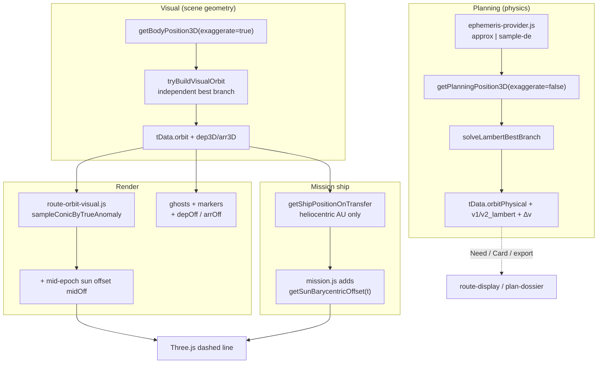
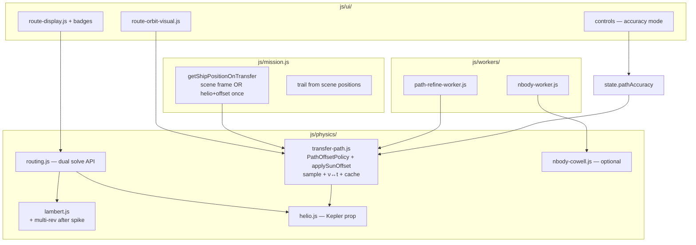

# HELIOS Trajectory Rendering Accuracy — Full Multi-Phase Design

| Field | Value |
|---|---|
| **Document title** | HELIOS Trajectory Rendering Accuracy (Phases 1–4) |
| **Author** | HELIOS engineering (design owner TBD for product sign-off) |
| **Date** | 2026-07-16 |
| **Status** | **Draft** (rev 2 — review issues addressed) |
| **Repo** | `C:\Users\kevin\workspace\k-solar-system-navigator` |
| **Branch policy** | **`main` only** (sequential, independently reviewable commits) |
| **Audience** | Senior engineers owning physics, scene, and mission UI |
| **Prior designs** | `docs/trip-planner-design.md`, `docs/ephemeris-fidelity-platform-design.md`, `docs/concept-grade-and-extras-design.md` |
| **Related tests** | `tests/path_frame_consistency.mjs` (**new, primary gate**), `tests/transfer_path_smooth.mjs`, `tests/ship_velocity.mjs`, `tests/sun_wobble.mjs`, `tests/run_physics.mjs`; note on `visual_alignment.mjs` below |
| **Product class** | Educational / concept-grade — **not** flight-cert, **not** SPICE ops, **not** SpaceX performance |

---

## Overview

HELIOS plans transfers with a real dual-geometry Lambert pipeline (`js/physics/routing.js` `solveTransferOrbit` / `solveMultiLegRoute`) and draws them as dashed polylines (`js/ui/route-orbit-visual.js`) while animating the ship with Kepler propagation (`getShipPositionOnTransfer` + `js/mission.js`). Numbers (Δv, Need, perihelion) come from **physical** real-inclination states; the cinematic scene uses **exaggerated** inclinations (×8) and sun barycentric wobble (×50) via `js/display-scale.js`.

That dual-path architecture is intentional and pedagogically valuable, but several frame inconsistencies produce visible ship-vs-line drift (estimated ~0.08–0.4 AU on multi-year cinematic legs — see gap #1), endpoint/ghost mismatches, dual longWay disagreements, multi-leg draw-time longWay omission, and sparse sampling near aphelion. This design specifies a **full multi-phase program** to make rendering **internally consistent**, then **mode-honest**, then **numerically richer** (adaptive sampling, multi-rev Lambert spike→product, sample-DE preference), and finally **ops-grade optional overlays** (Cowell n-body coast, low-thrust note-only).

**Delivery style:** incremental PRs on `main`; each PR leaves physics tests green; heavy work uses Web Workers already patterned in `js/workers/`; progressive refinement is preferred over blocking the main thread.

**Rev 2 focus:** Phase 1 is fully specified (ν→t mapping, single offset ownership, soft-snap order, multi-leg longWay, sun-offset cache). Multi-rev is demoted to a spike with numerical appendix until goldens exist. Acceptance gates import production modules and measure same-time residuals.

---

## Background & Motivation

### Pipeline today (verified in code)



| Stage | Module / function | Frame / model |
|---|---|---|
| Physical Lambert | `solveTransferOrbit` → `orbitPhysical` | Real inclination; planning ephemeris backend |
| Visual Lambert | `tryBuildVisualOrbit` → `orbit` | Exaggerated inclination; **independent** longWay best-branch |
| Polyline (single-leg) | `buildTransferPolyline` / `sampleConicByTrueAnomaly` | Pure conic in helio AU; stamps `longWay: !!td.longWay`; **then** + `midOff` once |
| Polyline (multi-leg) | `renderMultiLegVisual` | Samples `leg.orbit` **without** stamping `leg.longWay` (~336) — short Δν may be used even when longWay |
| Ship | `getShipPositionOnTransfer` | Returns **heliocentric** AU; **callers** add sun offset (`routing.js` ~599–600) |
| Mission placement | `mission.js` ~143–147, ~277–278 | Always `shipInfo + getSunBarycentricOffset(t)` |
| Ghosts / rings | `updateTransferOrbitVisual` | `depOff` / `arrOff` at burn epochs |
| Velocity | `propagateOrbitState` / `propagateHelioOrbitState` | Vis-viva / Kepler in orbit frame (heliocentric; no \(\dot s\)) |
| Planet-relative polyline | `parentFrameToHelioAU(..., midT)` | Parent frozen at mid-epoch for whole arc |
| Planet-relative ship | `parentFrameToHelioAU(..., currentSimTime)` | Live parent |
| Planet-relative date ticks | `parentFrameToHelioAU(..., depart+dt)` + midOff | Time-varying parent, constant sun midOff — **third** policy |

### Known accuracy gaps

| # | Gap | Evidence | Severity / magnitude |
|---|---|---|---|
| 1 | **Ship vs dashed line** | Line: constant `midOff`; ship: `s(t)` each frame | **Largest visual bug**. **Estimated** (not CI-measured): midOff vs \(s(t)\) over multi-year TOF with cinematic \(k=50\) yields ~**0.08–0.4 AU** class drift (physical barycenter amp ~few×10⁻³ AU from `sun_wobble.mjs` / Jupiter dominance × `SUN_WOBBLE_EXAGGERATION=50`). **No existing automated test fails on this** — see Test Plan. |
| 2 | **Dual Lambert longWay** | `tryBuildVisualOrbit` free best-branch first (`routing.js` ~93–112, ~395) | Path branch can disagree with Δv branch |
| 3 | **Endpoint / ghost frame** | Soft snap if within **0.75 AU**; markers dep/arr Off, line midOff | Ghosts can float off line ends |
| 4 | **Equal-ν sampling** | Uniform in ν | Dense perihelion, sparse outer; high-e facets |
| 5 | **Planet-relative parent freeze** | Polyline mid-epoch; ship live; markers live parent | Arc/parent/ship mismatch on long hops |
| 6 | **Cosine fallback** | `cosineBlend` | Non-physical; `visualWarnHtml` already warns |
| 7 | **Single-rev Lambert only** | `lambert.js` z bracket stops before (2π)² | Multi-rev unavailable |
| 8 | **2-body only** | Helio Kepler coast | No n-body residual overlay |
| 9 | **Approx ephemeris** | L1 default; sample-DE optional | Outer multi-year geometric error vs DE-class |
| 10 | **Multi-leg draw longWay** | No `leg.longWay` stamp on conic sample | Wrong arc / 12 AU jump rejects on long-way legs |

### Test suite gap (critical for implementers)

| Suite | What it actually gates today |
|---|---|
| `tests/visual_alignment.mjs` | **Standalone reimplementation** of Lambert/Kepler with ×8 incl. **No** sun offset, **no** midOff vs \(s(t)\), **no** production `getShipPositionOnTransfer` / `route-orbit-visual`. Mid “ship-on-line” is same-`propagate` sampling error only. **Does not gate the cinematic ship–line bug.** |
| `tests/transfer_path_smooth.mjs` | High-e conic smoothness (mirrors sampler math; no Three.js) |
| `tests/ship_velocity.mjs` | Vis-viva / Kepler velocity; production routing import |
| `tests/sun_wobble.mjs` | Barycenter closure and amplitude order-of-magnitude |
| `tests/perf_budgets.mjs` | Soft / always exit 0 — **does not** measure path build |

**Implication:** CI can stay green while 0.1 AU-class cinematic drift remains. Phase 1 **must** add production-imported gates (`path_frame_consistency.mjs`).

### Why fix now

- Users launch missions and watch the ship leave the dashed path — undermines trust in an otherwise careful physics core.
- Classroom / schematic mode already exists but path consistency is not a first-class accuracy mode.
- Workers, progressive porkchop, and ephemeris provider seams already exist.
- User has compute budget and wants numerical methods in later phases (with multi-rev gated behind a spike).

### Strengths to preserve

1. Dual physical/visual philosophy for cinematic education (`INCL_EXAGGERATION = 8`, `SUN_WOBBLE_EXAGGERATION = 50`).
2. Pure ESM physics modules tested offline via `tests/run_physics.mjs`.
3. Hyperbola-safe visual build (`buildHelioOrbit` in `tryBuildVisualOrbit`).
4. Honesty surfaces: Trust Card, `visualFallback`, fidelity L1/L2-plan.
5. Ship velocity is Kepler/vis-viva (`tests/ship_velocity.mjs`), not scrub-rate fiction.
6. Clear **today** contract: ship helper returns heliocentric; callers add offset — must not break silently.

---

## Goals & Non-Goals

### Goals

1. **Frame-consistent rendering** — ship, polyline, ghosts, markers, and trail share one formal offset model per accuracy mode (position). Velocity honesty: document heliocentric 2-body vs scene tangent (K15).
2. **Branch consistency** — visual longWay forced to physical longWay at solve time; **draw-time** multi-leg also stamps per-leg longWay.
3. **Accuracy modes** — schematic ground truth; scene / physical / both; mission rebuild vs trail-only.
4. **Sampling & dynamics** — adaptive conic (after worker); multi-rev after spike goldens; sample-DE recommend for outer.
5. **Honest UI** — badges for cosine/physical/branch_diverged/offset policy; Trust Card + export.
6. **Browser performance** — main-thread soft budgets + sun-offset cache; workers for dense refine / n-body.
7. **Quantitative tests** — production imports; same-time AU residuals; pinned Δv goldens.
8. **Incremental delivery** — ordered PRs, feature flags, rollback.

### Non-Goals

| Non-goal | Rationale |
|---|---|
| Flight-certified trajectory design / OD | Concept-grade educational |
| Mandatory SPICE / full DE440.bsp | L3 out of planning modes |
| Replacing cinematic dual-geometry as default | Keep unless user picks schematic / physical path |
| Full low-thrust optimization | Phase 4 docs / future RFC only |
| Server-side mission design backend | Browser-first |
| TypeScript rewrite | Pure ESM + JSDoc continues |
| Changing moon `displayOrbit` layout scale | Unrelated schematic layout |

### Success metrics

| Metric | Baseline (today) | Target after Phase 1 | Target after Phase 3 |
|---|---|---|---|
| Ship–line same-time residual (fixtures C1–C2) | **Not gated**; estimated 0.08–0.4 AU cinematic multi-year | **≤ 1e-6 AU** when sharing one sampler (numerical identity); ≤ 5e-4 AU only as **legacy midOff diagnostic** ceiling | same |
| Ship–ghost endpoints (C3–C4) | midOff vs depOff mismatch | ≤ **1e-4 AU** with **no geometric snap** (or snap &lt; 1e-3 AU that preserves identity) | same |
| longWay physical == visual / multi-leg draw | often independent; multi-leg omit stamp | 100% forced or `visualBranchDiverged`; multi-leg stamps `leg.longWay` | multi-rev meta if enabled |
| Adaptive sampling | N/A | flag OFF | ON only with worker; max segment gates per fixture |
| Vis-viva mid-course | ~1e-6 relative | preserve | preserve |
| Main-thread path build | sync unmeasured | **soft** p95 target ≤ 8 ms on desktop; **not** a hard CI fail; `pathMeta.buildMs` recorded | coarse ≤ 8 ms soft; refine worker ≤ 200 ms wall soft |

---

## Proposed Design

### Architecture (target)



**Modules (no orphan `frames.js`):**

| Module | Responsibility | Delivered in |
|---|---|---|
| `js/physics/transfer-path.js` | `PathOffsetPolicy`, `EndpointMarkerPolicy`, `applySunOffset`, ν↔t, sampling, day-bucket sun-offset cache, `buildTransferPathSamples`, `sampleTransferPathAtTime` | **PR1** |
| `js/physics/lambert.js` (+ optional later `lambert-multirev.js`) | Single-rev now; multi-rev after **PR7 spike** goldens | PR7b product |
| `js/physics/nbody-cowell.js` | Optional RK Cowell residual | PR10 |
| `js/workers/path-refine-worker.js` | Adaptive dense refine off main thread | PR8 |
| `js/workers/nbody-worker.js` | N-body overlay | PR10 |

**K16:** Frame helpers live **inside** `transfer-path.js` (and re-export if needed). Do **not** add a separate empty `frames.js` unless a future PR needs it for non-path callers — avoids abandoned abstraction (review Issue 6).

Keep Three.js only in UI/scene layers; Node tests import `transfer-path.js` without WebGL.

---

## Frame Model (formal definitions)

### Coordinate systems

| Symbol | Name | Definition in HELIOS |
|---|---|---|
| **H_phys** | Physical heliocentric | Planning provider / `getBodyPosition3D(..., false)`; real inclination; scene-axis convention from `kepler.js` |
| **H_vis** | Visual heliocentric | Same with `inclMultiplier()` on *I* |
| **B_scene** | Scene barycentric placement | \(\mathbf{r}_{scene}(t) = \mathbf{r}_{H}(t) + \mathbf{s}(t)\) |
| **P_c** | Planetocentric / parent-frame | Parent-relative metres; `parentFrameToHelioAU` |

### Sun barycentric offset

\[
\mathbf{s}(t) = -k \frac{\sum_i m_i \mathbf{r}_i(t)}{M_{tot}}, \quad
k = \begin{cases}
\texttt{sunWobbleMultiplier()} & \text{exaggerate / visual scene} \\
1 & \text{physical}
\end{cases}
\]

Physical amp ~0.005 AU class; cinematic \(k \approx 50\). **Time-varying** \(\mathbf{s}(t)\) is the dominant ship–line discrepancy when the line freezes mid-epoch.

### Inclination exaggeration

\[
I_{vis} = I_{phys} \cdot m_{incl}, \quad m_{incl} \in \{8, 1\}
\]

Physics Δv never uses \(I_{vis}\).

### PathOffsetPolicy (arc + ship only)

| Policy id | Definition | When |
|---|---|---|
| `none` | \(\mathbf{r}_{draw} = \mathbf{r}_{H}\) | Pure helio study |
| `mid_epoch` | \(\mathbf{r}_{draw} = \mathbf{r}_{H} + \mathbf{s}(t_{mid})\) constant on whole arc | Legacy smooth diagram; explicit user choice |
| `time_varying` | \(\mathbf{r}_{draw}(t_i) = \mathbf{r}_{H}(t_i) + \mathbf{s}(t_i)\) | **Default Phase 1** for ship+line consistency |
| `locked_departure` | \(\mathbf{s}(t_{dep})\) constant | Pedagogical “fixed frame at launch” |

**Not** a path policy: ghost/marker placement — see `EndpointMarkerPolicy`.

### EndpointMarkerPolicy (ghosts / rings only)

| Policy id | Definition |
|---|---|
| `epoch_true` | Ghost/ring at body endpoint + \(\mathbf{s}(t_{dep})\) or \(\mathbf{s}(t_{arr})\) — **default** |
| `match_path_end` | Ghost/ring equals path sample 0 / N after path offset policy (guarantees visual coincidence) |

Path and markers are **two concerns**. URL/export: `pathOffsetPolicy` / `endpointMarkerPolicy` separately.

### Dual geometry identity

| Quantity | Physical | Visual |
|---|---|---|
| Endpoints | Planning provider | `getBodyPosition3D(..., true)` |
| Orbit cache | `orbitPhysical` | `orbit` |
| longWay | `tData.longWay` / `leg.longWay` | Forced equal when valid; `visualLongWay` recorded |
| Draw stamp | — | Sampler **must** receive per-leg `longWay` (single-leg already does; multi-leg must) |
| Δv / Need / export | Physical only | Never |
| Ship preferred orbit | Prefer `orbit` then `orbitPhysical` when geometry=scene | Physical when geometry=physical |

---

## Phase 1 — Visual consistency

**Objective:** eliminate the largest trust breakers without new numerics beyond ν↔t and shared sampling.

### 1.1 Shared path builder API

```js
// js/physics/transfer-path.js

/** @typedef {'none'|'mid_epoch'|'time_varying'|'locked_departure'} PathOffsetPolicy */
/** @typedef {'epoch_true'|'match_path_end'} EndpointMarkerPolicy */
/** @typedef {'visual'|'physical'} PathGeometry */

/**
 * Apply sun offset policy to a heliocentric position (AU).
 * @param {{x,y,z}} rHelioAU
 * @param {number} tAbsSec absolute sim time for this sample
 * @param {object} ctx { offsetPolicy, tDep, tArr, tMid, exaggerate }
 */
export function applySunOffset(rHelioAU, tAbsSec, ctx) { /* ... */ }

/**
 * True anomaly → time since periapsis epoch of orbit element set.
 * Ellipse: ν → E → M; dt = (M - M0) / n  (unwrap multi-rev if needed).
 * Hyperbola: ν → H → M; same with hyperbolic anomaly.
 * @returns {number} dt seconds from orbit's reference (dt=0 at departure state)
 */
export function timeFromTrueAnomaly(orb, nu) { /* ... */ }

/**
 * Inverse used by equal-time sampling: dt → state via existing
 * propagateOrbitState / propagateHelioOrbitState.
 */
export function stateAtDt(orb, dt) { /* ... */ }

/**
 * Build polyline samples. Pure: no Three.js.
 * @param {object} td transfer or single leg view
 * @param {object} opts
 * @param {PathGeometry} [opts.geometry='visual']
 * @param {PathOffsetPolicy} [opts.offsetPolicy='time_varying']
 * @param {'equal_time'|'equal_nu'} [opts.sampleMode]  // Phase 1 default: equal_time
 * @param {number} [opts.nSamples=320]
 * @param {boolean} [opts.longWay]  // required for multi-leg: pass leg.longWay
 * @param {boolean} [opts.adaptive=false]  // Phase 3; default OFF until PR8
 */
export function buildTransferPathSamples(td, opts = {}) { /* ... */ }

/**
 * Ship/query position in the SAME pipeline as polyline.
 * @returns {{ x,y,z, t_sec, r_helio, frame, offsetPolicy, mode, v_*? }}
 */
export function sampleTransferPathAtTime(td, simTime, opts = {}) { /* ... */ }
```

`route-orbit-visual.js` and ship path **both** call this module.

### 1.1.1 Phase 1 sampling + ν → t algorithm (must-have)

**Problem:** Shape today is equal-ν; ship is equal-time Kepler. For `time_varying`, \(\mathbf{s}(t_i)\) must use the **absolute time that corresponds to that position on the conic**. Linear \(t = t_{dep} + (i/N)\cdot TOF\) paired with equal-ν positions is **wrong** on high-e transfers.

**Phase 1 default (required for C1–C2):**

**Mode A — `sampleMode: 'equal_time'` (default for shared path / ship–line gates)**

1. Orbit = visual or physical per `geometry`.
2. For \(i = 0 \ldots N\): \(dt_i = (i/N) \cdot TOF\), \(t_i = t_{dep} + dt_i\).
3. \(\mathbf{r}_H = \) `stateAtDt(orb, dt_i).r` (metres → AU).
4. Planet-relative: convert with parent policy (see §1.5).
5. \(\mathbf{r}_{draw} = \) `applySunOffset(r_H, t_i, ctx)`.
6. Store `{ t_sec: t_i, x,y,z, r_helio, nu? }`.

**Mode B — `sampleMode: 'equal_nu'` (optional shape-quality; still needs correct times)**

1. Compute \(\nu_1, \nu_2\) and signed \(\Delta\nu\) using **`opts.longWay`** (not default short-arc heuristic alone).
2. For each sample \(\nu_i = \nu_1 + (i/N)\Delta\nu\):
   - \(dt_i = \) `timeFromTrueAnomaly(orb, ν_i)` − `timeFromTrueAnomaly(orb, ν_1)`  
     (normalize so \(dt(\nu_1)=0\); for multi-rev later, add \(2\pi N / n\) as needed).
   - Clamp / validate \(dt_i \in [0, TOF]\) within 1e-3 relative or reject sample set.
3. Apply \(\mathbf{s}(t_{dep}+dt_i)\) as above.

**`timeFromTrueAnomaly` (ellipse, \(e < 1\)):**

\[
\tan\frac{E}{2} = \sqrt{\frac{1-e}{1+e}}\tan\frac{\nu}{2},\quad
M = E - e\sin E,\quad
dt = (M - M_0)/n
\]

**Hyperbola (\(e > 1\)):** standard \(\nu \to H \to M = e\sinh H - H\), \(dt = (M-M_0)/n\).

Use existing `orb.M0`, `orb.n`, `orb.e`, `orb.hyperbolic` from `helio.js`.

**Identity invariant (PR1 must-test):**

```
sampleTransferPathAtTime(td, t).xyz
  == interpolate-or-exact buildTransferPathSamples point at same t
```

For equal_time samples, residual at sample knots ≤ **1e-9 AU** (float). Between knots, nearest-segment residual is sampling-only (document separately). **C1/C2 use same-absolute-time residual, not nearest-segment alone.**

### 1.1.2 Single offset ownership (breaking change — PR1 mandatory)

**Today:** `getShipPositionOnTransfer` → heliocentric AU; `mission.js` adds `s(t)`.

**Phase 1 Option A (required):**

| Layer | Responsibility |
|---|---|
| `sampleTransferPathAtTime` / `getShipPositionOnTransfer` | Returns **scene-frame** position when `offsetPolicy !== 'none'`; sets `frame: 'scene'`, `r_helio: {x,y,z}`, `offsetApplied: true` |
| `mission.js` | **Stops** adding `getSunBarycentricOffset`. Uses return value directly for ship + trail. |
| Trail | Continues to store scene positions (already does) — now consistent with dashed path |
| JSDoc | Explicit breaking change on `getShipPositionOnTransfer` |

**Double-offset unit test:**  
`‖scene − (helio + s(t))‖ < 1e-12 AU` and `‖scene − (helio + 2·s(t))‖` must **fail** if someone reintroduces double apply — assert scene equals helio + **one** s(t).

**Option B (rejected as default):** path returns helio + separate `offset` field; mission always adds. Slightly safer migration but two call sites still easy to desync. Document as fallback only if Option A review fails.

**Required PR1 files for ownership:**  
`js/physics/transfer-path.js`, `js/physics/routing.js`, `js/ui/route-orbit-visual.js`, **`js/mission.js` (mandatory)**, `js/state.js`, any launch-path callers, `tests/path_frame_consistency.mjs`, `tests/ship_velocity.mjs` (adapt if positions now include offset — assert on `r_helio` / velocity, not scene x for vis-viva).

Grep for other `getShipPositionOnTransfer` / sun offset pairings: `mission.js` is primary; Playwright may read `__HELIOS` — update if it asserts helio coords.

### 1.2 Force visual longWay = physical (PR2)

```js
// AFTER Phase 1 PR2:
// 1) Solve visual with forced longWay = physical chosenLongWay
// 2) If miss > 1000 km, try free best; stamp visualBranchDiverged
// 3) Else visualFallback = 'cosine' | 'physical'
```

Fields: `longWay`, `visualLongWay`, `visualBranchDiverged`, `pathOffsetPolicy`, `pathMeta`.

**Multi-leg:** same at solve time **and** draw time (`buildTransferPathSamples(..., { longWay: leg.longWay ?? leg.visualLongWay })`).

### 1.2b Multi-leg draw-time longWay (PR1 extract, assert in PR2)

Today single-leg stamps `orbDraw.longWay`; multi-leg does **not**. Phase 1 shared sampler **requires** `opts.longWay` for every leg. Acceptance: if `leg.longWay === true`, \(\Delta\nu\) uses long arc; no silent short-way.

### 1.3 Endpoint placement + soft snap order of operations

**Order of operations (mandatory):**

1. Build heliocentric samples (equal_time or equal_nu+timeFromTrueAnomaly).
2. Apply `PathOffsetPolicy` per sample → scene path.
3. Place ghosts/rings via `EndpointMarkerPolicy`.
4. **Soft geometric snap:** default **OFF** when path and ghosts share the same pipeline (geometry consistent).  
   If retained for legacy cosine fallback ends only: snap path endpoint toward ghost only if miss **&lt; 1e-3 AU** (~150_000 km), never 0.05 AU / 0.75 AU class.  
5. Assert C3/C4 on **post-pipeline** positions **without** snap moving ship identity: ship(t0) and path sample 0 are the same function — snap must not break that.

| Element | Position |
|---|---|
| Line sample 0 / N | `sampleTransferPathAtTime` at dep / arr |
| Ghost `epoch_true` | body dep3D/arr3D + s(dep/arr) with same exaggerate as path geometry |
| Ghost `match_path_end` | copy path sample 0 / N |

**Do not** soft-snap path ends to a different offset frame than the ship.

### 1.4 Fallback badges (minimal copy in PR1; full UI PR3)

PR1 **must** ship minimal user-visible honesty when `time_varying` is default:

- Results one-liner or mission `#mission-path-mode`:  
  `kepler · offset=time_varying · (sun barycenter motion, not third-body gravity)`.
- Cosine/physical fallback strings can stay as today’s `visualWarnHtml` and expand in PR3.

Full badge set (PR3):

| Code | Badge copy |
|---|---|
| `cosine` | Scene path non-Keplerian cosine blend — numbers still physical Lambert |
| `physical` | Scene path uses physical geometry (visual branch unstable) |
| `branch_diverged` | Visual longWay could not match physical |
| `offset_time_varying` | Path includes sun barycenter motion (not third-body gravity) |

### 1.5 Planet-relative (Phase 1 interim + PR4)

**Today (document as known interim inconsistency until PR4):**

| Consumer | Parent position | Sun offset |
|---|---|---|
| Polyline | mid-epoch freeze | midOff |
| Ship | `currentSimTime` | s(t) via mission |
| Date markers | depart+dt | midOff |

**PR1:** Shared path uses **same parent policy as ship for the active path** when building samples used for C1-style tests of planet-relative routes: prefer **time-varying parent** per sample for consistency with ship; optional `parentPolicy: 'mid_epoch'|'time_varying'`.  
**Interim:** If PR1 keeps mid freeze for short hops only, date markers must use the **same** parent policy as the polyline in that PR (no third policy). Document in code comment + design.

**PR4:** One policy for polyline, ship, date markers:

- TOF &lt; 30 d (default threshold): `mid_epoch` parent freeze OK for all three.
- TOF ≥ 30 d: `time_varying` parent for all three.
- Sun offset still follows `PathOffsetPolicy` independently.

### 1.6 Performance: sun-offset cache + soft budgets

**Cache design (PR1):**

```js
// Inside transfer-path.js (path-build and sampleTransferPathAtTime only — NOT animation.js planet loop)
const _sunOffCache = new Map(); // key → {x,y,z}
// key = `${bucket}|${exaggerate?1:0}|${displayMode}`
// bucket = Math.floor(tSec / DAY)  // 1-day buckets
export function getSunOffsetCached(tSec, exaggerate) { /* ... */ }
export function clearSunOffsetCache() { _sunOffCache.clear(); }
```

- **Invalidate** on: display mode cinematic↔schematic, `sunWobbleMultiplier` change, classroom toggle, tests `beforeEach`.
- **Do not** wire this cache into `animation.js` live planet updates without separate review (avoids stale visual planets).
- Path build of N samples: ≤ N distinct day-buckets over a multi-year TOF (~365–2000 keys max) — far cheaper than N×8 full Kepler body loops if uncached, still OK with cache.

**Budgets:** soft targets only; record `pathMeta.buildMs`. Extend `tests/perf_budgets.mjs` with **informational** path-build timing (still soft exit 0 unless absurd e.g. &gt; 500 ms on Node CI for N=320).

| Operation | Soft target (desktop) |
|---|---|
| 320 pts equal_time + time_varying + cache | ≤ 5–8 ms typical |
| Full `updateTransferOrbitVisual` | ≤ 8–12 ms |
| Ship frame | ≤ 0.2 ms |

### 1.7 Acceptance criteria (Phase 1) — measurable fixtures

**Distance definition:** Unless noted, residual is \(\|\mathbf{r}_{ship}(t) - \mathbf{r}_{line}(t)\|\) at the **same absolute sim time** \(t\), where \(\mathbf{r}_{line}(t)\) is exact sample if \(t\) is a knot, else linear interpolate only for diagnostic — **primary gate uses knots and `sampleTransferPathAtTime` identity**.

| ID | Inputs | Flags | Gate |
|---|---|---|---|
| **C0** | any | — | Test imports **production** `transfer-path.js` + `routing.js` (not a reimplemented Lambert) |
| **C1** | Earth→Mars, dep `2026-12-01` noon UTC J2000-rel, TOF **259 d**, cinematic, `time_varying`, equal_time N=320 | production path | same-time residual at 21 knots (0%, 5%, … 100%) ≤ **1e-6 AU** |
| **C2** | Earth→Jupiter, dep `2030-01-01`, TOF **1000 d** (or solved Hohmann-class ±), cinematic, `time_varying` | production path | same-time residual ≤ **1e-6 AU** shared-function; **optional diagnostic** max‖ship_midOff_legacy − ship_time_varying‖ printed as baseline estimate (not fail) |
| **C3** | same as C1 | `EndpointMarkerPolicy` | ‖ship(t_dep) − depGhost‖ ≤ **1e-4 AU** |
| **C4** | same as C1 | | ‖ship(t_arr) − arrGhost‖ ≤ **1e-4 AU** |
| **C5** | Earth→Mars as ship_velocity | | vis-viva mid relative ≤ **1e-6** on **heliocentric** state |
| **C6** | Earth→Mars, backend approx, single-rev, no multi-rev | pin `tests/fixtures/dv_earth_mars_2026-12-01.json` | \|Δv − golden\| ≤ **1 m/s** |
| **C7** | suite of routes | after PR2 | `visualLongWay === longWay` or `visualBranchDiverged` |
| **C7b** | multi-leg with a longWay leg | | sampler Δν long; path not rejected solely due to missing stamp |
| **C8** | force cosine path | | `visualFallback==='cosine'` and badge field set |
| **C-dbl** | any ship sample | | scene = helio + **one** s(t) |

---

## Phase 2 — Accuracy modes

### 2.1 State model

```js
// state.js extension
pathAccuracy: {
  pathGeometry: 'scene',       // 'scene' | 'physical' | 'both'
  offsetPolicy: 'time_varying',// PathOffsetPolicy
  endpointMarkerPolicy: 'epoch_true',
  flightPathMode: 'static',    // 'static' | 'rebuild' | 'trail_only'
  sampleMode: 'equal_time',    // 'equal_time' | 'equal_nu'
  flags: {
    forceVisualLongWay: true,
    sharedPathBuilder: true,
    timeVaryingOffsetDefault: true,
    accuracyModeUI: false,       // PR5
    adaptiveSampling: false,     // ON only after PR8
    multiRevLambert: false,      // after PR7b
    preferSampleDeOuter: false,
    nbodyOverlay: false,
  },
},
pathRefineRequestId: 0, // bump to cancel workers
```

### 2.1b Defaulting matrix (classroom × display × path)

| Context | display.mode | pathGeometry | offsetPolicy | ephemeris / n-body / sample-DE recommend |
|---|---|---|---|
| Default user | cinematic | scene | time_varying | L1; flags as above |
| User schematic | schematic | physical (or scene ≡ physical at m_incl=1) | time_varying, k=1 | L1 |
| `?mode=classroom` | schematic (forced) | physical | time_varying k=1 | forceOfflineL1; n-body hidden; preferSampleDeOuter **inert** |
| cinematic + both | cinematic | both | time_varying | see §2.2 |
| schematic + both | schematic | both | time_varying | nearly coincident paths — UI may hide “both” or show as no-op tip |

When `m_incl=1`, `pathGeometry: 'scene'` and `'physical'` are geometrically near-identical; prefer storing `physical` in classroom for honesty of labels.

### 2.2 Dual-path overlay — frozen defaults (resolves OQ2)

| Mode | Visual path | Physical path |
|---|---|---|
| **cinematic + both** | H_vis + visual \(\mathbf{s}(t)\) (exag I, exag wobble) | H_phys + **physical** \(\mathbf{s}(t)\) (real I, k=1) |
| **schematic + both** | ~coincident with physical | H_phys + physical s(t) |

**Deferred (flag never on by default):** “physical conic with visual s(t) for shape compare in cinematic” — future only.

Physical path may sit far from exaggerated planets — **intentional teaching**. Label: `PHYSICAL GEOMETRY (real inclination)`.

### 2.3 Flight rebuild policy

| Mode | Behavior | Coalesce rule |
|---|---|---|
| `static` | Build on route compute / accuracy change | — |
| `rebuild` | Rebuild on scrub or play | **Min interval 2 s wall** AND coalesce to **latest** simTime; bump `pathRefineRequestId` |
| `trail_only` | Hide future dashed line while mission active | Abort restores path |

### 2.4 Mission study

`#mission-path-mode` shows:  
`{mode}/{geometry}/{offsetPolicy}/v=helio2body`  
Velocity always labeled heliocentric 2-body (K15).

### 2.5 Phase 2 acceptance

| ID | Gate |
|---|---|
| P2-1 | Toggle scene→physical: physical endpoints match planning positions + physical offset policy within 1e-4 AU |
| P2-2 | both: two line objects; no hard residual max (educational separation) |
| P2-3 | trail_only: transfer line hidden when `mission.active && !arrived` |
| P2-4 | classroom matrix: no sample-DE auto, no n-body control |

---

## Phase 3 — Dynamics & sampling

### 3.1 Adaptive conic sampling

Chord-error recursive subdivision in **heliocentric** frame (K14), then apply offset.

- ε default 0.02 AU (inner), 0.05 AU (r &gt; 5 AU); L_max 0.25 AU.
- N_min=64, N_max=1024 (2048 worker only).
- **`flags.adaptiveSampling` default OFF until PR8 worker lands.** Main thread must not default-on adaptive N_max=1024.
- Fixture C9: Mercury→Pluto-class (or existing transfer_path_smooth case), adaptive ON in worker or Node, max segment ≤ **0.15 AU** at N≤1024 — separate from intentional multi-AU jump **reject** threshold (12 AU) used as gross error detector.

### 3.2 Multi-revolution Lambert — **spike first (PR7a), product second (PR7b)**

**Not implementable as a production PR from formula names alone.** Delivery:

| Step | Deliverable |
|---|---|
| **PR7a — Spike / RFC** | Numerical appendix (below), bibliography, Node harness that may live under `tests/spikes/` or `docs/notes/`, **≥2 golden vectors**, decision go/no-go |
| **PR7b — Product** | Only after goldens land; feature flag default **OFF**; UI badge + export `revolutions` |

**API sketch (product):**

```js
solveLambertProblem(r1v, r2v, tof, mu, { longWay, revolutions /* 0 = single */ })
solveLambertBestBranch(r1v, r2v, tof, mu, v1, v2, { maxRevolutions /* default 0 */ })
```

**Enumeration (product):** For \(N = 0..N_{max}\), for `longWay` in `{false,true}` (with care that longWay and N interact via transfer angle \(\theta + 2\pi N\)): solve, validate miss &lt; 1000 km, perihelion gate, pick min Δv.

**z intervals (product sketch — spike must verify):** Multi-rev universal-variable TOF has singularities near \((2\pi k)^2\). For each N, search z in intervals between consecutive singularities (literature: Gooding 1990; Izzo 2015). Spike documents exact brackets used.

**Provisional N_max:** interactive solve **1** (OQ3 provisional).

**Porkchop:** never multi-rev per cell by default.

See **Appendix A** for golden placeholders and bibliography.

### 3.3 Prefer sample-DE for outer system

Banner + one-click “Upgrade endpoints to L2-plan” (K8). No silent switch. Classroom inert.

### 3.4 Worker / progressive strategy + requestId lifecycle

```mermaid
sequenceDiagram
  participant UI as route-orbit-visual
  participant Main as transfer-path coarse
  participant W as path-refine-worker
  UI->>UI: pathRefineRequestId++
  UI->>Main: equal_time N≤320, adaptive off
  Main-->>UI: draw &lt;~8ms soft
  UI->>W: refine {requestId, payload}
  W-->>UI: dense samples
  UI->>UI: apply only if requestId === state.pathRefineRequestId
```

**Lifecycle rules:**

- One `state.pathRefineRequestId` (monotonic).
- Bump on: new route, display mode, pathGeometry, offsetPolicy, flight rebuild tick, abort, unmount.
- Ignore stale worker messages.
- Rebuild mode: min 2 s + coalesce latest simTime (no queue per frame).
- `refreshVisualTransferGeometry`: bump id, clear pathMeta pending, cancel worker.

### 3.5 Phase 3 acceptance

| ID | Gate |
|---|---|
| C9 | Adaptive fixture: max segment ≤ 0.15 AU (documented bodies/TOF) |
| C10 | Multi-rev goldens: miss ≤ 1000 km; after PR7b only |
| Worker | Late message after id bump does not swap geometry |

---

## Phase 4 — Ops-grade optional overlays

### 4.1 Cowell / n-body coast overlay

- RKF45/RK4; Sun + 8 planets; worker-only; flag default off; classroom hidden.
- **Never** feeds Need/Δv (C11).
- **PR10 includes minimal Trust Card string** (not deferred solely to PR11):  
  `n-body coast overlay = educational residual under Approximate Positions — not navigation OD`.

### 4.2 Continuous low-thrust

Docs / future RFC only (K10). No spiral demo unless product explicitly schedules.

### 4.3 Phase 4 acceptance

| ID | Gate |
|---|---|
| C11 | Need bit-identical with overlay on vs off |
| N-body smoke | residual finite; arrival miss order documented in snapshot |

---

## API / Interface Changes

### `getShipPositionOnTransfer` (breaking)

```js
/**
 * @returns {object|null}
 *  Position fields x,y,z are SCENE frame when offsetPolicy !== 'none'
 *  (offset already applied — callers must NOT add getSunBarycentricOffset again).
 *  r_helio: {x,y,z} heliocentric AU before offset
 *  frame: 'scene' | 'helio'
 *  offsetPolicy, offsetApplied, geometry, mode, v_km_s (heliocentric 2-body), ...
 */
```

### transferData fields

| Field | Notes |
|---|---|
| `orbitPhysical` / `orbit` | Unchanged semantics |
| `longWay` / `visualLongWay` / `visualBranchDiverged` | PR2 |
| `visualFallback` | existing |
| `revolutions` | PR7b; default 0 |
| `pathMeta` | `{ offsetPolicy, endpointMarkerPolicy, geometry, sampleMode, nSamples, adaptive, buildMs, refineRequestId }` |

### Export / share

- `methodology.path_offset_policy`, `path_geometry`, `endpoint_marker_policy`, `multi_rev`, `nbody_overlay`
- Schema: **minor bump** compatible (provisional OQ5)
- Share optional short tokens if space allows; else export-only

---

## Data Model Changes

In-memory `state.pathAccuracy` + transferData meta. No DB. localStorage recent routes: missing fields → Phase 1 defaults.

---

## Numerical Methods Detail

### Phase 1 ν ↔ t

See §1.1.1 — required for implementation.

### Adaptive sampling

Chord-error subdivision pre-offset (K14). Default OFF on main until worker.

### Multi-rev

Spike-defined; see Appendix A. Product only after goldens.

### Cowell

State \((r,v)\) SI; forces Sun+planets; compare to 2-body `propagateHelioOrbitState`.

---

## Alternatives Considered

### A1. Remove sun wobble from ship (match midOff line)

Reject as default — ship leaves barycentric planets. Keep as shared `mid_epoch` policy.

### A2. Physical-only path in cinematic

Reject as sole mode — misses exaggerated planets. Phase 2 `both` teaches gap.

### A3. Full SPICE / DE in browser

Reject — cold-load / L3 non-goal.

### A4. Mid-epoch translate ship by (midOff − s(t))

Reject as default — same class as A1.

### A5. GPU n-body

Defer indefinitely — workers + RK enough.

### A6. Hybrid: mid_epoch static preview, time_varying only during active mission

| Pros | Cons |
|---|---|
| Fewer “squiggle” complaints before launch | Ship still leaves pre-launch path at t=0+ if path not rebuilt; trust break moves to launch moment |
| Fits `flightPathMode` mentally | Two truths; users compare parked path vs flight |

**Reject as default (K2 stands):** pre-launch path should match the path the ship will fly. Optional power-user combo (`offsetPolicy=mid_epoch` + `flightPathMode=rebuild` to time_varying at launch) may be documented later — not Phase 1 default.

---

## Security & Privacy Considerations

No new network by default; workers same-origin; classroom forces offline; n-body never overclaims as flight path.

---

## Observability

- `pathMeta.buildMs`, refine latency, soft perf_budgets timing.
- User-visible badges + Trust Card + mission path mode.
- No production APM.

---

## Rollout Plan

### Feature flags

```js
{
  forceVisualLongWay: true,        // PR2
  sharedPathBuilder: true,         // PR1
  timeVaryingOffsetDefault: true,  // PR1 — with minimal copy in same PR
  accuracyModeUI: false,           // PR5
  adaptiveSampling: false,         // ON only after PR8
  multiRevLambert: false,          // PR7b
  preferSampleDeOuter: false,
  nbodyOverlay: false,
}
```

URL QA: `?pathOffset=...`, `?pathGeom=...`, `?pathSample=equal_time|equal_nu`.

### Staged enablement

1. **PR1** — shared path + **default time_varying** + mission ownership + **minimal offset copy/badge** + C0–C5 + C-dbl.
2. **PR2–4** — longWay force, full badges, planet-relative unified policy.
3. **PR5** — accuracy mode UI.
4. **PR6+PR8** — adaptive only with worker (or PR6 flag-off extract, PR8 enables).
5. **PR7a spike → PR7b product** — multi-rev.
6. **PR9** sample-DE UX; **PR10** n-body + Trust string; **PR11** docs polish.

### Rollback

| Failure | Action |
|---|---|
| Squiggle complaints | `offsetPolicy=mid_epoch` URL/default flag off |
| Double offset regression | C-dbl fails CI — fix mission/routing |
| Multi-rev unstable | flag off |
| Worker thrash | bump id / disable refine |

---

## Test Plan (quantitative)

### Primary new suite

**`tests/path_frame_consistency.mjs`** (PR1, required):

- Production imports only (C0).
- C1, C2, C3, C4, C-dbl, multi-leg longWay stamp case (C7b partial).
- Optional diagnostic: print max midOff-vs-time_varying residual for Earth→Jupiter (baseline estimate documentation).

### Extend / rewrite

| File | Action |
|---|---|
| `visual_alignment.mjs` | **Rewrite or replace** to import production path+routing OR relegate to legacy and exclude from “frame consistency” claims. PR1 treats production suite as gate of record. |
| `transfer_path_smooth.mjs` | Point at `transfer-path.js`; keep high-e jump checks |
| `ship_velocity.mjs` | Assert on heliocentric velocity / `r_helio`; tolerate scene x including offset |
| `sun_wobble.mjs` | Unchanged physics; path tests use production offset |
| `perf_budgets.mjs` | Soft path buildMs log |
| **New** `tests/fixtures/dv_earth_mars_2026-12-01.json` | C6 golden |
| **New** `tests/lambert_multirev.mjs` | After PR7a goldens |
| **New** `tests/nbody_cowell_smoke.mjs` | PR10 |

### Gate table (summary)

| ID | Definition of pass |
|---|---|
| C0 | production imports |
| C1–C2 | same-time ‖ship−line‖ ≤ 1e-6 AU (shared function) |
| C3–C4 | ship vs ghost ≤ 1e-4 AU |
| C5 | vis-viva ≤ 1e-6 rel on helio |
| C6 | Δv golden ≤ 1 m/s |
| C7 / C7b | longWay force + multi-leg draw stamp |
| C8 | cosine badge |
| C9 | adaptive segment (post PR8) |
| C10 | multi-rev golden miss |
| C11 | Need invariant |
| C-dbl | single offset apply |

---

## Risks

| Risk | Severity | Mitigation |
|---|---|---|
| time_varying “squiggle” UX | Medium | Minimal copy in PR1; mid_epoch option; tip (OQ1 provisional yes) |
| Wrong ν–t pairing | Critical | equal_time default; identity tests |
| Double offset | Critical | Option A + C-dbl + mission.js in PR1 |
| Soft snap breaks identity | High | Snap OFF by default; ≤1e-3 AU if on |
| Adaptive main-thread blowup | High | default OFF until PR8 |
| Multi-rev wrong branch | High | spike+goldens before product |
| N-body overclaim | High | Trust string in PR10; classroom hide |
| Rebuild thrash | Medium | 2 s min + coalesce + requestId |
| Planet-relative triple policy interim | Low | Document PR1; unify PR4 |

---

## Open Questions — provisional defaults for implementers

Product owner may veto; until then implementers use:

| # | Question | Provisional default |
|---|---|---|
| OQ1 | One-time tip for multi-year wobble? | **Yes** — first multi-year path notify once per session |
| OQ2 | Physical overlay frame in cinematic both? | **Frozen** in §2.2 (physical s + real I) — **K17** |
| OQ3 | Multi-rev N_max interactive? | **1** |
| OQ4 | sample-DE outer auto vs banner? | **Banner only** (K8) |
| OQ5 | Export schema? | **Minor** methodology fields; no major schema_version bump required |
| OQ6 | trail_only default for multi-year? | **No** — static path remains default |

---

## Key Decisions

| ID | Decision | Rationale |
|---|---|---|
| **K1** | Shared pure module `transfer-path.js` for path **and** ship | Single source of truth; Node-testable |
| **K2** | Default `PathOffsetPolicy = time_varying` for ship and line | Fixes largest visual bug; mid_epoch retained as option |
| **K3** | Force visual longWay = physical when valid | Numbers and path share transfer-angle story |
| **K4** | Keep dual physical/visual geometry in cinematic | Product aesthetic; Phase 2 teaches gap |
| **K5** | Schematic / classroom = educational ground truth | Matches display-scale + classroom URL |
| **K6** | Explicit `pathAccuracy` state | Exportable honesty; no hidden magic |
| **K7** | Multi-rev opt-in after **spike+goldens**; not porkchop-default | Implementability + safety |
| **K8** | sample-DE outer: recommend, don’t silent-switch | Fidelity badge contract |
| **K9** | N-body overlay only; never Need/Δv | Concept-grade boundary |
| **K10** | Low-thrust docs/RFC only | Different problem class |
| **K11** | Heavy work via workers + progressive coarse→fine | Matches existing worker culture |
| **K12** | Ordered PRs on `main` with flags | Reviewable + rollback |
| **K13** | Planet-relative: one parent policy for path/ship/markers; mid freeze only short TOF | Ends triple inconsistency |
| **K14** | Adaptive subdivide in helio **before** offset | Wobble ≠ orbital curvature |
| **K15** | Velocity remains heliocentric 2-body; position may include educational \(\mathbf{s}(t)\); optional \(\dot s\) later behind note | Honesty over false scene-tangent precision |
| **K16** | No separate `frames.js` in Phase 1 — policies live in `transfer-path.js` | Avoid orphan module |
| **K17** | cinematic+both defaults per §2.2 matrix | Resolves overlay ambiguity |
| **K18** | Phase 1 default sampleMode = **equal_time**; equal_nu requires `timeFromTrueAnomaly` | Correct s(t) pairing |
| **K19** | Offset ownership Option A: ship API returns scene frame; mission does not re-add | Prevents double offset |
| **K20** | Adaptive default OFF until path-refine worker (PR8) | Protect main-thread budget |
| **K21** | Soft snap default OFF; if on, miss &lt; 1e-3 AU only | Protect C3–C4 identity |
| **K22** | PR1 includes minimal time_varying UX copy | Don’t ship squiggle without explanation |

---

## References

- Code: `js/physics/routing.js`, `lambert.js`, `helio.js`, `kepler.js`, `ephemeris-provider.js`, `display-scale.js`
- Scene: `js/ui/route-orbit-visual.js`, `js/scene/transfer-visual.js`, `js/mission.js`
- Workers: `js/workers/porkchop-worker.js` (requestId/cancel reference)
- Designs: trip-planner, ephemeris-fidelity, concept-grade
- Tests: path_frame_consistency (new primary), transfer_path_smooth, ship_velocity, sun_wobble
- Classical: Vallado; Gooding 1990 multi-rev Lambert; Izzo 2015; Battin / Cowell

---

## Appendix A — Multi-rev Lambert spike (PR7a)

### Bibliography (minimum)

1. Gooding, R. H. (1990). “A procedure for the solution of Lambert’s orbital boundary-value problem.” *Celestial Mechanics and Dynamical Astronomy*.
2. Izzo, D. (2015). “Revisiting Lambert’s problem.” *Celestial Mechanics and Dynamical Astronomy*.
3. Vallado, D. *Fundamentals of Astrodynamics and Applications* — multi-rev notes / universal variable.

### Spike checklist

- [ ] Derive/document residual \(F_N(z)\) for N ≥ 1 used in code
- [ ] Document z search intervals between \((2\pi k)^2\) singularities for N=0,1
- [ ] Short/long × N enumeration order and rejection (y&lt;0, v &gt; 50 v_circ, miss &gt; 1000 km)
- [ ] Land ≥2 goldens in `tests/fixtures/lambert_multirev_*.json`

### Golden fixture schema (required fields)

```json
{
  "name": "synthetic_N1_example",
  "mu_m3_s2": 1.32712440018e20,
  "r1_m": [1.496e11, 0, 0],
  "r2_m": [0, 2.0e11, 0],
  "tof_s": 3.0e7,
  "revolutions": 1,
  "longWay": false,
  "expected": {
    "v1_m_s": [null, null, null],
    "v2_m_s": [null, null, null],
    "miss_m_max": 1000e3,
    "notes": "Fill v1/v2 from independent trusted solver during spike"
  }
}
```

**Note:** Exact numeric goldens are **outputs of the spike**, not claimed in this design. PR7b does not merge without filled expected vectors and a passing `tests/lambert_multirev.mjs`.

### Worked procedure (engineer)

1. Pick coplanar r1, r2, TOF long enough that N=1 is feasible.
2. Solve with an independent reference (e.g. published test vectors from Izzo paper or a known Python `poliastro`/`lamberthub` result frozen into JSON).
3. Port single branch to ESM; match v1 within 1 m/s and miss &lt; 1000 km.
4. Only then wire `maxRevolutions` into `solveLambertBestBranch`.

---

## PR Plan

Each PR is independently reviewable on `main`. Dependencies noted.

### PR 1 — Shared path builder, equal_time + time_varying, offset ownership, minimal copy

- **Title:** `path: transfer-path module; equal-time samples; scene-frame ship; no double offset`
- **Files:** `js/physics/transfer-path.js` (**new** — includes PathOffsetPolicy, EndpointMarkerPolicy, applySunOffset, timeFromTrueAnomaly, sun cache), `js/physics/routing.js` (`getShipPositionOnTransfer` breaking contract), **`js/mission.js` (required)**, `js/ui/route-orbit-visual.js` (single + multi-leg longWay stamp into sampler), `js/state.js`, `js/ui/route-display.js` or mission path-mode **minimal** time_varying copy (K22), `tests/path_frame_consistency.mjs` (**primary gate**), `tests/ship_velocity.mjs`, `tests/transfer_path_smooth.mjs` (wire production), `tests/perf_budgets.mjs` (soft buildMs)
- **Dependencies:** none
- **Description:**  
  - Default `sampleMode=equal_time`, `offsetPolicy=time_varying`.  
  - Option A offset ownership; C-dbl test.  
  - Multi-leg passes `leg.longWay` into sampler.  
  - Soft snap default OFF.  
  - Sun offset day-bucket cache + clear on display mode.  
  - C0–C5, C3–C4, C-dbl.  
  - **Does not** force visual longWay at solve (PR2).  
  - Optional split if review load high: **PR1a** extract sampler mid_epoch parity with old behavior; **PR1b** switch default + mission ownership + copy.

### PR 2 — Force visual longWay = physical + branch metadata

- **Title:** `path: force visual Lambert longWay to match physical`
- **Files:** `js/physics/routing.js`, multi-leg solve, `tests/path_frame_consistency.mjs` (C7, C7b), route-display badge hooks
- **Dependencies:** PR1
- **Description:** Forced longWay; `visualLongWay` / `visualBranchDiverged`; multi-leg parity at **solve** (draw stamp already PR1).

### PR 3 — Full fallback badges + endpoint marker policy UI polish

- **Title:** `ui: path/ghost badges and endpoint marker policy`
- **Files:** `js/ui/route-display.js`, `js/ui/trust-card.js`, `js/mission.js` path-mode string, `css/app.css`
- **Dependencies:** PR1 (PR2 for branch_diverged)
- **Description:** Full badge table; EndpointMarkerPolicy; tighten any remaining snap only for cosine.

### PR 4 — Planet-relative unified parent policy

- **Title:** `path: unify planet-relative parent policy for arc, ship, markers`
- **Files:** `transfer-path.js`, `route-orbit-visual.js`, `routing.js`, `tests/planet_relative.mjs`
- **Dependencies:** PR1
- **Description:** One parent policy; TOF threshold 30 d; sun offset independent.

### PR 5 — Accuracy mode state + dual path overlay UI

- **Title:** `ui: path accuracy modes (scene / physical / both) and flight path policy`
- **Files:** `state.js`, `controls.js`, `index.html`, `route-orbit-visual.js`, `transfer-visual.js` (second line slot), export/share, `display-scale.js` defaults, classroom matrix
- **Dependencies:** PR1–3
- **Description:** pathGeometry/offset/flight modes; dual overlay per §2.2; rebuild coalesce rules; trail_only.

### PR 6 — Adaptive sampling (flag default OFF)

- **Title:** `path: adaptive true-anomaly sampling (flagged off)`
- **Files:** `transfer-path.js`, tests for subdivision correctness
- **Dependencies:** PR1
- **Description:** Implement adaptive algorithm; **do not** default ON. Enable in PR8 with worker.

### PR 7a — Multi-rev Lambert **spike / RFC**

- **Title:** `spike: multi-rev Lambert research + golden fixtures`
- **Files:** `docs/` or `tests/spikes/`, `tests/fixtures/lambert_multirev_*.json`, Appendix A filled numbers
- **Dependencies:** none
- **Description:** Bibliography implementation notes; ≥2 goldens; go/no-go. **No UI flag on.**

### PR 7b — Multi-rev Lambert product (flag default OFF)

- **Title:** `physics: multi-rev Lambert (feature-flagged)`
- **Files:** `lambert.js` / `lambert-multirev.js`, `routing.js`, badges/export, `tests/lambert_multirev.mjs`
- **Dependencies:** PR7a goldens required; UI nicer after PR3
- **Description:** maxRevolutions search; C10; single-rev regression C6.

### PR 8 — Path refine worker + enable adaptive progressive draw

- **Title:** `workers: path refine; enable adaptive progressive sampling`
- **Files:** `js/workers/path-refine-worker.js`, `route-orbit-visual.js`, requestId lifecycle, flag `adaptiveSampling` → true after soak optional
- **Dependencies:** PR6 (algorithm); PR1
- **Description:** Coarse main equal_time; worker adaptive refine; stale id ignore; C9.

### PR 9 — Outer-system sample-DE preference UX

- **Title:** `ephemeris: recommend L2-plan samples for outer-system transfers`
- **Files:** route-display / card banner, route-planner, classroom lock
- **Dependencies:** existing L2-plan stack
- **Description:** Banner + one-click; no silent backend switch.

### PR 10 — Cowell n-body overlay + Trust Card string

- **Title:** `physics: optional Cowell n-body residual overlay (worker)`
- **Files:** `nbody-cowell.js`, `nbody-worker.js`, route-orbit-visual, **trust-card.js (minimal string required)**, controls, `nbody_cowell_smoke.mjs`
- **Dependencies:** PR1; PR5 for Advanced UI preferred
- **Description:** Overlay only; C11; classroom hide; Trust copy in this PR (Issue 17).

### PR 11 — Docs methodology polish

- **Title:** `docs: trajectory accuracy methodology + About copy`
- **Files:** this design as-built notes, `docs/README.md`, About strings
- **Dependencies:** after major phases land
- **Description:** User-facing methodology; low-thrust non-goal; update status when phases complete.

### Suggested merge order

```text
PR1 (or PR1a→PR1b) → PR2 → PR3 → PR4
PR1 → PR6 → PR8          # adaptive only enabled at PR8
PR7a → PR7b              # spike then product
PR5 after PR3
PR9 anytime (parallel)
PR10 after PR5 (+ PR1)
PR11 ongoing / final
```

**Phase mapping:** Phase 1 = PR1–4; Phase 2 = PR5; Phase 3 = PR6–9; Phase 4 = PR10–11.

---

### Revision history

| Rev | Date | Notes |
|---|---|---|
| 1 | 2026-07-16 | Initial draft |
| 2 | 2026-07-16 | Review: ν→t, offset ownership, multi-rev spike, tests, multi-leg longWay, policies, snap, velocity honesty, perf/cache, PR order, gates, overlay matrix, planet-relative, OQ defaults, A6, Trust in PR10, baseline labeling, worker lifecycle, classroom matrix |

---

*End of design document.*
