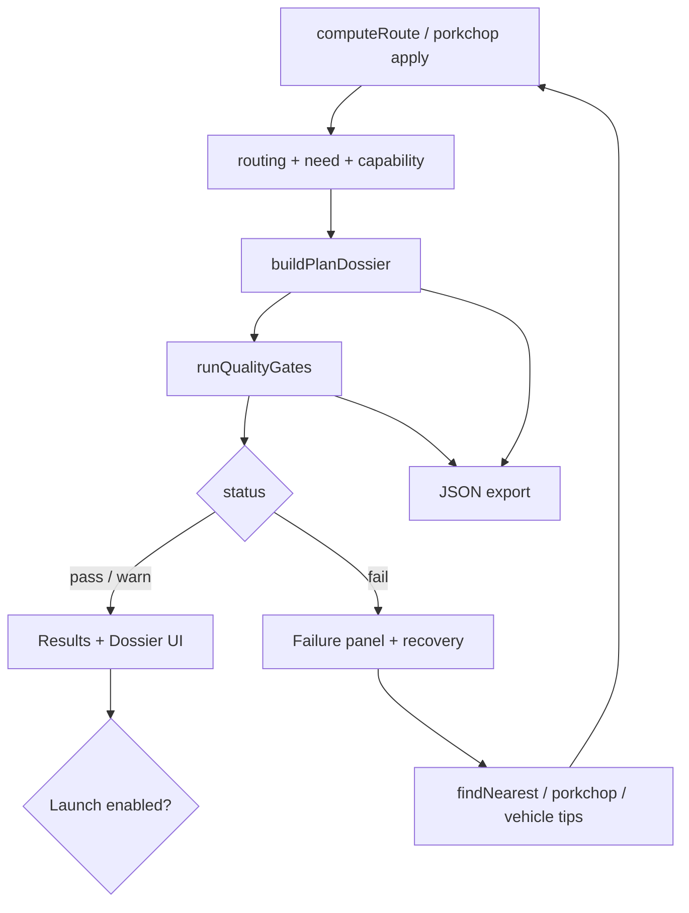
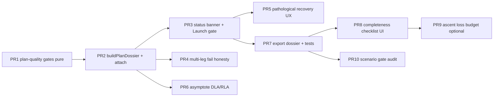

# HELIOS Trip Plan Reliability & Completeness Platform

| Field | Value |
|---|---|
| **Document title** | Trip Plan Reliability & Completeness Platform |
| **Author** | HELIOS engineering (design owner TBD for product sign-off) |
| **Date** | 2026-07-16 |
| **Status** | **Implemented on `main`** (Plan Dossier, gates, recovery, Launch block). Follow-ons in concept-grade + post-landing designs also landed. |
| **Last verified** | 2026-07-17 |
| **Repo** | `C:\Users\kevin\workspace\k-solar-system-navigator` |
| **Branch policy** | **`main` only** |
| **Baseline** | `main` |
| **Prior designs** | `docs/trip-planner-design.md`, `docs/cargo-vehicle-platform-design.md`, `docs/ephemeris-fidelity-platform-design.md` |
| **Audience** | Engineers reading dossier / gate rationale |
| **Product vow** | **No “oops, it didn’t work out” without diagnosis, metrics, and a concrete next action** |

---

## Overview

HELIOS already computes real Lambert transfers, multi-leg gravity assists, porkchop windows, patched-conic parking budgets, and Need/Capability/Margin for sample vehicles. Users still encounter outcomes that feel like **failure without accountability**: silent date shifts, multi-leg “computed” with unachievable flybys, sun-grazing paths, F9 inapplicable with a hard red card, or a toast that vanishes while the panel shows contradictory numbers.

This design makes trip planning **complete, inspectable, and fail-safe**:

1. Every compute produces a **Plan Dossier** (structured object) with inputs, geometry, budgets, vehicle, environment, fidelity, and **quality status**.
2. Failures are **classified, scored, explained, and recovered** (window search, alternate TOF, vehicle swap hints) — never a dead-end toast.
3. **Hard gates** prevent presenting a “successful mission” when physics or vehicle constraints are broken.
4. A **completeness checklist** (IMDH / porkchop-class fields) ensures the dossier has the data a serious preliminary mission design needs, within browser educational scope.
5. Delivery is evolutionary on **`main`**, preserving offline classroom and concept-grade honesty (not flight ops).

**Success sentence:** A user who hits Compute always leaves with either (A) a **validated feasible plan** with full numbers and confidence, or (B) a **structured failure report** plus one-click recovery to the nearest viable window.

---

## Background & Motivation

### Documented failure modes on `main` (verified)

| Failure mode | Code path | User experience today | Severity |
|---|---|---|---|
| **Planet-relative (same SOI)** | Parent-centered Lambert (`planet-relative.js`) for moon↔parent / co-parent moons | Concept-grade; not CR3BP; multi-leg flybys still heliocentric-only | Low |
| **Pathological Lambert** (sun-grazer, huge Δv) | `pathological` + `findNearestFeasibleTransfer` | Date silently adjusted; toast “LAUNCH ADJUSTED…” easy to miss | **High** |
| **Pathological + no fix** | `fix` null | Still shows transfer UI with bad numbers / no hard STOP | **Critical** |
| **Multi-leg infeasible flybys** | `solveMultiLegRoute` then optional `findMultiLegWindow` | May still `MULTI-LEG ROUTE COMPUTED` with TOO SHARP flybys if search fails | **Critical** |
| **Multi-leg window search fails** | `win` null after infeasible seed | Falls through to render broken plan as “computed” | **Critical** |
| **F9 non-Earth / no C3** | `evaluateCapability` inapplicable | Card says NOT APPLICABLE; easy to miss amid other rows | High |
| **Vehicle margin NO** | `evaluateMargin` | Feasible NO but launch button still available | High |
| **Lambert miss / reject** | `lambertOk` false | Hohmann estimate panel — looks like a plan but isn’t ballistic truth | High |
| **Ephemeris OOR sample** | sample-de fallback | Silent approx fallback possible without loud banner | Medium |
| **Toast-only errors** | `notify(...)` | Disappears; no durable record in results panel | High |

### Product vow (non-negotiable)

> **Never claim a plan “worked” when geometry, flybys, or vehicle margins fail gates.**  
> **Never fail without a durable, on-panel explanation and at least one recovery action when possible.**

### Strengths to preserve

- Dual-branch Lambert, perihelion gate, nearest-feasible search, porkchop C3/V∞, mission budget, triad Card, vehicle engineering sheets, fidelity labels, offline tests.

---

## Goals & Non-Goals

### Goals

1. **Plan Dossier v1** — single structured object for every compute outcome (success or failure).
2. **Quality gates** — pass / warn / fail with machine-readable codes.
3. **Confidence score** — 0–100 educational score from gate results + fidelity backend (not statistical OD).
4. **Complete data package** — all fields a preliminary interplanetary design sketch needs (see Completeness Catalog).
5. **Recovery UX** — “Find next window”, “Open porkchop”, “Switch cost basis / vehicle”, “Use sample L2-plan” when relevant.
6. **Launch safety** — disable Launch when gates fail; show reason.
7. **Export honesty** — JSON includes dossier + gate results; never export `feasible: true` when gates fail.
8. **Regression suite** — offline tests that **fail CI** if a known-bad multi-leg still presents as success.
9. **Main-only delivery** — sequential commits.

### Non-Goals

| Non-goal | Rationale |
|---|---|
| Flight-certified navigation / SPICE OD | Out of product scope (L3) |
| Guaranteed global multi-leg optimum | Search remains local/coarse; label as such |
| Real atmosphere ascent integration | Qualitative losses + optional loss budget knob later |
| OEM warranty performance | Educational vehicles only |
| Server-side optimization farm | Browser-first |
| Hiding educational uncertainty | Confidence must stay honest |

### Success metrics

| Metric | Baseline | Target |
|---|---|---|
| Opaque “computed” with broken flybys | Possible | **0** (CI-gated) |
| Pathological plan with no on-panel STOP | Possible | **0** |
| Compute outcomes without dossier | All | **0** |
| Launch enabled on gate fail | Yes | **No** |
| User can recover next window in 1 click | Partial (silent snap) | Explicit button + explanation |
| Completeness checklist shown | No | Always on dossier |

---

## Completeness Catalog (data the user must receive)

Inspired by interplanetary mission design handbooks and porkchop practice (C₃, TOF, arrival V∞, launch asymptote language), adapted to HELIOS’s browser scope.

### A. Plan identity & inputs (always)

| Field | Source today | Gap |
|---|---|---|
| Origin / destination (id + name) | Catalog | — |
| Departure UTC, arrival UTC, TOF | transferData | — |
| Flyby list with epochs | state.flybys | Must list feasibility per flyby in dossier |
| Vehicle id, arch, cargo, F9 variant, cost basis | state | — |
| Display mode, fidelity, ephemeris backend | state | — |
| Classroom mode flag | state | Force L1 already |

### B. Geometry & energy (single-leg)

| Field | Source | Gap |
|---|---|---|
| Lambert ok / branch (longWay) | transferData | Surface branch in UI |
| Heliocentric Δv1, Δv2, total | transferData | — |
| C₃ (dep), V∞ dep, V∞ arr | need / porkchop | **Always** put V∞ arr on Card (today partial) |
| Transfer a, e, perihelion, apoapsis | orbitPhysical | Gate perihelion |
| Phase angle / window hint | transferData | — |
| **DLA / RLA of departure asymptote** | **Missing** | **PR: asymptote angles from v_inf vector** |
| Declination vs launch-site feasibility | Stub only | Educational: site lat vs DLA note |
| Miss distance / residual at arrival | Lambert validation | Surface if available |

### C. Mission parking budget

| Field | Source | Gap |
|---|---|---|
| Parking altitude assumption | mission-budget 100 km | Make explicit on dossier |
| Escape Δv breakdown | computeMissionBudget | Already in panel when Lambert ok |
| Capture Δv + aeroassist | need / budget | Show reduced capture when aero > 0 |
| Mission total vs helio total | dual summary | Align with cost basis |

### D. Vehicle / capability

| Field | Source | Gap |
|---|---|---|
| Need / Capability / Margin | Measurement Card | — |
| Engineering sheet (T/W, escape, stages) | vehicle-performance | — |
| Gravity/drag **loss budget** (educational) | Missing | Optional 1.5–2 km/s class add-on for ascent framing |
| Propellant margin language | margin only | Add residual % note |

### E. Multi-leg / flyby

| Field | Source | Gap |
|---|---|---|
| Per-leg TOF, Δv, Lambert ok | legs[] | Aggregate gate: all legs ok |
| Per-flyby turning, δ_max, r_p, achievable | gravityAssistInfo | **Hard fail if any !achievable** |
| Search status (seed vs optimized) | partial notify | Dossier field |

### F. Trust & fidelity

| Field | Source | Gap |
|---|---|---|
| Ephemeris backend + fidelity badge | state | — |
| Approx error class origin/dest | approx-ephemeris-errors | — |
| Confidence score | **Missing** | This design |
| Gate results[] | **Missing** | This design |

### G. Actions & recovery

| Action | Today | Target |
|---|---|---|
| Launch mission | Always if results shown | Only if `status === 'pass' \|\| 'pass_with_warnings'` |
| Export JSON | Always | Include dossier; mark failed plans `exportable: true` but `mission_ready: false` |
| Find next window | Silent / porkchop | Explicit primary button on fail |
| Share link | Works | Encode plan + fidelity; never claim feasible if not |

---

## Proposed Design

### Architecture



### Plan Dossier schema (v1)

```js
/**
 * @typedef {'pass'|'pass_with_warnings'|'fail'} PlanStatus
 * @typedef {'ok'|'warn'|'fail'} GateLevel
 *
 * @typedef {object} QualityGate
 * @property {string} code     // e.g. G_LAMBERT_OK, G_PERIHELION, G_FLYBY, G_VEHICLE
 * @property {GateLevel} level
 * @property {string} message  // human
 * @property {object} [detail] // numbers for UI
 *
 * @typedef {object} PlanDossier
 * @property {1} dossier_version
 * @property {string} computed_at_iso
 * @property {PlanStatus} status
 * @property {number} confidence_0_100
 * @property {QualityGate[]} gates
 * @property {object} inputs
 * @property {object} geometry
 * @property {object} mission_budget
 * @property {object} measurement   // need, capability, margin
 * @property {object} vehicle_engineering
 * @property {object} fidelity
 * @property {object} recovery      // suggested actions
 * @property {boolean} mission_ready  // Launch allowed
 * @property {string[]} completeness_missing // checklist holes
 */
```

Attach to `state.transferData.dossier` and export under `plan.dossier`.

### Quality gates (ordered)

| Code | Level if violated | Rule |
|---|---|---|
| `G_ORIGIN_DEST` | fail | Origin & dest set (planet-relative pairs allowed via parent-frame Lambert) |
| `G_LAMBERT_OK` | fail (single-leg ballistic claim) | `lambertOk === true` for primary geometry; warn if Hohmann-only |
| `G_PERIHELION` | fail | perihelion ≥ `MIN_PERIHELION_AU` |
| `G_DV_SANE` | fail | total helio Δv finite and ≤ 30 km/s (same class as pathological) |
| `G_ARRIVAL_CLOSE` | warn/fail | If residual miss available and > 1000 km → fail for “ballistic”; else warn |
| `G_FLYBY_ALL` | **fail** | Every flyby `achievable === true` |
| `G_ALL_LEGS` | **fail** | Multi-leg: every leg `ok` |
| `G_VEHICLE_APPLICABLE` | fail | capability.applicable |
| `G_VEHICLE_FEASIBLE` | fail | margin.feasible (or warn if abstract sandbox mode later) |
| `G_FIDELITY_CLASSROOM` | warn | If sample-de requested in classroom → forced approx |
| `G_SAMPLE_OOR` | warn | sample-de requested but fell back to approx |
| `G_DATE_ADJUSTED` | warn | nearest-feasible snapped departure |
| `G_ASYMPTOTE` | warn | DLA outside ±28° educational “low latitude” band (informational) |

**K1 — Multi-leg with any TOO SHARP flyby is `status: fail`, never pass.**  
**K2 — Pathological with no recovery is `fail` and Launch disabled.**  
**K3 — Vehicle margin NO ⇒ fail mission_ready (Launch off); still export for learning.**

### Confidence score (educational)

```
start 100
- 40 if any fail gate
- 15 per warn gate (cap -45)
- 10 if fidelity L1 only (optional soft)
- 5 if date was auto-adjusted
clamp 0..100
label: High ≥80, Medium ≥50, Low <50, Failed = 0 if status fail
```

Not a navigation covariance — labeled **“plan completeness confidence (educational)”**.

### Recovery actions

| Situation | Primary action | Secondary |
|---|---|---|
| Pathological / no Lambert | Find nearest feasible window | Open porkchop |
| Flyby too sharp | Snap flyby dates / multi-leg window search | Remove flyby |
| Vehicle infeasible | Switch to abstract high-energy / unrefueled / more tankers | Reduce cargo |
| F9 non-Earth | Switch to SH+SS or abstract | — |
| Planet-relative | Suggest planet↔heliocentric framing | Link docs |

UI: durable banner + buttons, not toast-only.

### Asymptote data (completeness)

From Lambert `v1_lambert` and planet velocity:

\[
\mathbf{v}_\infty = \mathbf{v}_1 - \mathbf{v}_{\mathrm{planet}}
\]

In ecliptic frame:

- **DLA** = declination of \(\mathbf{v}_\infty\)
- **RLA** = right ascension of \(\mathbf{v}_\infty\) (or longitude of asymptote in ecliptic as educational proxy if equatorial conversion deferred)

**K4 — Ship ecliptic-frame asymptote angles first; document if not Earth-equatorial DLA/RLA.**  
Handbook DLA is usually Earth-equatorial; v1 may label **“ecliptic asymptote declination (educational)”** until EOP/equatorial transform lands.

### Loss budget (educational ascent framing)

Optional Need add-on (not default on):

- `state.ascentLossBudget_m_s` default 0; presets 1500 / 2000 m/s class  
- Shown as **separate line**, not mixed into pure heliocentric Lambert Δv  
- Clarity: “Launch vehicle must also cover ascent losses — not included in interplanetary Need unless enabled”

### Plan Result Panel UX

```
┌─ PLAN STATUS: PASS | WARN | FAIL  conf XX ─────────────┐
│ Gates summary (icons)                                   │
│ [Find next window] [Porkchop] [Adjust vehicle]          │
├─ Trajectory …                                           │
├─ Mission budget …                                       │
├─ Need / Capability / Margin …                           │
├─ Vehicle engineering …                                  │
├─ Completeness checklist ✓/✗                             │
└─ Disclaimers + fidelity                                 │
```

Launch button: disabled + tooltip when `!mission_ready`.

### Export JSON extensions (schema stays 3, additive)

```json
"dossier": {
  "dossier_version": 1,
  "status": "fail",
  "confidence_0_100": 0,
  "mission_ready": false,
  "gates": [ ... ],
  "geometry": { "c3_m2_s2": 0, "vinf_arr_m_s": 0, "dla_ecliptic_deg": 0, "rla_ecliptic_deg": 0 },
  "recovery": { "primary": "find_nearest_window", "detail": "..." }
}
```

`feasibility.feasible` must equal `margin.feasible && mission_ready` for success exports (K5).

---

## API / Interface Changes

### New modules

| Module | Role |
|---|---|
| `js/physics/plan-quality.js` | Pure: `runQualityGates(td, measurement, opts) → { status, gates, confidence, mission_ready }` |
| `js/physics/departure-asymptote.js` | Pure: v_inf → DLA/RLA-class angles |
| `js/ui/plan-dossier.js` | `buildPlanDossier(...)`, HTML status banner |
| `js/ui/plan-recovery.js` | Wire recovery buttons |

### Call-site changes

| File | Change |
|---|---|
| `route-planner.js` `computeRoute` | Always build dossier; never notify-only for terminal outcomes; on multi-leg fail after search, **fail dossier** not “ROUTE COMPUTED” |
| `route-display.js` | Render status banner first; Launch gated |
| `mission-export.js` | Embed dossier |
| `porkchop.js` apply | Build dossier after solve |
| `share.js` apply | Rebuild dossier after recompute |

### State

```js
// optional
ascentLossBudget_m_s: 0,
planStrictVehicle: true, // if false, vehicle fail → warn only (default true)
```

**K6 — Default strict vehicle gates (Launch requires feasible margin).**

---

## Alternatives Considered

### Alt 1 — Only improve toast messages  
**Rejected:** toasts are ephemeral; user already lost trust.

### Alt 2 — Block all auto date adjustment  
**Rejected:** auto-window is valuable; must be **loud + reversible** (show before/after dates).

### Alt 3 — Full n-body + SPICE before UX reliability  
**Rejected:** does not fix multi-leg TOO SHARP presented as success; do reliability first, fidelity continues in parallel (`ephemeris-fidelity-platform-design.md`).

### Alt 4 — Dossier + hard gates + recovery (chosen)  
**Accepted.**

---

## Security & Privacy

No new network. Dossier is client-side only. Export may contain larger JSON — fine.

---

## Observability

- `?debug=1` logs full dossier  
- Soft metric: % of computes with status fail (local only)  
- CI: golden bad multi-leg must be `status === 'fail'`

---

## Risks

| Risk | Severity | Mitigation |
|---|---|---|
| Users think confidence is navigation-grade | High | Explicit “educational completeness” label |
| Stricter gates frustrate demos | Medium | Recovery buttons; scenarios pre-validated |
| DLA ecliptic ≠ handbook equatorial | Medium | Label frame; later PR for equatorial |
| Export break for old importers | Low | Additive `dossier`; keep schema 3 |
| Performance | Low | Pure JS gates ≪ Lambert cost |

---

## Open Questions (defaults)

| # | Question | Default |
|---|---|---|
| Q1 | Vehicle infeasible = fail or warn? | **fail** for mission_ready (K6) |
| Q2 | Auto-adjust date without modal? | Keep auto-adjust but **warn gate + show old/new dates** |
| Q3 | Ascent loss budget default on? | **Off** (0); user opt-in |
| Q4 | Schema 3 vs 4? | Stay **3**, additive dossier |

---

## Key Decisions

1. **K1 — Any infeasible flyby ⇒ plan fail.**  
2. **K2 — Pathological without recovery ⇒ fail + no Launch.**  
3. **K3 — Vehicle margin NO ⇒ not mission_ready.**  
4. **K4 — Ecliptic asymptote angles first; label frame.**  
5. **K5 — Export feasible/mission_ready consistent with gates.**  
6. **K6 — Strict vehicle gates by default.**  
7. **K7 — Every compute yields a Plan Dossier.**  
8. **K8 — Toast never sole failure channel.**  
9. **K9 — Recovery actions required when fail and recovery exists.**  
10. **K10 — Main-only sequential delivery.**  
11. **K11 — Confidence is educational completeness, not OD covariance.**  
12. **K12 — Scenarios must pass gates or be labeled demo-unsafe.**

---

## PR Plan (main-only)



### PR 1: Pure quality gates module
- **Files:** `js/physics/plan-quality.js`, `tests/plan_quality.mjs`
- **AC:** Unit tests for flyby fail, perihelion fail, vehicle fail, all-pass
- **Effort:** M

### PR 2: buildPlanDossier + wire computeRoute
- **Files:** `js/ui/plan-dossier.js`, `route-planner.js`, `porkchop.js`, `share.js`
- **AC:** Every compute sets `transferData.dossier`; debug=1 logs it
- **Effort:** M

### PR 3: Status banner + Launch disable
- **Files:** `route-display.js`, CSS, mission controls
- **AC:** FAIL banner red; Launch disabled when `!mission_ready`; Playwright/ci_ui assert
- **Effort:** M

### PR 4: Multi-leg honesty
- **Files:** `route-planner.js`, tests with TOO SHARP fixture
- **AC:** Infeasible multi-leg after failed search ⇒ status fail, never “ROUTE COMPUTED” success toast
- **Effort:** M

### PR 5: Pathological recovery UX
- **Files:** `route-planner.js`, `plan-recovery.js`
- **AC:** On adjust: show previous vs new date; on no fix: FAIL + Find window button
- **Effort:** M

### PR 6: Departure asymptote angles
- **Files:** `js/physics/departure-asymptote.js`, dossier geometry, Card rows
- **AC:** Finite DLA/RLA-class for Earth→Mars Lambert-ok; frame labeled ecliptic
- **Effort:** M

### PR 7: Export + golden regression
- **Files:** `mission-export.js`, fixtures, `tests/plan_dossier_export.mjs`
- **AC:** Export contains dossier; bad plan `mission_ready: false`
- **Effort:** S

### PR 8: Completeness checklist UI
- **Files:** plan-dossier UI
- **AC:** Checklist of A–F fields with ✓/✗/n/a
- **Effort:** S

### PR 9: Optional ascent loss budget
- **Files:** state, controls, need display (separate line)
- **AC:** Default 0; when 2000, Card shows line; does not corrupt Lambert Δv
- **Effort:** S

### PR 10: Scenario pack gate audit
- **Files:** scenarios + offline test
- **AC:** Each scenario either passes gates or flagged `demo_unsafe` in data
- **Effort:** M

**Platform launch:** PR 1–7 (reliability vow).  
**Completeness polish:** PR 8–10.

---

## Implementation checklist (per commit)

1. Implement slice on `main`  
2. `npm run test:physics` green  
3. Commit + `git push origin main`  
4. No long-lived side branches  

---

## Appendix A — User-visible failure copy (examples)

| Code | Banner title | Body |
|---|---|---|
| `G_FLYBY_ALL` | Plan failed: gravity assist not achievable | Flyby at {body} requires periapsis {rp} km below safe minimum {min}. Snap flyby dates or remove the flyby. |
| `G_PERIHELION` | Plan failed: sun-grazing transfer | Perihelion {p} AU &lt; 0.3 AU. Find a different launch window. |
| `G_VEHICLE_FEASIBLE` | Plan failed: vehicle cannot meet Need | Margin negative ({margin}). Reduce cargo, add tankers, or change vehicle. |
| `G_LAMBERT_OK` | Plan failed: no ballistic Lambert solution | Try Find Launch Windows (porkchop) or nearest feasible date. |

---

## Appendix B — Completeness checklist (UI)

- [ ] Origin / destination / epochs  
- [ ] Ballistic Lambert solution  
- [ ] C₃ and V∞ (dep & arr)  
- [ ] Perihelion safe  
- [ ] Parking mission budget (if single-leg)  
- [ ] Asymptote angles (DLA/RLA-class)  
- [ ] Vehicle applicable + margin  
- [ ] Flybys all achievable (if any)  
- [ ] Fidelity / ephemeris backend labeled  
- [ ] Confidence + mission_ready  

---

## Appendix C — Relationship to other designs

| Design | Role |
|---|---|
| Trip planner design | Catalog, share, vehicles foundation |
| Cargo platform | Need/Capability/Margin |
| Ephemeris fidelity | L1/L2-plan accuracy of *states* |
| **This design** | Reliability of *outcomes* + completeness of *dossier* |
| **Concept-grade & extras** | `docs/concept-grade-and-extras-design.md` — equatorial DLA, scenario audit, Vehicle Lab, ascent model, site gate |

Fidelity without reliability still yields “oops.” Reliability without fidelity still yields honest L1 plans. **Both are required.** Concept-grade extras tighten completeness without claiming flight ops.

---

## References

- NASA / JPL Interplanetary Mission Design Handbook materials (C₃, TOF, porkchop families)  
- HELIOS: `js/ui/route-planner.js`, `js/physics/routing.js`, `gravity-assist.js`, `mission-budget.js`, `need.js`, `vehicles.js`, `vehicle-performance.js`  
- `docs/ephemeris-fidelity-platform-design.md`  
- `docs/cargo-vehicle-platform-design.md`  

---

## Appendix D — Suggested commit messages

```
feat(plan): quality gates pure module
feat(plan): Plan Dossier on every compute
feat(plan): status banner and Launch gate
fix(plan): multi-leg never success with bad flybys
feat(plan): pathological recovery UX
feat(plan): departure asymptote DLA/RLA-class
feat(plan): export dossier + regression fixtures
feat(plan): completeness checklist UI
feat(plan): optional ascent loss budget
test(plan): scenario gate audit
```
