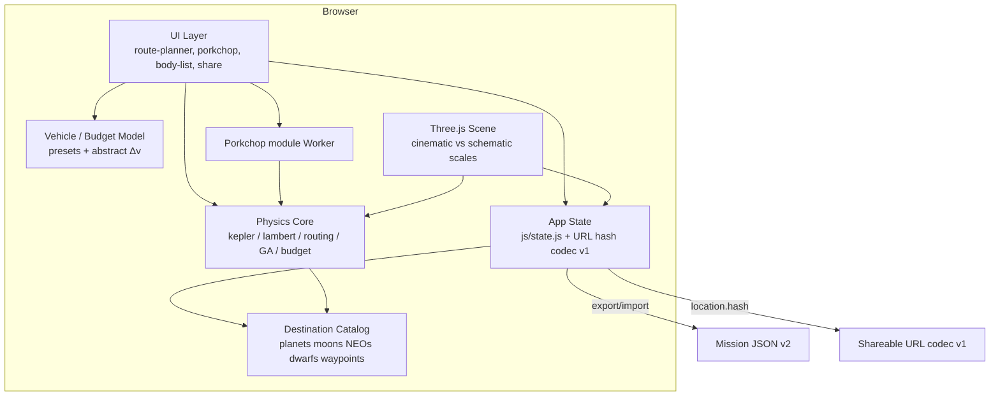
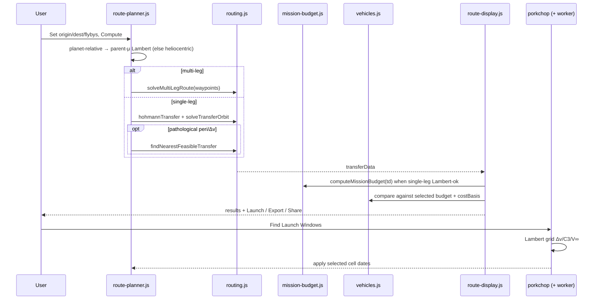
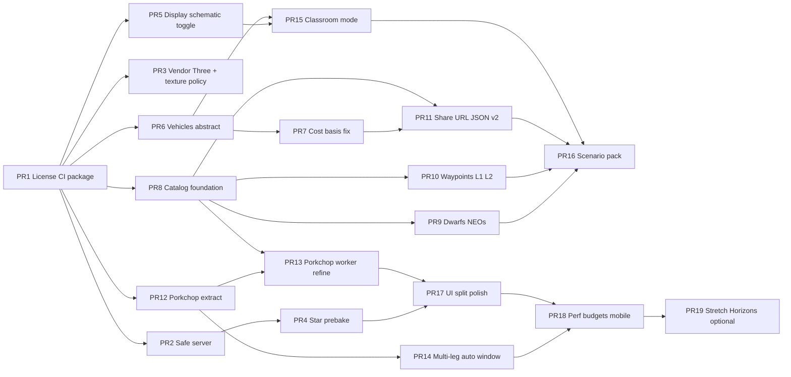

# HELIOS Solar System Navigator — Evolutionary Redesign to Category-Defining Trip Planner

| Field | Value |
|---|---|
| **Document title** | HELIOS Trip Planner Product & Architecture Redesign |
| **Author** | HELIOS engineering (design owner TBD for product sign-off) |
| **Date** | 2026-07-16 |
| **Status** | **Implemented on `main`** (as-built; body text is historical design snapshot) |
| **Last verified** | 2026-07-17 |
| **Repo** | `C:\Users\kevin\workspace\k-solar-system-navigator` |
| **Branch baseline** | `main` only (original design targeted a side branch that was retired) |
| **Audience** | Engineers reading product history / rationale |
| **Follow-ons** | Cargo, fidelity, reliability, concept-grade, post-landing, geographic-site designs |

---

## Overview

HELIOS is a browser-first interplanetary mission visualizer with a real physics core: JPL Approximate Positions ephemeris (`js/physics/kepler.js`), a bracketed universal-variable Lambert solver (`js/physics/lambert.js`), multi-leg gravity-assist routing (`js/physics/routing.js` + `js/physics/gravity-assist.js`), porkchop C3/V∞ heatmaps (`js/ui/porkchop.js`), patched-conic mission budgets (`js/physics/mission-budget.js`), and a cinematic Three.js scene. It already supports planet and major-moon origin/destination, automatic nearest-feasible-window snap, flyby date optimization, mission animation, and JSON plan **export** (`exportMissionPlan` in `js/ui/mission-export.js`, surfaced via the route panel in `js/ui/route-display.js`; no import UI yet).

This design evolves HELIOS from an educational mission-design demo into the **go-to browser place for comprehensive solar-system trip planning** — without a big-bang rewrite. Work is sequenced as independently mergeable PRs that keep physics tests green, fix platform/security footguns, expand destinations (NEOs, dwarfs, simple Lagrange waypoints), generalize vehicle/Δv honesty, add shareable URLs, introduce less-exaggerated display modes, and improve load time and maintainability. Scope is explicitly **education and early mission sketching**, not flight operations.

**Parallel tracks (revision 2):** Foundation hygiene, Core Trip Planner (vehicles, porkchop, multi-leg windows), UX trust (display modes), and Destination Catalog can proceed largely independently after PR 1. Share URLs need stable catalog ids; multi-leg window search does **not** wait on NEOs/waypoints.

---

## Background & Motivation

### Current product (as implemented)

| Layer | Reality in repo |
|---|---|
| **Stack** | Vanilla ES modules + Three.js r0.164 via CDN importmap (`index.html`) + planet textures from unpinned `threex.planets@master` on jsDelivr (`js/scene/planets.js` `TEX_BASE`) + zero-dep Node static server (`server.js`) + ~32 MB `hyg_v42.csv` |
| **Entry** | `js/main.js` wires scene → UI → mission → `animate()`; exposes `window.__HELIOS` for Playwright/Puppeteer |
| **Shared state** | Mutable `state` object in `js/state.js` (route, flybys, transferData, mission) |
| **Physics** | `js/physics/{vec3,kepler,lambert,helio,gravity-assist,routing,mission-budget}.js` |
| **Vehicle** | Starship/Super Heavy only in root `trajectory-calculator.js`; `transferDeltaV()` ≈ **3766.67 m/s** (Super Heavy rocket equation); feasibility is `transferDeltaV() >= totalDv` vs **heliocentric** totals in `route-display.js` |
| **UI** | Route panel split: `route-display.js` (DOM), `route-orbit-visual.js` (scene arcs), `mission-export.js` (JSON plan), `mission-budget-ui.js` (shared Δv helpers); also `porkchop.js`, `route-planner.js`; styles in `css/app.css`; `index.html` shell + importmap |
| **Data** | 8 planets (`js/data/bodies.js`, name-keyed, no stable `id`), **25** major moons (`js/data/moons.js`; README says “~30”), 5 probes (`js/data/spacecraft.js`), 7 scenarios with string `id`s (`js/data/scenarios.js`) |
| **Tests** | ~19 files under `tests/` — offline physics + module integration + Playwright UI |
| **Gaps** | No LICENSE, no CI, path-unsafe server, CDN Three **and** textures, 32 MB star parse, no display-scale toggle, Starship-only theatrics, no NEOs/Lagrange/URL share, no TypeScript, `MODULE_TYPELESS_PACKAGE_JSON` warning on ESM imports |

### Strengths to preserve

1. **Physics quality** — dual geometry (physical vs exaggerated inclination) in `solveTransferOrbit` / `solveMultiLegRoute`; Oberth-correct powered flyby Δv; perihelion gate (`MIN_PERIHELION_AU = 0.3`); auto-snap via `findNearestFeasibleTransfer`.
2. **Modular extract** — post-`59f15a1` ES module layout; `tests/module_integration.mjs` imports production physics directly.
3. **Test culture** — Lambert, porkchop, gravity-assist, ephemeris, visual alignment, multi-leg Playwright.
4. **Demo UX** — drag/right-click routing, scenarios, porkchop metrics (Δv / C3 / arrival V∞), mission flight with date markers.
5. **Data honesty beginnings** — about-modal methodology copy; JSON export with `schema_version: 1`, frame, units, feasibility block.

### Pain points

| Pain | Evidence | Impact |
|---|---|---|
| Dual visual/physics identity is opaque | `INCL_EXAGGERATION = 8`, `SUN_WOBBLE_EXAGGERATION = 50`; `MOON_ORBIT_SCALE = 0.12` only affects **displayOrbit** layout in `moons.js`, not physics `a_km` | Users may treat cinematic scene as truth |
| Cost-basis / feasibility mismatch | `computeMissionBudget(td)` runs for **any** single-leg Lambert-ok transfer (planet–planet **and** moons); feasibility always compares Super Heavy to heliocentric `dvTotal_lambert` (`route-display.js` ~270–321, ~435–439) | YES/NO disagrees with displayed “Mission total Δv” for Earth→Mars as well as moon routes |
| Thin vehicle model | Single stack in `trajectory-calculator.js` | Cannot compare abstract budgets or alternate classes honestly |
| Platform footguns | `server.js` joins `req.url` without path containment | Directory traversal if this server is deployed |
| Heavy cold load + CDN surfaces | HYG CSV; Three + `TEX_BASE` `@master` textures | Slow first paint; offline demos fail without local assets |
| Catalog ceiling | Planets + 25 moons only; flyby `<select>` is `BODIES` only | Cannot plan NEO/dwarf/L-point tours |
| Shareability partial | JSON download exists; no URL state / import | Cannot deep-link classroom or social demos |
| Maintainability | No CI/license; fat UI modules; typeless package.json | Bus factor, regressions, legal ambiguity |
| Porkchop main-thread | 65×52 Lambert grid, 14 ms rAF slices in `porkchop.js` | UI jank; hard to refine denser grids |

### Prior SWOT (refined)

- **Strengths:** physics core, modular layout, tests, demo UX, growing honesty (export, about, perihelion warnings).
- **Weaknesses:** visual/physics dual identity, vehicle theatrics, fidelity ceilings, security footgun, assets, packaging.
- **Threats:** misuse as operational truth; CDN breakage (Three **and** textures); competition; no CI regressions; bus factor.
- **Opportunities:** CI/license/safe server; display-scale toggle; prebaked stars; vehicle presets + abstract budget; shareable URLs; NEOs/Lagrange; Web Worker porkchop; classroom mode; optional Horizons later; static hosting for production.

---

## Goals & Non-Goals

### Goals

1. **Destination catalog** — plan among planets, major moons, selected NEOs, dwarf planets, and simple approximate waypoints (Earth–Moon L1/L2 as fixed-fraction offsets, clearly labeled **geometric sketches**).
2. **Trip planning depth** — single-leg + multi-leg GA tours with window search, flyby date optimization, refineable porkchop (Δv / C3 / arrival V∞).
3. **Honest budgets** — vehicle presets + abstract Δv budget mode; methodology disclaimers; feasibility aligned with selected cost basis (heliocentric vs full patched-conic mission total when available).
4. **Share & export** — frozen URL hash codec for plan_request + JSON import/export (schema v2).
5. **Trustworthy visualization** — cinematic vs less-exaggerated display modes for inclinations and sun wobble; **honest labeling** that moon orbits remain schematic.
6. **Performance** — fast cold load for **planning path**, progressive star field, offline-friendly **planning + untextured/fallback meshes** (see Non-Goals for photoreal maps).
7. **Platform hygiene** — safe local-dev server, LICENSE, CI on physics, pinned/vendored Three.js; production via static hosting preferred.
8. **Evolutionary delivery** — each PR independently reviewable; physics tests stay green.

### Non-Goals

| Non-goal | Rationale |
|---|---|
| **Flight dynamics operations tool** | No navigation filters, covariance, burn sequencing for real missions |
| **Full n-body / SPICE kernels in phase 1–5** | JPL Approximate Positions 1800–2050 remains the core ephemeris; SPICE `.bsp` never required; optional Horizons **fetch** is Stretch only (not kernels) |
| **High-fidelity planet-relative CR3BP** | Same-SOI routes (Europa→Io, Earth→Moon) use **parent-centered Lambert** (concept-grade patched-conic), not CR3BP / n-body lunar transfer design |
| **Mandatory backend** | Core planning stays browser-only; optional remote ephemeris later |
| **TypeScript big-bang** | Optional incremental JSDoc / `// @ts-check` later; not a rewrite gate |
| **Mobile-first redesign** | Desktop primary; progressive mobile (touch-friendly later polish) |
| **Photoreal rendering / game engine** | Keep Three.js cinematic aesthetic |
| **Photoreal planet maps offline (required)** | Textures may stay CDN or optional assets; offline guarantee is planning + solid-color/fallback materials (K16) |
| **Realtime multiplayer or accounts** | Stateless share via URL/JSON only |
| **Complete small-body catalog** | Curated NEOs/dwarfs only, not MPC full dump |
| **Moon gravity-assist targets (phase 1–5)** | Flybys = heliocentric mass concentrations only (K17) |

---

## Proposed Design

### Product architecture (target)



### Trip-planning control flow (existing + extensions)



### Core design pillars

#### 1. Physics core stays pure and browser-importable

Keep `js/physics/*` free of DOM/Three. Continue validating via:

- `tests/trip_planning_test.mjs`, `verify_fix.mjs`, `lambert_both_branches.mjs`
- `tests/porkchop_sim.mjs`, `gravity_assist_sim.mjs`, `flyby_optimizer.mjs`
- `tests/ephemeris_check.mjs`, `module_integration.mjs`, `visual_alignment.mjs`

New math (waypoint positions, NEO elements, refined multi-leg window search) lands in physics/data first with offline tests, then UI.

#### 2. Unified destination catalog

Today routing uses ad-hoc `BODIES` / `MOONS` / `findRoutingBody`. Target:

```
js/data/
  bodies.js          # planets (unchanged rates model) + id slugs
  moons.js           # 25 major moons + id
  dwarfs.js          # NEW: Ceres, Pluto, Eris, Haumea, … 
  neos.js            # NEW: curated NEOs (committed SBDB-style snapshots)
  waypoints.js       # NEW: EM-L1, EM-L2 geometric approximations
  catalog.js         # NEW: unified index + findById + kind filters
  scenarios.js       # extend scenarios across catalog (id + body ids)
  spacecraft.js      # probes (display, not routing targets initially)
```

**Routing body contract** (minimal fields used by physics today):

```js
// Fields consumed by kepler/routing/mission-budget
{
  id: 'earth',           // stable slug for URL/JSON (freeze early)
  name: 'Earth',         // display + legacy keys
  kind: 'planet',        // planet | moon | dwarf | neo | waypoint
  mass, radius, color, emissive, displayRadius, desc,
  // heliocentric Kepler (planets/dwarfs/NEOs):
  a, e, I, L0, wBar, omega, period,
  a_dot?, e_dot?, I_dot?, L_dot?, wBar_dot?, omega_dot?, b?, c?, s?, f?,
  // moons:
  parent?, a_km?, M0?, displayOrbit?,  // displayOrbit = scene layout only
  // waypoints:
  waypointOf?: { primaryId: 'earth', secondaryId: 'moon', lagrange: 'L1' },
  // selection / UI:
  selectable: true,
  routeable: true,
  flybyEligible: false,  // true only for planet|dwarf|selected neo
}
```

**Catalog migration order (PR 8 → 11):**

1. Add `id` on every planet/moon; `catalog.findById` / `findByName` (name → id alias table).
2. **Internal routing** and `state.flybys[]` store `bodyId` (string); readers accept legacy `bodyName` for one release and normalize on write.
3. **Display** always uses `name`.
4. Scenarios gain `origin_id` / `destination_id` while keeping display names.
5. Export v2 includes **both** `summary.origin` (name) and `summary.origin_id` (and same for destination/flybys).
6. `window.__HELIOS` may expose `catalog` helpers; Playwright may keep selecting by visible name.

**Flyby eligibility (K17):**  
`kind ∈ {planet, dwarf}` plus curated large NEOs with `flybyEligible: true`. **Moons and waypoints are never GA targets** in this roadmap (patched-conic model in `gravity-assist.js` is planet-centered). `renderFlybyList` options = `catalog.listFlybyEligible()`.

**Waypoint model (geometric sketch only):**

Collinear Earth–Moon approximations (constants frozen in `waypoints.js`):

- \(R_{EM}(t) = \|\mathbf{r}_M(t) - \mathbf{r}_E(t)\|\)
- \(\hat{u}(t) = (\mathbf{r}_M - \mathbf{r}_E) / R_{EM}\)
- \(\mathbf{r}_{L1}(t) = \mathbf{r}_E(t) + 0.84\, R_{EM}(t)\, \hat{u}(t)\)
- \(\mathbf{r}_{L2}(t) = \mathbf{r}_E(t) + 1.16\, R_{EM}(t)\, \hat{u}(t)\)

**Velocity (v1 implementation):**

\[
\mathbf{v}_{L}(t) \approx \mathbf{v}_E(t) + f\cdot(\mathbf{v}_M(t)-\mathbf{v}_E(t))
\]

with \(f = 0.84\) (L1) or \(1.16\) (L2) — i.e. linear interpolation/extrapolation of Earth–Moon relative velocity along the line. **No** three-body effective potential; **no** halo/Lissajous.

UI/export **must** show: *“Approximate collinear Lagrange geometry — not CR3BP. Δv is a geometric sketch only.”*  
Feasibility YES/NO for any route with a waypoint endpoint: **force abstract budget comparison** and append extra disclaimer (or hide vehicle-preset YES/NO and show “sketch — abstract budget only”). Origin/dest only — never flyby (K8, K17).

**NEO/dwarf elements (K18):** Committed static snapshots (JPL SBDB / published elements) in-repo with epoch and source URL in file header. No live fetch in phase 1–5. Frozen J2000-style elements OK with validity note in UI.

#### 3. Vehicle & budget honesty

| Mode | Behavior |
|---|---|
| **Abstract budget** | User sets usable transfer Δv (default **8000 m/s**); feasibility = budget ≥ selected cost basis |
| **Vehicle presets** | Fixed abstract transfer budgets (except SH+Starship, which keeps the real rocket-equation helper) — **not** inventing fake detailed stacks |
| **Cost basis** | `helio` = heliocentric leg (or multi-leg sum); `mission` = `computeMissionBudget.totalMission` when available |

Move `trajectory-calculator.js` → `js/physics/vehicles.js` (pure ESM under `js/`). Optional one-release re-export shim at old path.

##### Preset table (frozen contract — PR 6)

| `id` | Display name | Usable transfer Δv | How derived | Disclaimer (one line) |
|---|---|---|---|---|
| `sh-starship` | Super Heavy + Starship (default) | **`superHeavyDeltaV()` ≈ 3766.67 m/s** (golden: within ±1 m/s of current `trajectory-calculator.js`) | Rocket equation on SH dry/propellant with fully loaded Starship as payload; Starship propellant **reserved** (not in transfer budget) | “Illustrative stack model from published-ish mass/Isp assumptions — not SpaceX performance guarantee.” |
| `abstract` | Abstract Δv budget | `state.abstractBudget_m_s` (default **8000**, UI range 500–50000 m/s) | User slider/input | “User-defined budget for comparison only.” |
| `chem-medium` | Chemical medium (abstract) | **6000 m/s** fixed | Round educational number for inner-system multi-burn class | “Abstract class budget — not a flight performance estimate.” |
| `fh-class` | Heavy-lift chemical (abstract) | **9000 m/s** fixed | Round educational number (order-of-magnitude heavy-lift class) | “Abstract class budget — not Falcon Heavy or any specific vehicle.” |
| `high-energy` | High-energy / advanced (abstract) | **15000 m/s** fixed | Round educational number for outer-system / high-C3 sketches | “Abstract advanced-propulsion placeholder — not nuclear/EP sizing.” |

Offline tests assert golden constants for every fixed preset and SH within ±1 m/s of 3766.67 m/s.

##### Cost-basis rules (PR 7) — broader than moons

`computeMissionBudget(td)` already applies to **all** single-leg Lambert-ok transfers (parking escape/capture), not only moons.

1. **Single-leg, `costBasis === 'mission'`:** if `budget != null`, required Δv = `budget.totalMission`; else fall back to helio and notify.
2. **Single-leg, `costBasis === 'helio'`:** required Δv = `td.dvTotal_lambert` (or `td.dvTotal` if Lambert failed estimate path).
3. **Multi-leg:** `computeMissionBudget` is **not** defined for multi-leg. Mission basis control is **disabled** with tooltip “Mission parking budget is single-leg only.” Required Δv = `td.dvTotalMultiLeg` always. Export records `cost_basis: 'helio'` for multi-leg even if user preferred mission globally. Share hash **encode** always writes `basis=helio` for multi-leg; **apply** coerces `basis=mission` → `helio` when `fb` non-empty (see §5).
4. **Default policy:** default `costBasis = 'helio'`. When user selects a **moon** origin or destination, UI **auto-suggests** switching to `mission` (one-time notify + toggle highlight); does not force if user already chose.
5. **Export always records** when available: `heliocentric_total_dv_m_s`, `mission_total_dv_m_s` (null if N/A), `cost_basis`, `required_dv_m_s`, `feasible`.

#### 4. Display scale: cinematic vs schematic (not “physics truth”)

Rename modes to avoid overclaim (K4 revised):

```js
display: {
  mode: 'cinematic' | 'schematic',  // default cinematic
}
```

| Parameter | Cinematic (today) | Schematic |
|---|---|---|
| Inclination exaggeration | 8 | **1** (true inclinations in **scene**) |
| Sun wobble exaggeration | 50 | **1** |
| Moon `displayOrbit` layout scale | `MOON_ORBIT_SCALE = 0.12` | **unchanged 0.12** in v1 — moons stay schematic layout |

**Badge copy (required):**

- Cinematic: `VIEW: CINEMATIC (exaggerated incl. / wobble)`
- Schematic: `VIEW: SCHEMATIC — incl. & sun wobble physical; moon orbits still layout-scaled; numbers always physical`

Physics paths already use `exaggerate=false` for Δv — invariant under tests. Schematic mode does **not** claim the 3D scene is a metrically true solar system (planet `displayRadius` remains exaggerated for visibility).

Implementation:

1. `js/display-scale.js` getters for incl/wobble multipliers.
2. On mode flip: rebuild orbit lines, re-solve visual Lambert branch, `updateTransferOrbitVisual`.
3. Do **not** set `MOON_ORBIT_SCALE` to 1.0 in this roadmap (would still not be true AU distances relative to planet sizes; risks unreadable clutter). True moon distances = non-goal unless a future PR adds dual-scale camera.

#### 5. Shareable missions — URL codec v1 (frozen) + JSON v2

**Transport:** `location.hash` only (K15). Rationale: works on static hosts (GitHub Pages) without server rewrite; query strings remain free for `?mode=classroom` and `?debug=1`.

**Codec v1 grammar** (application/x-www-form-urlencoded after `#`):

```
#v=1&o=earth&d=mars&dep=2026-11-21&tof=258&fb=venus@2027-06-15,mars@2028-01-01&veh=abstract&ab=8000&basis=helio&view=cinematic
```

| Key | Required | Meaning | Limits |
|---|---|---|---|
| `v` | yes | Codec version; only `1` accepted in this design | unknown `v` → ignore hash, notify |
| `o` | yes | Origin body **id** | must resolve in catalog |
| `d` | yes | Destination body **id** | must resolve |
| `dep` | yes | Departure date **UTC date-only** `YYYY-MM-DD` (noon UTC when applied) | clamp to 1800-01-01 … 2050-12-31 |
| `tof` | no | Transit days (integer); if omitted, compute uses Hohmann/default path | 1…20000 |
| `fb` | no | Flybys: `id@YYYY-MM-DD` comma-separated | **max 6**; each id must be `flybyEligible` |
| `veh` | no | Vehicle preset id | default `sh-starship` |
| `ab` | no | Abstract budget m/s (integer) | only if `veh=abstract` |
| `basis` | no | `helio` \| `mission` | default `helio`; **coerced** on multi-leg (below) |
| `view` | no | `cinematic` \| `schematic` | default `cinematic` |

Unknown keys: **ignore**. Malformed values: skip field or reject whole plan with notify (strict for `o`/`d`/`dep`).  
Max encoded length target: **≤ 1500 characters**; if longer, share via JSON download instead and notify.

Module: `js/ui/share.js` — `encodePlanRequest`, `parsePlanRequest`, `applyPlanRequest`.  
**Golden table** in `tests/share_codec.mjs` (encode → parse equality for ≥5 fixtures including multi-leg + abstract + schematic + **one with `tof`**).

##### `applyPlanRequest` / encode semantics (frozen)

**Multi-leg + `basis=mission` coercion:**

- **On apply:** if `fb` is non-empty (any flybys), set `state.costBasis = 'helio'` even when hash has `basis=mission`. One-line notify: `MISSION BASIS IS SINGLE-LEG ONLY — USING HELIO`.
- **On encode:** if `state.flybys.length > 0`, always write `basis=helio` (never emit `mission` for multi-leg shares).

**Optional `tof` binding (single-leg only):**

| Case | Behavior |
|---|---|
| `tof` present, no flybys | Set departure from `dep` (noon UTC). Set **user TOF override** = `tof` days. Build transfer as: `transferTime = tof * DAY`, `arrivalSimTime = departureSimTime + transferTime`, then `solveTransferOrbit` (same path as porkchop “apply cell”, not fresh Hohmann TOF). **Auto-snap** (`findNearestFeasibleTransfer`) runs **only if** the solution is pathological (perihelion &lt; 0.3 AU or Δv &gt; 30 km/s) — same gate as today’s `computeRoute`. |
| `tof` omitted, no flybys | Current behavior: Hohmann TOF guess → Lambert → auto-snap if pathological. |
| `tof` present **with** flybys | **Ignore `tof`** (multi-leg uses per-leg dates from `dep` + `fb` + Hohmann tail). Notify once if `tof` was present: `TOF IGNORED FOR MULTI-LEG`. |
| State field | `state.userTofDays = number \| null` — set by share apply or porkchop apply; cleared when origin/dest changes or user edits depart without porkchop. |

##### Body id slug convention (shared with catalog / worker)

Planet/moon/dwarf/neo/waypoint **ids** are stable lowercase ASCII slugs: planet name lowercased (`Earth` → `earth`, `Mercury` → `mercury`). PR 8 freezes these on data objects. Resolvers:

```js
// Available from PR 8; interim before PR 8 only for docs — do not ship worker without it
findById(id)           // catalog primary
findByIdOrName(key)    // id exact, else case-insensitive name match
```

**JSON v2:** includes `plan_request` mirroring codec fields + methodology + dual Δv totals.  
**JSON v1 import:** best-effort map `summary.origin` / `summary.destination` / `summary.departure_utc` by **name** via catalog alias → recompute. Missing names → reject with notify. **Do not** apply v1 `feasibility` or stored Δv as live state. After catalog migration, names resolve through `findByName`.

#### 6. Porkchop refinement & module workers

Extract pure sweep into `js/physics/porkchop-grid.js` (PR 12). UI paints only.

**Worker (PR 13) — implementable contract:**

**Sequencing:** PR 13 **hard-depends on PR 8** (catalog ids + `findById`) **and PR 12** (grid module). Do not invent ad-hoc id schemes in the worker before catalog lands.

```js
// Main thread
const w = new Worker(new URL('../workers/porkchop-worker.js', import.meta.url), { type: 'module' });
w.postMessage({
  type: 'sweep',
  requestId: 42,
  body1Id: 'earth',   // catalog id (lowercase slug), not display name
  body2Id: 'mars',
  gridSpec: { departStart, departEnd, tofMin, tofMax, nx: 65, ny: 52 },
});
// Worker replies progressive: { type:'row', requestId, iy, dv[], c3[], vinf[] }
// Then: { type:'done', requestId, minCell }
// Cancel: post { type:'cancel', requestId } — worker ignores further rows for that id
```

- Worker is **module worker**; statically imports `porkchop-grid.js` + `catalog.js`; resolves bodies via `findById(body1Id)` / `findById(body2Id)` once per sweep — **main posts only ids + gridSpec**.
- Same pure module used on main-thread **fallback** if `Worker` or module workers unavailable (feature-detect try/catch); fallback also resolves via catalog ids.
- Served as normal `.js` (existing MIME `application/javascript` in `server.js`); works under path-jail local server and static hosts; `file://` may block workers — document “use `npm start`”.
- Refine: 40×40 neighborhood at ¼ coarse cell spacing around selection.

#### 7. Star field performance

1. Offline script → `assets/stars-mag75.json` (or binary); mag ≤ 7.5 parity with current filter.
2. `loadStarField` default = prebaked asset.
3. Progressive placeholder stars until load completes.
4. Raw CSV not on critical path.

#### 8. Safe packaging, CI, hosting

- **Production (K19):** prefer static hosting (GitHub Pages / any static file host). Hardened local static server is **local-dev** convenience only.
- **Local server + ESM packaging (PR 1):** `package.json` gets `"type": "module"`. Current `server.js` is CommonJS (`require`) and **must not break** under that flag. **PR 1 converts the server to ESM** (`import http from 'http'`, `__dirname` via `fileURLToPath(import.meta.url)`), keeps `"start": "node server.js"`, and AC requires `npm start` prints a listening URL. PR 2 then adds path jail on the same ESM server. *(Alternative acceptable only if documented: rename to `server.cjs` and point `start` at it — prefer ESM conversion for one file story.)*
- **LICENSE:** MIT (K14).
- **`package.json` scripts:** `test:physics` (no browser install), `test:ui` (Playwright, optional CI job), `start`, `build:stars`.
- **CI:** pin Node **20 LTS**; physics job uses `npm ci` with Playwright/Puppeteer not required for default path (move browsers to optional/devDependency or `test:ui` profile so physics CI stays light). Soft-fail or omit Lambert solves/s hard gate on GH runners (see Success Metrics).
- **Three.js:** vendor pin 0.164.x via local importmap.
- **Textures (K16):** pin `TEX_BASE` to a **versioned** URL or vendor a minimal set; ship **solid-color material fallback** when texture load fails so offline planning demos still render. Photoreal maps not required offline.

#### 9. Multi-leg window search (Core Trip Planner)

Hard dependency: porkchop-grid / routing primitives (**PR 12**). Share (PR 11) is **soft** (nice for exporting results). **Not** gated on NEO/dwarf/waypoint catalog.

- Coarse search on departure (+ optional first flyby), then existing `snapFlybyDates` (±30 d, 2 d, 3 passes).
- Label “local coordinate descent — not global optimum.”
- Testable golden seeds (PR 14 AC).

#### 10. Scene & animation (unchanged contract)

Keep day-sampled transfer polylines, multi-leg ship, `window.__HELIOS` extended with `display.mode`, `catalog`, share helpers.

---

## API / Interface Changes

### State (`js/state.js`)

```js
export const state = {
  // existing…
  selectedBody: null,
  routeOrigin: null,
  routeDestination: null,
  // flybys: [{ bodyId, simTime }]  — bodyName accepted on read, normalized to bodyId
  flybys: [],
  transferData: null,
  showTransferOrbit: false,
  followMode: false,
  hoveredBody: null,
  bodyPositions: new Map(),
  moonPositions: new Map(),
  mission: { /* existing */ },

  vehicleId: 'sh-starship',
  abstractBudget_m_s: 8000,
  costBasis: 'helio',             // 'helio' | 'mission'; multi-leg always coerced to helio
  userTofDays: null,              // number | null — share/porkchop TOF override for single-leg
  display: { mode: 'cinematic' }, // 'cinematic' | 'schematic'
};
```

### Vehicles API

```js
// js/physics/vehicles.js
export const VEHICLE_PRESETS = { /* table above */ };
export function usableTransferBudget(state) { /* m/s */ }
export function isFeasible(requiredDv_m_s, state) { /* boolean */ }
export function requiredDvForTransfer(td, state) { /* applies costBasis rules */ }
```

### Catalog API

```js
export function allRouteableBodies() {}
export function findById(id) {}
export function findByName(name) {}  // case-sensitive current names; alias map as needed
export function listByKind(kind) {}
export function listFlybyEligible() {}
```

### Share API (hash codec v1)

```js
export function encodePlanRequest(req) { /* returns hash body without leading #; multi-leg ⇒ basis=helio */ }
export function parsePlanRequest(hashOrSearch) { /* PlanRequest | null */ }
export function applyPlanRequest(req, { compute = true } = {}) {
  /* sets route/flybys/vehicle/view; coerces basis if flybys; applies tof→userTofDays; optional computeRoute */
}
// Golden fixtures live in tests/share_codec.mjs (include multi-leg basis=mission coerce + tof single-leg)
```

### Mission JSON schema v2 (additive)

```json
{
  "schema_version": 2,
  "plan_request": {
    "origin_id": "earth",
    "destination_id": "mars",
    "departure_utc": "2026-11-21T12:00:00.000Z",
    "tof_days": 258,
    "flybys": [{ "body_id": "venus", "epoch_utc": "…" }],
    "vehicle_id": "abstract",
    "abstract_budget_m_s": 8000,
    "cost_basis": "mission",
    "display_mode": "cinematic"
  },
  "methodology": {
    "ephemeris": "JPL Approximate Positions 1800-2050",
    "lambert": "universal variable, best branch",
    "disclaimer": "Educational / early sketch only — not flight ops"
  },
  "summary": {
    "origin": "Earth",
    "origin_id": "earth",
    "destination": "Mars",
    "destination_id": "mars",
    "departure_utc": "…",
    "arrival_utc": "…",
    "transit_days": 0,
    "total_dv_m_s": 0,
    "heliocentric_total_dv_m_s": 0,
    "mission_total_dv_m_s": null,
    "multi_leg": false,
    "n_flybys": 0
  },
  "feasibility": {
    "vehicle": "…",
    "cost_basis": "mission",
    "required_dv_m_s": 0,
    "transfer_dv_budget_m_s": 0,
    "feasible": true
  }
}
```

### Porkchop physics extract

```js
// js/physics/porkchop-grid.js
export function porkchopSpecFromBodies(body1, body2, departStart) {}
export function solveCell(body1, body2, dep, tof) { /* {dv,c3,vinf}|null */ }
export function solveGrid(body1, body2, gridSpec, { onRow } = {}) {}
```

---

## Data Model Changes

| Data | Change | Migration |
|---|---|---|
| Planets | Add stable `id` slug | Additive; names remain display + v1 import keys |
| Moons | Add `id` (25 bodies) | Additive |
| Dwarfs / NEOs | New files; committed element snapshots | New |
| Waypoints | Geometric L1/L2; position+velocity formulas above | New |
| Stars | Prebaked asset | CSV optional |
| Scenarios | Prefer body ids; keep name fields during transition | Extend |
| Export | schema_version 2 + dual ids | v1 import = recompute from names |
| Flyby state | `bodyId` primary | Read `bodyName` fallback once |

No server DB. No user accounts. All state client-side.

---

## Alternatives Considered

### A1. Big-bang React/TypeScript rewrite

| Pros | Cons |
|---|---|
| Modern component model | Months of freeze; high regression risk; fights evolutionary PR constraint |

**Decision:** Reject for this roadmap.

### A2. Mandatory Horizons/SPICE backend for “real” positions

| Pros | Cons |
|---|---|
| Higher fidelity | Breaks offline/browser-first; not needed for education/sketch |

**Decision:** Stretch optional Horizons **fetch** only; **no SPICE kernels**.

### A3. Keep Starship-only feasibility as brand identity

**Decision:** Keep SH+Starship as **default preset**, not the only mode.

### A4. Full CR3BP for Earth–Moon and Lagrange

**Decision:** Geometric collinear points + labels; CR3BP is non-goal.

### A5. WebAssembly Lambert

**Decision:** Prefer module Worker + refine; WASM only if still insufficient after Worker.

### A6. Drop custom `server.js` for production (static hosting)

| Pros | Cons |
|---|---|
| Path traversal irrelevant in production; CDN/static cache; matches “no mandatory backend” | Local demos still need *some* static file server for ES modules |

**Decision:** **Adopt.** Production = GitHub Pages / any static host. Hardened `server.js` retained for local `npm start` only (K19). Document deploy as “upload static tree.”

---

## Security & Privacy Considerations

| Threat | Severity | Mitigation |
|---|---|---|
| Path traversal via `server.js` | **High** if deployed | Jail reads; prefer not deploying this server to production (A6/K19) |
| CDN supply-chain (Three.js) | Medium | Vendor pin local importmap |
| CDN supply-chain (`threex.planets@master`) | Medium | **Pin versioned commit/tag** or vendor textures; solid-color fallback on failure (K16) |
| Malicious share URLs / JSON import | Medium | Codec validate; date clamp 1800–2050; max 6 flybys; no `eval`; unknown keys ignored |
| User treats tool as flight ops | Medium | Disclaimers; schematic badge honesty; waypoint sketch labels; methodology on export |
| Privacy | Low | No telemetry; share URLs may leak mission intent if posted |

No secrets. No auth.

---

## Observability

| Signal | Approach |
|---|---|
| **Logging** | `?debug=1` or `localStorage.HELIOS_DEBUG` |
| **Perf marks** | porkchop sweep, star load, first route; about/debug panel |
| **CI metrics** | Physics suite correctness primary; Lambert solves/s **informational** on GH runners (record, soft threshold) |
| **User-facing errors** | `notify()` for import/share failures |
| **Alerting** | CI red on main |

---

## Rollout Plan

### Feature-flag strategy (owned)

| Mechanism | Use |
|---|---|
| **None for Foundation (PR 1–4)** | Ship directly |
| **UI toggles** | Display mode, vehicle preset, cost basis, worker vs main (auto feature-detect, no `ff_*`) |
| **Query** | `?mode=classroom` only (sets schematic + abstract defaults + methodology emphasis); `?debug=1` for logs |
| **Share hash** | plan_request codec v1 only — not feature flags |

Do **not** introduce `ff_worker_porkchop` / `ff_catalog_neos` / `ff_url_share` unless a PR is merged dark — default is ship-with-UI.

### Staged phases

1. **Foundation** — safe local dev + CI; static-host ready  
2. **Core Trip Planner + UX trust** — vehicles, cost basis, display mode, porkchop, multi-leg windows  
3. **Destination Catalog** — dwarfs, NEOs, waypoints  
4. **Share + classroom/scenarios** — after ids stable  
5. **Scale & Polish**  
6. **Stretch** — optional Horizons fetch only  

### Rollback

Per-PR revert. Codec `v=1` only; unknown versions ignored. JSON v1 import remains best-effort recompute.

### Risks

| Risk | Severity | Mitigation |
|---|---|---|
| Schematic mode breaks visual tests | Medium | Dual solve preserved; update Playwright |
| Catalog ID churn breaks shares | Medium | Freeze ids in PR 8; aliases |
| Worker module load fails | Medium | Main-thread fallback; document `npm start` |
| Truth-badge overclaim (historical) | Medium | Renamed to schematic; moon scale explicit |
| Offline texture gap | Medium | Fallback materials + pin/vendor |
| Scope creep into SPICE | High | Non-goal; **PR 19** is Horizons fetch only (not kernels) |
| Fake vehicle precision | Medium | Fixed abstract presets + disclaimers |

---

## Success Metrics (“go-to place”)

| Metric | Baseline | Target | CI gate? |
|---|---|---|---|
| **Time-to-first-route** | Untimed (stars dominate) | ≤ 3 s mid desktop after star opt; ≤ 1.5 s without waiting for stars | Local measure recorded in **PR 18** README; not hard CI |
| **Cold load critical path** | ~32 MB CSV + CDN Three + textures | **Planning path** ≤ 5 MB (app + vendored Three + prebaked stars); textures optional / fallback | Size check optional; document measured in **PR 18** README |
| **Porkchop 65×52** | Main-thread multi-second | ≤ 2 s wall with Worker preferred | Correctness offline; FPS **manual** / Playwright tracing optional |
| **Physics CI** | Manual | 100% offline physics green | **Yes** |
| **UI smoke** | Manual | Slim Playwright optional job | Optional job |
| **Destination count** | 8 planets + **25** moons | + dwarfs (≥4) + NEOs (≥5) + EM L1/L2 | Count asserts in tests |
| **Share round-trip** | N/A | codec golden table + Δv within 1 m/s after recompute | **Yes** (`share_codec.mjs`) |
| **Trust** | About only | Schematic badge + methodology export + feasibility matches cost basis | UI/unit tests |
| **Server safety** | Vulnerable | `GET /../package.json` → 404 | **Yes** if server tests run |
| **Lambert throughput** | ≥10k/s on modern desktop (`module_integration`) | Keep as **soft**/informational on CI | Soft |

---

## Open Questions

1. **Brand rename** (“HELIOS Trip Planner” vs keep Navigator) — product/marketing only; no engineering dependency.
2. **Owner override of MIT (K14)** — if legal prefers Apache-2.0, swap in PR 1 only.

All other prior open questions are resolved as Key Decisions K14–K19.

---

## Key Decisions

| # | Decision | Rationale |
|---|---|---|
| K1 | **Evolutionary PRs, no framework rewrite** | Preserve Lambert/GA test equity |
| K2 | **Browser-only core planning** | Offline demos; no mandatory backend |
| K3 | **JPL Approximate Positions remains default ephemeris** | Implemented; SPICE kernels never required |
| K4 | **Dual geometry preserved; cinematic vs schematic display toggle** | Numbers always physical; badge must not claim full visual truth; moon layout stays schematic |
| K5 | **Vehicle presets + abstract budget; SH+Starship default** | Demo flavor without single-stack theatrics; fixed abstract numbers |
| K6 | **Feasibility uses selected cost basis for all single-leg budgets** | Fixes planet–planet and moon mismatch vs displayed mission total |
| K7 | **Unified catalog with stable string ids** | URL share and JSON v2 |
| K8 | **Approximate EM L1/L2 geometry only — no CR3BP; sketch Δv** | Scope + honesty |
| K9 | **Extract porkchop physics; module Worker + main fallback** | UI responsiveness |
| K10 | **Prebaked star asset; demote raw 32 MB CSV** | Cold-load |
| K11 | **Path-jail local server + LICENSE + CI before feature flash** | Public trust baseline |
| K12 | **JSON v2 + hash plan_request; recompute on import** | Share without server |
| K13 | **Planet-relative routes stay refused** | Avoid fake heliocentric Moon transfers |
| K14 | **MIT license** | Simple educational OSS default |
| K15 | **URL plan_request codec v1 on `location.hash` only** | Static hosting; frozen keys/limits/version |
| K16 | **Offline = planning + fallback materials; textures pinned or optional** | Honest offline goal; fix `@master` supply chain |
| K17 | **Flybys = planet \| dwarf \| flybyEligible neo only; never moons/waypoints** | Matches patched-conic planet model |
| K18 | **NEO/dwarf elements = committed static snapshots** | Offline + reproducible |
| K19 | **Production = static hosting; `server.js` is local-dev only** | A6; reduces deploy attack surface |

---

## References

- Repo README physics table (`README.md`)
- JPL “Keplerian Elements for Approximate Positions of the Major Planets” (1800–2050) — `js/data/bodies.js` / `js/physics/kepler.js`
- HYG Database v4.2 — `hyg_v42.csv`, loader `js/scene/stars.js`
- Texture CDN — `TEX_BASE` in `js/scene/planets.js` (`threex.planets@master`)
- Production modules: `js/physics/routing.js`, `lambert.js`, `gravity-assist.js`, `mission-budget.js`
- UI: `js/ui/route-planner.js`, `route-display.js`, `porkchop.js`
- Vehicle: `trajectory-calculator.js` (`transferDeltaV` ≈ 3766.67 m/s)
- Tests: `tests/module_integration.mjs`, `playwright_full_ui.mjs`, `ephemeris_check.mjs`

---

## PR Plan

Dependency overview (revision 3 — Core planner parallel to Catalog; share not blocked on dwarfs/waypoints):



**Parallelization:** After PR 1: {PR 2, PR 3, PR 5, PR 6, PR 8, PR 12} can proceed independently. **PR 11** hard-deps only **PR 7 + PR 8** (planets/moons share); PR 9/10 soft-extend goldens later. **PR 13** needs **PR 12 + PR 8** (worker body ids). **PR 14** needs only PR 12. **PR 15** hard-deps **PR 5 + PR 6** only (not catalog). Classroom before full scenario pack (PR 16).

---

### PR 1: License, package scripts, ESM packaging, and CI scaffold

- **Description:** Add MIT LICENSE; set `"type": "module"` in `package.json`; **convert `server.js` from CommonJS to ESM** in the same PR so `npm start` keeps working (`import` + `import.meta.url` for `__dirname` equivalent); add `test:physics` running offline `.mjs` suite without Playwright browser download; GitHub Actions on Node 20 LTS for physics only; document scripts. Optional later `test:ui` job. *(Do not land `"type": "module"` without a working start path.)*
- **Files/components affected:** `LICENSE` (new), `package.json`, `server.js` (CJS → ESM), `.github/workflows/ci.yml` (new), `README.md`, `.gitignore` if needed
- **Dependencies:** None
- **Acceptance criteria:**
  - LICENSE present (MIT)
  - `"type": "module"` set; `MODULE_TYPELESS_PACKAGE_JSON` no longer fires on `trajectory-calculator.js` import
  - **`npm start` still works:** process listens and prints `HELIOS server running at http://localhost:…` (or equivalent); no ERR_REQUIRE_ESM / require-of-ESM failure
  - `server.js` uses ESM imports (no bare `require` for node builtins) **or** documented `server.cjs` + `"start": "node server.cjs"` alternative fully wired
  - `npm run test:physics` runs at least: `trip_planning_test`, `verify_fix`, `module_integration`, `ephemeris_check`, `porkchop_sim`, `gravity_assist_sim`, `flyby_optimizer` and fails non-zero on assertion failure
  - Physics CI job does not require Playwright browser install
  - Node 20 pinned in workflow
- **Effort:** S
- **Phase:** Foundation

### PR 2: Path-safe static server (local-dev)

- **Description:** Harden the **ESM** `server.js` (from PR 1) with path jail; document that production should use static hosting (K19). Add jail test. No re-break of `npm start`.
- **Files/components affected:** `server.js`, `tests/server_path_jail.mjs` (new), `package.json`, `README.md` (deploy section)
- **Dependencies:** PR 1
- **Acceptance criteria:**
  - `/../package.json`, encoded traversal → 404
  - `/`, `/index.html`, `/js/main.js` → 200
  - `npm start` still prints listening URL
  - README states production = static host; `server.js` = local only
  - Jail test in CI
- **Effort:** S
- **Phase:** Foundation

### PR 3: Vendor Three.js, pin textures, solid-color fallback

- **Description:** Local importmap for `three@0.164.x`. Change `TEX_BASE` to a **pinned** jsDelivr commit/tag **or** vendor minimal maps under `assets/textures/`. On texture error, use solid `MeshStandardMaterial` from body `color` so offline demos render without maps. Offline AC: planning + untextured/fallback meshes (not photoreal).
- **Files/components affected:** `index.html` importmap, `package.json`, `js/scene/planets.js`, `js/scene/moons.js`, `assets/textures/**` (optional), README
- **Dependencies:** PR 1
- **Acceptance criteria:**
  - App loads with jsDelivr **Three** blocked if vendored; if textures still remote, blocked texture host still shows colored spheres (fallback path exercised)
  - `TEX_BASE` does not use unpinned `@master`
  - Version Three remains 0.164.x
  - Security note updated in README
- **Effort:** M
- **Phase:** Foundation

### PR 4: Prebaked star field asset and progressive load

- **Description:** Build script HYG → compact asset; `loadStarField` uses it by default; progressive placeholder.
- **Files/components affected:** `js/scene/stars.js`, `scripts/build-stars.mjs`, `assets/stars-mag75.*`, `package.json`, README
- **Dependencies:** PR 2
- **Acceptance criteria:**
  - Default star payload ≪ 32 MB (target ≤ 2 MB compressed or ≤ 4 MB raw)
  - Mag cutoff parity ±5% star count vs current filter
  - No default fetch of full `hyg_v42.csv`
- **Effort:** M
- **Phase:** Foundation

### PR 5: Cinematic vs schematic display-scale toggle

- **Description:** `js/display-scale.js` for inclination and sun-wobble multipliers. UI toggle. Badge uses schematic wording (not “PHYSICS TRUTH”). Moon `displayOrbit` scale **unchanged**. Physics Δv invariant.
- **Files/components affected:** `js/constants.js`, `js/display-scale.js`, `js/state.js`, `js/physics/kepler.js`, scene modules, `js/ui/controls.js`, `index.html`, relevant tests
- **Dependencies:** PR 1
- **Acceptance criteria:**
  - Default cinematic (8× incl, 50× wobble)
  - Schematic: incl/wobble multipliers = 1; same route Δv within 1e-6 relative
  - Badge text states moon orbits remain layout-scaled / schematic
  - Toggle without full reload; `__HELIOS.display.mode` exposed
- **Effort:** M
- **Phase:** UX & Trust

### PR 6: Vehicle presets and abstract Δv budget mode

- **Description:** Move to `js/physics/vehicles.js` with frozen preset table (SH rocket equation + three fixed abstract class budgets + user abstract). UI selector + disclaimers. Golden offline tests.
- **Files/components affected:** `trajectory-calculator.js` (shim optional), `js/physics/vehicles.js`, `js/ui/route-display.js`, `js/state.js`, `index.html`, tests
- **Dependencies:** PR 1
- **Acceptance criteria:**
  - `sh-starship` transfer Δv within ±1 m/s of **3766.67 m/s**
  - Fixed presets `chem-medium=6000`, `fh-class=9000`, `high-energy=15000` asserted in tests
  - Abstract mode uses user budget for feasibility
  - Each preset shows disclaimer string in UI
- **Effort:** M
- **Phase:** Core Trip Planner

### PR 7: Cost-basis alignment for feasibility and mission budget

- **Description:** Implement cost-basis rules for all single-leg (planet and moon); disable mission basis for multi-leg; auto-suggest mission when moon endpoint selected; export dual totals.
- **Files/components affected:** `js/ui/route-display.js`, `js/physics/mission-budget.js` helpers if needed, `js/state.js`, export builders, tests
- **Dependencies:** PR 6
- **Acceptance criteria:**
  - Earth→Mars single-leg with basis=mission: feasible compares to `budget.totalMission`, not only heliocentric
  - Multi-leg: mission basis control disabled; export `cost_basis` is `helio`
  - Export includes `heliocentric_total_dv_m_s` and `mission_total_dv_m_s` when available
  - Moon select triggers suggest-to-mission UX once
- **Effort:** S
- **Phase:** Core Trip Planner

### PR 8: Unified destination catalog foundation

- **Description:** Stable `id`s; `catalog.js`; migrate routing/flybys/scenarios to id-primary with name fallback; export fields prepared for v2 dual ids.
- **Files/components affected:** `js/data/bodies.js`, `js/data/moons.js`, `js/data/catalog.js`, `js/ui/body-list.js`, `js/ui/route-planner.js`, `js/ui/scenarios.js`, `js/data/scenarios.js`, `js/state.js` flyby shape, tests
- **Dependencies:** PR 1
- **Acceptance criteria:**
  - Every planet/moon has unique `id`; slug convention = lowercase display name (`Earth` → `earth`); `findById('earth')` works
  - `findByIdOrName` accepts id or case-insensitive name
  - `state.flybys` persists `bodyId`; legacy `bodyName` still readable
  - Internal routing resolves by id; UI shows names
  - Flyby list = `listFlybyEligible()` (planets only until PR 9)
  - Existing offline + Playwright route tests green
- **Effort:** M
- **Phase:** Destination Catalog

### PR 9: Dwarf planets and curated NEOs

- **Description:** Committed element snapshots; scene + body list; routeable; `flybyEligible` for dwarfs and selected NEOs per K17.
- **Files/components affected:** `js/data/dwarfs.js`, `js/data/neos.js`, catalog, scene small-bodies, body-list, tests
- **Dependencies:** PR 8
- **Acceptance criteria:**
  - ≥4 dwarfs, ≥5 NEOs routeable with at least one Lambert-ok window in tests each
  - File headers document epoch + source URL
  - Moons not in flyby list; dwarfs appear in flyby list
- **Effort:** L
- **Phase:** Destination Catalog

### PR 10: Earth–Moon L1/L2 approximate waypoints

- **Description:** Implement geometric position/velocity formulas; origin/dest only; sketch disclaimers; abstract-budget-only feasibility path for waypoint endpoints.
- **Files/components affected:** `js/data/waypoints.js`, catalog, kepler/waypoint helpers, scene markers, route-planner guards, tests
- **Dependencies:** PR 8
- **Acceptance criteria:**
  - L1/L2 selectable as origin/dest; not in flyby list
  - Distance ratios match 0.84 / 1.16 ± documented tolerance
  - UI and export label Δv as approximate geometric sketch
  - Vehicle-preset feasibility either disabled or forced through abstract + disclaimer for waypoint endpoints
- **Effort:** M
- **Phase:** Destination Catalog

### PR 11: Shareable URL hash codec v1 and JSON schema v2 import

- **Description:** Implement frozen hash codec (K15); Copy share link; JSON v2 export/import with recompute; v1 import by name → recompute. Planets/moons only required at merge; dwarf/NEO/waypoint hash fixtures added when PR 9–10 land (soft follow-ups, not hard blockers).
- **Files/components affected:** `js/ui/share.js`, `js/ui/route-display.js`, `js/ui/route-planner.js` (TOF override path), `js/main.js`, `js/state.js`, `index.html`, `tests/share_codec.mjs`, Playwright extensions
- **Dependencies:** PR 7, PR 8
- **Acceptance criteria:**
  - Golden encode/decode table ≥5 fixtures in `tests/share_codec.mjs` (incl. multi-leg fb list, abstract, schematic view, **single-leg with `tof`**)
  - Multi-leg fixture with `basis=mission` in hash → after `applyPlanRequest`, `state.costBasis === 'helio'` (coerce rule)
  - Encode of multi-leg plan never emits `basis=mission`
  - Single-leg `tof=258` on Earth→Mars sets `userTofDays` and Lambert uses that TOF (arrival = dep + tof) unless pathological auto-snap fires
  - Unknown `v` ignored safely; max 6 flybys enforced
  - Round-trip recompute Δv within 1 m/s for planet–planet fixture
  - v1 JSON import recomputes from names; does not trust stored feasibility
  - v2 export includes `origin_id` / `destination_id` and dual Δv fields
- **Effort:** M
- **Phase:** Core Trip Planner

### PR 12: Extract porkchop grid physics module

- **Description:** Move Lambert grid evaluation to `js/physics/porkchop-grid.js`; UI imports pure API. No Worker yet. No vehicle dependency.
- **Files/components affected:** `js/physics/porkchop-grid.js`, `js/ui/porkchop.js`, tests
- **Dependencies:** PR 1
- **Acceptance criteria:**
  - No Lambert solver loop left inline in `porkchop.js`
  - Offline test imports grid module; Earth–Mars min region consistent with existing porkchop expectations
  - UI metrics Δv/C3/V∞ and apply selection unchanged
- **Effort:** M
- **Phase:** Core Trip Planner

### PR 13: Porkchop module Worker + refine-around-selection

- **Description:** Module worker per contract in §6; progressive rows; cancel; main-thread fallback; refine neighborhood. Resolves bodies via catalog `findById` (stable lowercase slugs from PR 8).
- **Files/components affected:** `js/workers/porkchop-worker.js`, `js/ui/porkchop.js`, `index.html` if needed, tests
- **Dependencies:** PR 12, PR 8
- **Acceptance criteria:**
  - Worker constructed with `{ type: 'module' }`; posts only catalog ids + gridSpec
  - Worker resolves `earth`/`mars` via `catalog.findById` (fails clearly if id missing)
  - Cancel prevents stale `done` from applying
  - Fallback path when Worker unavailable
  - Refine min Δv ≤ coarse min within numerical noise
  - FPS not gated in CI; optional manual check
- **Effort:** M
- **Phase:** Scale & Polish

### PR 14: Multi-leg automatic launch window search

- **Description:** Coarse multi-leg window search using routing + grid primitives; then `snapFlybyDates`. Local-opt disclaimer. **Does not depend on share or full catalog expansion.** Fixtures live in `tests/fixtures/ml_window_seeds.mjs` (or top of extended `flyby_optimizer.mjs`).
- **Files/components affected:** `js/physics/routing.js`, `js/ui/route-planner.js`, `js/ui/route-display.js`, `tests/flyby_optimizer.mjs`, `tests/gravity_assist_sim.mjs`, `tests/fixtures/ml_window_seeds.mjs` (new)
- **Dependencies:** PR 12
- **Acceptance criteria:**
  - **Seed A — `ml-window-evm-early-flyby`:** Earth → Venus → Mars; `dep=2027-01-10` (aligned with `js/data/scenarios.js` `venus-mars-via-venus` / `gravity_assist_sim.mjs` good corridor); **bad flyby** Venus `@2027-01-25` (15 d after depart — far earlier than the known-good ~2027-06-15). Assert seed pre-search is infeasible **or** cost is finite but search still runs. Post-search: `allLegsOk && flybys.every(f => f.achievable)` and (`!isFinite(seedCost)` → result feasible) **or** (`resultCost <= seedCost`).
  - **Seed B — `ml-window-emj-early-flyby`:** Earth → Mars → Jupiter; `dep=2031-01-10` (scenario `jupiter-via-mars`); **bad flyby** Mars `@2031-02-01` (vs known-good ~2031-10-01). Same assert class as Seed A.
  - Optional reference: optimizer regression remains covered by existing `tests/flyby_optimizer.mjs` Earth→Earth→Jupiter corridor (`dep=2025-01-15`, flyby offset scan) — do not remove.
  - Optional harness: ≥ N random seeds, ≥ floor fraction become feasible — threshold in test comments after one calibration
  - UI copy does not claim global optimum
- **Effort:** L
- **Phase:** Core Trip Planner

### PR 15: Classroom mode defaults

- **Description:** `?mode=classroom` and UI entry set schematic display + abstract budget defaults + methodology emphasis. Does **not** require catalog ids (works with today’s name-keyed planets/moons). Share links that need ids remain PR 11’s concern.
- **Files/components affected:** `js/ui/scenarios.js` or controls, `js/state.js`, `js/main.js` query parse, about/help copy, `index.html`
- **Dependencies:** PR 5, PR 6
- **Acceptance criteria:**
  - `?mode=classroom` → `display.mode=schematic`, `vehicleId=abstract` (or equivalent defaults)
  - Methodology/disclaimer emphasis visible
  - Works with planet/moon data only (no PR 8/9/10 required)
- **Effort:** S
- **Phase:** UX & Trust

### PR 16: Scenario pack expansion

- **Description:** Expand scenarios to ≥12 including NEO/dwarf/waypoint/multi-leg classics; each loads cleanly; share codec can encode scenario plan_request.
- **Files/components affected:** `js/data/scenarios.js`, `js/ui/scenarios.js`, share integration tests
- **Dependencies:** PR 9, PR 10, PR 11, PR 15
- **Acceptance criteria:**
  - ≥12 scenarios in data file
  - Each scenario sets origin/dest/dates (and flybys if any) without throw; compute or documented SNAP yields Lambert-ok / multi-leg-ok in CI smoke list of critical scenarios (≥5 auto-tested)
  - Classroom mode still works after pack expansion
- **Effort:** M
- **Phase:** UX & Trust

### PR 17: Split fat UI modules and CSS extraction

- **Description:** Split `route-display.js`; extract CSS to `css/app.css`; no intentional UX change.
- **Files/components affected:** `js/ui/route-display.js`, new split modules, `js/main.js`, `index.html`, `css/app.css`
- **Dependencies:** PR 4, PR 13 (after porkchop UI churn settles)
- **Acceptance criteria:**
  - Playwright suite green
  - CSS external; visual parity smoke
- **Effort:** M
- **Phase:** Scale & Polish

### PR 18: Performance budgets, progressive mobile, and measured baselines

- **Description:** Record local cold-load and time-to-first-route baselines in README; soft perf checks; mobile stacking CSS; reduced-motion FX toggle.
- **Files/components affected:** `tests/perf_budgets.mjs` (informational thresholds), CSS, gravity-field FX, CI notes, README metrics table
- **Dependencies:** PR 14, PR 17
- **Acceptance criteria:**
  - README includes measured cold-load size and TTF-route numbers from a named machine class
  - CI primary gate remains correctness; throughput soft
  - 768px width: route panel usable without horizontal page scroll
- **Effort:** M
- **Phase:** Scale & Polish

### PR 19: Optional Horizons fetch adapter (Stretch)

- **Description:** Optional educational overlay comparing approximate ephemeris to a Horizons fetch when user opts in. **Not SPICE:** no `.bsp` kernels, no covariance, no ops navigation. Default offline path unchanged. Mocked-fetch unit tests only in CI (no live network required).
- **Files/components affected:** `js/physics/ephemeris-horizons.js`, UI opt-in, docs, mock tests
- **Dependencies:** PR 18
- **Acceptance criteria:**
  - Flag/opt-in off → zero network, identical planning path
  - Mocked fetch test parses sample payload
  - UI and README state: not SPICE, not flight ops, not required for planning
- **Effort:** L
- **Phase:** Stretch

---

*End of design document (revision 3).*
